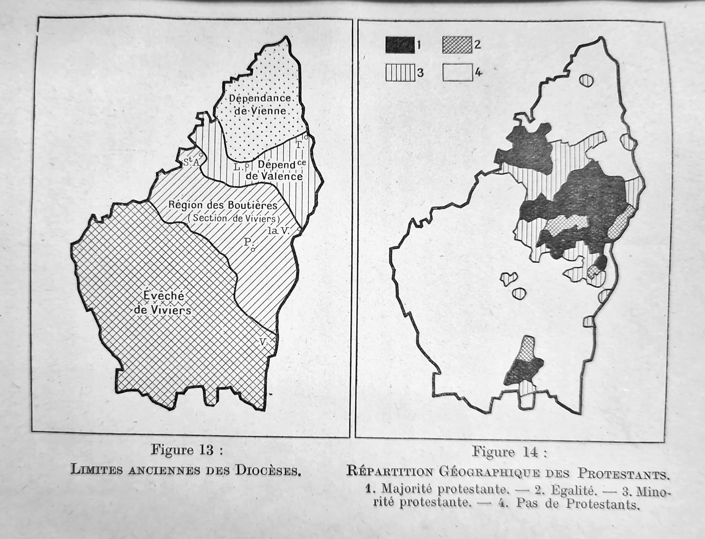

```{r setup, include=FALSE}

library(AER)
library(tidyverse)
library(sf)
library(marginaleffects)
library(SpatialRDD)
library(tmap)
library(rdrobust)
library(rddensity)
library(stringi)
library(readxl)
library(modelsummary)
library(purrr)
library(broom)
library(estimatr)
library(mediation)
library(sensemakr)
library(MatchIt)
library(WeightIt)
library(cobalt)
library(splines)
library(terra)
library(hegdata)
library(raster)

theme_set(theme_bw())

knitr::opts_chunk$set(echo=TRUE, warning=FALSE, message=FALSE,
                      fig.width = 10, fig.height = 7
                      #out.width = "14cm", out.height = "9.1cm"
                      )

```

# Cleaning the hand-transcribed data

```{r}


d_prots_1 <- read_xlsx("Protestants by Commune - 1839.xlsx") |>
  rename(
    code_insee = `Code INSEE`,
    code_insee_full = `Code INSEE (Department, Arrondissement, Canton, Commune)`,
    pop_general = `Population générale`,
    pop_protestant = `Population Protestante`,
    pop_protestant_section = `Population protestante par section`,
    dist = `Distance du chef-lieu de chaque commune au chef-lieu de la section`,
    residence = `Résidence du pasteur`,
    obs = `...16`
  ) |>
  mutate(
    Departement = as.character(Departement),
    Eglise = as.character(Eglise),
    Consistoire = as.character(Consistoire),
    Numeros = as.numeric(Numeros),
    Noms = as.character(Noms),
    Temples = as.character(Temples),
    Communes = as.character(Communes),
    code_insee = as.character(code_insee),
    code_insee_full = as.character(code_insee_full),
    pop_general = as.character(pop_general),
    pop_protestant = as.character(pop_protestant),
    pop_protestant_section = as.character(pop_protestant_section),
    dist = as.character(dist),
    residence = as.character(residence),
    Pasteur = as.character(Pasteur),
    obs = as.character(obs),
    obs_2 = NA_character_
  )


d_prots_2 <- read_xlsx("Protestants by Commune - 1839.xlsx", sheet = 2) |>
  rename(
    code_insee = `Code INSEE`,
    pop_general = `Population générale`,
    pop_protestant = `Population Protestante`,
    pop_protestant_section = `Population protestante par section`,
    dist = `Distance du chef-lieu de chaque commune au chef-lieu de la section`,
    residence = `Résidence du pasteur`,
    obs = `...15`,
    obs_2 = `...16`
  ) |>
  mutate(
    Departement = as.character(Departement),
    Eglise = as.character(Eglise),
    Consistoire = as.character(Consistoire),
    Numeros = as.numeric(Numeros),
    Noms = as.character(Noms),
    Temples = as.character(Temples),
    Communes = as.character(Communes),
    code_insee = as.character(code_insee),
    code_insee_full = NA_character_,
    pop_general = as.character(pop_general),
    pop_protestant = as.character(pop_protestant),
    pop_protestant_section = as.character(pop_protestant_section),
    dist = as.character(dist),
    residence = as.character(residence),
    Pasteur = as.character(Pasteur),
    obs = as.character(obs),
    obs_2 = as.character(code_insee_full)
  ) |>
  filter(!(Departement %in% c("Tarn", "Tarn et Garonne")))

pop_cage_piketty <- read_csv("cage_piketty/popcommunes.csv") |>
  dplyr::select(dep, nomdep, code_insee = codecommune, nomcommune, reg, nomreg, pop1839) |>
  distinct()

d_prots <- bind_rows(d_prots_1, d_prots_2) |>
  mutate(code_insee = str_pad(code_insee, width = 5, pad = "0")) |>
  full_join(pop_cage_piketty, by = "code_insee")


d_issues <- d_prots |> 
  filter(
    (code_insee %in% unique(d_prots$code_insee[duplicated(d_prots$code_insee) == TRUE])) | 
      !is.na(obs) | !is.na(obs_2) |
      is.na(code_insee)) #|>
  #dplyr::select(Departement, Communes, code_insee, pop_general, pop_protestant, obs, obs_2)

nrow(d_issues)

#View(d_issues |> filter(is.na(code_insee)))

```

There are 349 rows which might be problematic, including repeated or NA INSEE codes or observations left during coding. This is without taking into account the former department of Seine (now Paris, Hauts-de-Seine, Seine-Saint-Denis, and Val-de-Marne), for which no Protestant population was provided, and of Alsace-Lorraine (which was under heavy Lutheran influence and we lack the information on the Lutheran population for now).

Most rows lacking an INSEE code correspond to observations without reference to a concrete commune. Some mention a specific locality within a commune (e.g., Maine-Geoffroy in Royan or Saint-Césaire in Nîmes). 

Other observations without a corresponding INSEE code are observations where no particular commune is mentioned; instead, the authors simply state 'neighbouring communes' or give a number of communes without specifying which these relate. In Ain, where only two communes (Ferney-Voltaire and Gex) are explicitly named, a third entry lists 20 unspecified communes collectively hosting 300 protestants. In Aisne, we have five separate instances of vague references to multiple communes. We find similar references in Calvados, Manche, Doubs and the arrondissements of Giens and Montargis in Loiret. Bordeaux is included together with its unspecified suburbs, and with a note similar to that for Paris specifiying the difficulty of establishing the true Protestant population. There is also mention of 228 protestants living in Dordogne but attending services in Gironde, plus another 36 split between Dordogne and Lot-et-Garonne. We may likely discount those living in Lot-et-Garonne.

Ain, Aisne, Calvados, Manche, Doubs, Loiret, Dordogne, Paris, Hauts-de-Seine, Seine-Saint-Denis, and Val-de-Marne are therefore departments in which we must not assign a 0 value to the Protestant population and instead retain NAs. We will do the same for the métropole of Bordeaux.

In other departments, there is some information allowing us to assume the distribution of Protestants.

In Ardèche, there is only one vague entry, which relates to Tournon-sur-Rhône (07324) and the surrounding communes. The immediately surrounding communes (in Ardèche) are Mauves (07152), Saint-Jean-de-Muzols (07245), Saint-Barthélemy-le-Plain, and Plats. None of these are listed elsewhere. The current unité urbaine of Tournon-sur-Rhône includes Mauves and Saint-Jean-de-Muzols, so it seems fair to assume that these are the closest (economically and socially) to it. There were 130 Protestants overall in 1839. The 1836 population census for Tournon-sur-Rhône was 4 174; that for Mauves was 976; and that for Saint-Jean-de-Muzols was 801, so 5951 in total. This means the aggregate share of Protestants was 2.18% for the three. Assuming a uniform distribution, this means that Tournon-sur-Rhône had 91 protestants, Mauves had 21, and Saint-Jean-de-Muzols had 18.


```{r}

d_tournon <- tibble(
  Departement = "Ardèche",
  Communes = c("Tournon-sur-Rhône", "Mauves", "Saint-Jean-de-Muzols"),
  code_insee = c("07324", "07152", "07245"),
  pop_general = c(4174, 976, 801),
  pop_protestant = c(91, 21, 18),
  obs = NA,
  obs_2 = NA
) |>
  left_join(pop_cage_piketty, by = "code_insee")

```

In Ardennes, 180 protestants are listed as belonging to the following communes: Sainte-Vaubourg (8398), Attigny (8025), Voncq (8489), Semuy (8411), Rilly-sur-Aisne (8364), Saint-Lambert-et-Mont-de-Jeux (8384), Saint-Loup-Terrier (8387), Tourteron (8458), Autry (8036), Verrières (8471), La Berlière (8061), and Challerange (8097). We will assume that the Protestant population was uniformly distributed (based on the Cagé and Piketty estimates for 1839 population). Similarly, 50 Protestants were spread over Rethel (8362) and Charleville-Mézières (8105). The last vague entry for Ardennes mentions some hamlets in the arrondissement of Rocroi, which hosted 60 protestants. Rocroi belonged to its own arrondissement until 1926, when it became part of the arrondissement of Charleville-Mézières. The current canton of Rocroi includes 15 communes, such that it would seem reasonable to assume that they refer to the area encompassed by this entry. These communes are Rocroi (08367), Blombay (08071), Bourg-Fidèle (08078), Le Châtelet-sur-Sormonne (08110), Chilly (08121), Étalle (08155), Gué-d'Hossus (08202), Laval-Morency (08249), Maubert-Fontaine (08282), Regniowez (08355), Rimogne (08365), Sévigny-la-Forêt (08417), Taillette (08436), Tremblois-lès-Rocroi (08460)


```{r}

sum_1 <- (d_prots |> 
   filter(Departement == "Ardennes" & 
           pop_protestant == "180 spread over these communes"))$pop1839 |> 
  sum()

share_1 <- 180/sum_1

number_prots <- ((d_prots |> filter(Departement == "Ardennes" & pop_protestant == "180 spread over these communes"))$pop1839*share_1) |> round()


d_ardennes_1 <- d_prots |>
  filter(Departement == "Ardennes" & pop_protestant == "180 spread over these communes")

for (i in 1:nrow(d_ardennes_1)) {
  d_ardennes_1$pop_protestant[i] <- number_prots[i]
}

###

sum_2 <- (d_prots |> 
   filter(Departement == "Ardennes" & 
           pop_protestant == "50 spread over these communes"))$pop1839 |> 
  sum()

share_2 <- 50/sum_2

number_prots_2 <- ((d_prots |> filter(Departement == "Ardennes" & pop_protestant == "50 spread over these communes"))$pop1839*share_2) |> round()


d_ardennes_2 <- d_prots |>
  filter(Departement == "Ardennes" & pop_protestant == "50 spread over these communes")

for (i in 1:nrow(d_ardennes_2)) {
  d_ardennes_2$pop_protestant[i] <- number_prots_2[i]
}

###

sum_3 <- (d_prots |> 
   filter(code_insee %in% c("08367", "08071", "08078", "08110", "08121", "08155", "08202", "08249", "08282", "08355", "08365", "08417", "08436", "08460")))$pop1839 |> 
  sum()

share_3 <- 50/sum_3

number_prots_3 <- ((d_prots |> filter(code_insee %in% c("08367", "08071", "08078", "08110", "08121", "08155", "08202", "08249", "08282", "08355", "08365", "08417", "08436", "08460")))$pop1839*share_3) |> round()


d_ardennes_3 <- d_prots |>
  filter(code_insee %in% c("08367", "08071", "08078", "08110", "08121", "08155", "08202", "08249", "08282", "08355", "08365", "08417", "08436", "08460"))

for (i in 1:nrow(d_ardennes_3)) {
  d_ardennes_3$pop_protestant[i] <- number_prots_3[i]
}

```

In Bouches-du-Rhône, 335 Protestants were listed as belonging to La Roque-d'Anthéron and Charleval, and 90 among Saint-Rémy-de-Provence, Eyguières, and Arles.

```{r}

sum_3 <- (d_prots |> 
   filter(Departement == "Bouches-du-Rhône" & 
           pop_protestant == "335 spread over these communes"))$pop1839 |> 
  sum()

share_3 <- 335/sum_3

number_prots_3 <- ((d_prots |> filter(Departement == "Bouches-du-Rhône" & 
           pop_protestant == "335 spread over these communes"))$pop1839*share_3) |> round()


d_bouches_1 <- d_prots |>
  filter(Departement == "Bouches-du-Rhône" & 
           pop_protestant == "335 spread over these communes")

for (i in 1:nrow(d_bouches_1)) {
  d_bouches_1$pop_protestant[i] <- number_prots_3[i]
}


sum_4 <- (d_prots |> 
   filter(Departement == "Bouches-du-Rhône" & 
           pop_protestant == "90 spread over these communes"))$pop1839 |> 
  sum()

share_4 <- 90/sum_4

number_prots_4 <- ((d_prots |> filter(Departement == "Bouches-du-Rhône" & 
           pop_protestant == "90 spread over these communes"))$pop1839*share_4) |> round()


d_bouches_2 <- d_prots |>
  filter(Departement == "Bouches-du-Rhône" & 
           pop_protestant == "90 spread over these communes")

for (i in 1:nrow(d_bouches_2)) {
  d_bouches_2$pop_protestant[i] <- number_prots_4[i]
}

```

In Côtes-d'Or, 100 Protestants were spread between several communes, particularly Nuits-Saint-Georges (21464), Beaume (21054), and Auxonne (21038).

```{r}

sum_5 <- (d_prots |> 
   filter(code_insee %in% c("21038", "21054", "21464")))$pop1839 |> 
  sum()

share_5 <- 100/sum_5

number_prots_5 <- ((d_prots |> filter(code_insee %in% c("21038", "21054", "21464")))$pop1839*share_5) |> round()


d_cotedor <- d_prots |> 
   filter(code_insee %in% c("21038", "21054", "21464"))

for (i in 1:nrow(d_cotedor)) {
  d_cotedor$pop_protestant[i] <- number_prots_5[i]
}

```


In Indre-et-Loire, all other communes (apart from Tours) had 150 Protestants, for a total population of over 285 thousand (around 0.05%). As before, we will assume that the share of Protestants is broadly uniform across the department.

```{r}

sum_6 <- (d_prots |> 
   filter(nomdep == "INDRE-ET-LOIRE" & nomcommune != "TOURS"))$pop1839 |> 
  sum()

share_6 <- 150/sum_6

number_prots_6 <- ((d_prots |> filter(nomdep == "INDRE-ET-LOIRE" & nomcommune != "TOURS"))$pop1839*share_6) |> round()


d_indre <- d_prots |> 
   filter(nomdep == "INDRE-ET-LOIRE" & nomcommune != "TOURS")

for (i in 1:nrow(d_indre)) {
  d_indre$pop_protestant[i] <- number_prots_6[i]
}


```

In Loire, yet again a similar pattern: 60 Protestants spread between Le Chambon-Feugerolles (42044) and Firminy (42095), and 65 spread between Saint-Chamond (42207) and Rive-de-Gier (42186).

```{r}

sum_7 <- (d_prots |> 
   filter(code_insee %in% c("42044", "42095")))$pop1839 |> 
  sum()

share_7 <- 60/sum_7

number_prots_7 <- ((d_prots |> filter(code_insee %in% c("42044", "42095")))$pop1839*share_7) |> round()


d_loire_1 <- d_prots |>
  filter(code_insee %in% c("42044", "42095"))

for (i in 1:nrow(d_loire_1)) {
  d_loire_1$pop_protestant[i] <- number_prots_7[i]
}


sum_8 <- (d_prots |> 
   filter(code_insee %in% c("42207", "42186")))$pop1839 |> 
  sum()

share_8 <- 65/sum_8

number_prots_8 <- ((d_prots |> filter(code_insee %in% c("42207", "42186")))$pop1839*share_8) |> round()


d_loire_2 <- d_prots |>
  filter(code_insee %in% c("42207", "42186"))

for (i in 1:nrow(d_loire_2)) {
  d_loire_2$pop_protestant[i] <- number_prots_8[i]
}


```

One case relates to two observations for the commune of Les Salles-du-Gardon. One of them describes the left shore of the Gardon and corresponds geographically to the commune of La Grand-Combe, formed in 1846. The other describes the right shore of the Gardon, corresponding to the current commune of Les Salles-du-Gardon. The population mentioned for the first is the historical record for the entire pre-1846 commune. We have population estimates for both communes from 1846, when La Grand-Combe had 4 011 people and Les Salles-du-Gardon had 1 041. If the proportion had been the same in 1839, then out of the entire 1 224 people, about 972 would have lived in La Grand-Combe and 252 in Les Salles-du-Gardon. I will therefore assign the first observation to the modern-day commune of La Grand-Combe and the second to the modern-day commune of Les Salles-du-Gardon, with the population in each of them adjusted accordingly. These two communes should be removed from the analysis as a robustness check.

```{r}

d_salles <- d_prots |>
  filter(Communes %in% c("La Fovède, ou la partie de la commune des Salles, rive droite du Gardon", "La Grand Combe, ou la partie de la commune des Salles, rive gauche du Gardon")) |>
  mutate(
    code_insee = case_when(
      Communes == "La Fovède, ou la partie de la commune des Salles, rive droite du Gardon" ~ "30307",
      Communes == "La Grand Combe, ou la partie de la commune des Salles, rive gauche du Gardon" ~ "30132"
    ),
    pop_general = case_when(
      Communes == "La Fovède, ou la partie de la commune des Salles, rive droite du Gardon" ~ 252,
      Communes == "La Grand Combe, ou la partie de la commune des Salles, rive gauche du Gardon" ~ 972
    ),
    Communes = case_when(
      Communes == "La Fovède, ou la partie de la commune des Salles, rive droite du Gardon" ~ "Les Salles-du-Gardon",
      Communes == "La Grand Combe, ou la partie de la commune des Salles, rive gauche du Gardon" ~ "La Grand-Combe"
    )
  )

```


We can now move to cases where there is an INSEE code but the commune is either duplicated or no longer exists.

We have the following mergers: Saint-Maurice (17300), which merged with the the commune of La Rochelle (same code); Agonnay (17397) which merged with Saint-Savinien (same code); Rouquette, Saint-Sulpice-d'Eymet, and Cogulot (24167) which all merged with Eymet (same code); Le Canet and La Rouquette (24335) which merged with Port-Sainte-Foy-et-Ponchapt (same code); Puyguulhem and Mombos (24549) which merged with Thénac (same code); La Répara (26020) which merged with La Répara-Auriples; L'Escoulin (26128) which merged with Eygluy-Escoulin; La Bâtie-Crémazin (26136) which merged with Val-Maravel; Béconne (26276) merged with Roche-Saint-Secret-Béconne; La Ville-l'Évêque (28036) merged with Berchères-sur-Vesgre; Mainterne and Vitray-sous-Brézolles (28120) merged with Crucey-Villages; Bourneville (28190) merged with Guillonville; Cambo (30058) merged with La Cadière-et-Cambo; Saint-Martin-de-Sossenac (30106) merged with Durfort-et-Saint-Martin-de-Sossenac; Cézas (30325) merged with Sumène; Paroisse-du-Vigan (30350) merged with Le Vigan; Appelles (33369) merged with Saint-André-et-Appelles; Saint-Nazaire (33378) merged with Saint-Avit-Saint-Nazaire; Le Pouzat (7204) merged with Saint-Agrève; Naves (7334) merged with Les Vans; Saint-Genis (38226) merged with Mens (38226); Ecoman (41273) was merged with Vievy-le-Rayé (41273); Saint-Gayrand (47112) was merged with Grateloup-Saint-Gayrand (47112); , Saint-Vincent (47038) was merged with Bourran (47038); Lesterne (47213) was merged with Prayssas (47213); Saint-Amant (47276) was merged with Saint-Sardos (47276); Etussan (47143) was merged with Lavardac (47143); Limon (47097) was merged with Feugarolles (47097); Angviller (57086) was merged into Belles-Forêts (57086); Landonvillers (57155) was merged into Courcelles-Chaussy (57155); Fives (59350), Moulins-Lille (59350), and Wazemmes (59350) were merged into Lille (59350); Selvigny (59631) was merged with Walincourt-Selvigny (59631); Audencourt (59139) was merged with Caudry (59139); Ranchicourt (62693) was merged with Rebreuve-Ranchicourt (62693); Sainte-Suzanne (64430) was merged with Orthez (64430); Montestrucq (64440) was merged with Ozenx-Montestrucq (64440); Arance (64396), Gouze (64396), and Lendresse (64396) were merged with Mont (64396); Bezing (64133) was merged with Boeil-Bezing (64133); Cassaber (64168) was merged with Carresee-Cassaber (64168); Aspis (64071) was merged with Athos-Aspis (64071); Bideren (64083) and Saint-Martin (64083) were merged with Autevielle-Saint-Martin-Bideren (64083); Parenties (64251) merged with Guinarthe-Parenties (64251); Rivareyte (64435) merged with Osserain-Rivareyte (64435); Arrive (64480) and Munein (64480) merged with Saint-Gladie-Arrive-Munein (64480); Camu (64096) merged with Barraute-Camu (64096); Saint-Esprit (64102) merged with Bayonne (64102); Hanhoffen (67046) merged with Bischwiller (67046); Niederseebach (67351) merged with Seebach (67351); Altenstadt (67544) merged with Wissembourg (67544); Birlenbach (67104) merged with Drachenbronn-Birlenbach (67104); Griesbach-le-Bastberg (67061) merged with Bouxwiller (67061); Bischtroff-sur-Sarre (67435) and Zollingen (67435) merged with Sarrewerden (67435); Wiler (67183) merged with Harskirchen (67183); Dornach (68224) merged with Mulhouse (68224); Saint-Rambert-l'île-Barbe (69123) merged with Lyon (69123); Valasse (76329) merged with Gruchet-le-Valasse (76329); Bielleville (76543) merged with Rouville (76543); Buglise (76167) and Rimbertot (76167) merged with Cauville-sur-Mer (76167); Ecuquetot (76716) merged with Turretot (76716); Émalleville (76650) merged with Saint-Sauveur-d'Émalleville (76650); Graville-Sainte-Honorine (76351), Bléville (76351), Sanvic (76351) merged with Le Havre (76351); L'Enclave-de-la-Martinière (79264) merged with Saint-Léger-de-la-Martinière (79264); Montigné (79061) and Verrines-sous-Celles (79061) merged with Celles-sur-Belle (79061); Souché (79191), Sainte-Pezenne (79191), Saint-Florent (79191), and Saint-Liguaire (79191) merged with Niort (79191); Saint Carlais (79048) and Chavagné (79048) merged with La Crèche (79048); Saint-Denis (79066) merged with Champdenier-Saint-Denis (79066); Rouvre (79133) merged with Germond-Rouvre (79133); La Ronde (79123) merged with La Forêt-sur-Sèvre (79123); Plantières (57463), itself listed twice, is merged into Metz (57463), as well as Devant-les-Ponts (57463); Vallières-lès-Metz (57463) and Magny (57463); Vineuil-Saint-Firmin (60695) merged with Vinueil (60695); Puybelliard (85051) and Saint-Mars-de-Prés (85051) merged with Chantonnay (85051); Payré-sur-Vendée (85094) merged with Foussais-Payré (85094); and Lesson (85020) and Sainte-Christine (85020) merged with Benet (85020).

```{r}

d_merged <- d_prots |>
  filter(code_insee %in% c("17300", "17397", "24167", "24335", "24549", "26020", "26128", "26136", "26276", "28036", "28120", "28190", "30058", "30106", "30325", "30350", "33369", "33378", "7204", "7334", "38226", "41273", "47112", "47213", "47038", "47213", "47276", "47143", "47097", "57086", "57155", "59350", "59631", "59139", "62693", "64430", "64440", "64396", "64133", "64168", "64071", "64083", "64251", "64435", "64480", "64096", "64102", "67046", "67351", "67544", "67104", "67061", "67435", "67183", "68224", "69123", "76329" , "76543" , "76167" , "76716" , "76650" , "76351" , "79264", "79061", "79191", "79048", "79066", "79133" , "79123", "57463", "60695", "85051", "85094", "85020")) |>
  mutate(pop_general = as.numeric(pop_general),
         pop_protestant = as.numeric(pop_protestant)) |>
  group_by(code_insee) |>
  summarise(
    Departement = first(Departement),
    Communes = first(Communes),
    pop_general = sum(pop_general),
    pop_protestant = sum(pop_protestant, na.rm = TRUE),
    obs = NA
  ) |>
  mutate(
    Communes = case_when(#code_insee %in% c("17300", "17397", "24167", "24335", "24549", "26020", "26128", "26136", "26276", "28036", "28190", "30106", "30350", "33369", "33378", "7204", "7334") ~ first(Communes),
                         code_insee == "28120" ~ "Crucey-Villages",
                         code_insee == "30058" ~ "La Cadière-et-Cambo",
                         code_insee == "30325" ~ "Sumène",
                         .default = Communes
                         )
  ) |>
  left_join(pop_cage_piketty, by = "code_insee")

```


We then have cases where the same commune is mentioned twice. The true protestant population is therefore either the sum of each entry or one of the listed values.

For cases where it is only one the values, I have followed the conservative approach of using the lesser one. We have the case of Arvert (17021), mentioned twice with the same general population but different values of Protestants (658 and 727). As the sum is greater than the overall population, these are presumably two different measures of the same population. I will go with the conservative approach and use the lower value. Rémuzat (26264) is also listed twice although the protestant population could not retrieved from the first entry; I'll assume the second entry corresponds to the true value. Pommiers (30199) is a similar case, listed twice with the same general population but with different values for the protestant population. I will assume the lower value is correct. La Chefresne (50128) listed twice, with the same values for both general and Protestant population, suggesting double counting. Athis-de-l'Orne (61007), Flers (61169), Alençon (61001), Sainte-Honorine-la-Chardonne (61407), Berjou (61044), Montilly-sur-Noireau (61287) and Frênes (61177) are listed twice with the same data, so I will assume that they have been double-counted.

Cherbourg (50129) is similarly listed twice though with similar but different values. I assume double-counting and will take the higher value for both the general (13395) and the Protestant (360) populations.

```{r}

d_duplicates_1 <- d_prots |>
  filter(code_insee %in% c("17021", "26264", "30199", "50128",
                           "61007", "61169", "61001", "61407", 
                           "61044", "61287", "61177")) |> 
  mutate(pop_general = as.numeric(pop_general),
         pop_protestant = as.numeric(pop_protestant)) |>
  group_by(code_insee) |>
  summarise(
    Departement = first(Departement),
    Communes = first(Communes),
    pop_general = max(pop_general),
    pop_protestant = min(pop_protestant, na.rm = TRUE),
    obs = NA
  ) |>
  bind_rows(
    d_issues |>
      filter(code_insee %in% c("50129")) |> 
      mutate(pop_general = as.numeric(pop_general),
             pop_protestant = as.numeric(pop_protestant)) |>
      group_by(code_insee) |>
      summarise(
        Departement = first(Departement),
        Communes = first(Communes),
        pop_general = max(pop_general),
        pop_protestant = max(pop_protestant, na.rm = TRUE),
        obs = NA
      )
  ) |>
  left_join(pop_cage_piketty, by = "code_insee")

```


In the case of Marennes (17219), the same commune is listed twice and in immediate succession. One of the entries has a population a little above the registered overall population, at 4900 inhabitants, while the other is quite below at around 490. It would hardly be the case that the overall population corresponds to their sum; instead, the second entry probably refers to another commune and was mistakenly inputted as Marennes. I will therefore assume both population values are correct in the first entry. Chabeuil (26064) is also listed twice, once as 'Portion de Chabeuil'. It's made clear that the second entry corresponds to the whole Protestant population. Two entries were identified as referring to Saint-Germain-du-Seudre (17342), although one was only listed as Saint-Germain. It is possible that it refers to another commune, so I will assume that the second entry is the only correct one. Montdardier (30176) is listed twice, once with a slightly greater general population and another time with a value in line with the Cassini figures. The number of Prostestants differs - I will assume again the more conservative figure is correct. Péronville (28296) appears to be listed twice: once with a seemingly incorrect overall population and a protestant population of 20, and another time with a population more in line with the Cassini estimates but without listing the protestant population. I will assume the population was 20 but flagging this for the future. Similarly, Pranles (7184) is listed twice, once with a correct general population and another time with a much smaller general population. I will assume the second entry, with the correct population, is the more trustworthy value for the Protestant population as well.

```{r}

d_marennes <- d_issues |> 
  filter(code_insee == "17219" & pop_general == "4942")

d_chabeuil <- d_issues |> 
  filter(code_insee == "26064" & pop_general == "4295")

d_saint_germain <- d_issues |> 
  filter(code_insee == "17342" & pop_general == "812")

d_montdardier <- d_issues |> 
  filter(code_insee == "30176" & pop_general == "715")

d_peronville <- d_issues |> 
  filter(code_insee == "28296" & pop_general == "586") |>
  mutate(pop_protestant = "20")

d_pranles <- d_issues |>
  filter(code_insee == "7184" & pop_general == "1775")

d_duplicates_2 <- bind_rows(
  d_marennes,
  d_chabeuil,
  d_saint_germain,
  d_montdardier,
  d_peronville,
  d_pranles
)

```


Cases where the number of Protestants corresponds to the sum of each entry are more straighforward. Bois (17050) is similarly mentioned twice and with the same population. In this case, however, the values for the Protestant population are very small (10 and 13). It is possible that the real Protestant population here corresponds to their sum and I will therefore consider it as such. The case of Gageac-et-Rouillac (24193) is similar: the overall population listed is the same, the number of protestants differs and is quite small by reference to the overall population (50 and 70). Same goes for Verteuil (47317), Villeton (47325), Clermont (60157), Houchain (62456), Fomperron (79121). Josnes (41105) is listed twice, with a similar overall population (1503 vs 1500) and different Protestant population numbers (216 vs 400). The second listing mentions a particular canton, and it seems reasonable to assume that the correct number is their sum. Gardonne (24194) is listed twice, once as Partie Nord and another as Partie Sud. The overall population is the same but the protestant population differs, indicating that the total corresponds to their sum (140 and 47). Lasalle Prunet (48186) is similar. Dourbies (30105) is also listed twice with the same general population but differing in their protestant population (30 and 40), which corresponds, I will assume, to their sum. Barr (67021) is listed twice, once as the proper commune and another time as La scierie, Commune de Barr. The overall population listed is the same but the Protestant population differs, suggesting that the overall Protestant population corresponds to their sum. Saint-Frézal-de-Ventalon (48175) is listed twice, without any indication of the general population, but mentions of a *partie est* and a *partie ouest* suggest that the Protestant population corresponds to its sum.

Les Ollières-sur-Eyrieux (7167) is listed twice with the total number of protestants corresponding to the sum, but with different population values. The overall population seems, on the basis of the Cassini figures, to correspond roughly to their sum as well. The same goes for Saint-Étienne-Vallée-Française (48148).

Finally, we have cases like Saint-André-de-Majencoules (30229), which is listed twice, once as Hameau du Roy dans la commune de Saint-André-de-Majencoules, which suggests that the protestant population in the overall commune corresponds to their sum while the overall population is the greater value. Similarly, Giencourt (listed under 60107) is a locality of Breuil-le-Vert (60107) - the Protestant population seems to have been counted separately. Saint-Julien-lès-Metz (57616) is also listed twice, in the first occurrence seemingly as a part of the commune and without listing the general population. Laventie (62491) is listed twice, first without an indication of the general population and with 22 Protestants, and then with a general population of 4415 and a Protestant population of 15. I will assume the Protestant population corresponds to its sum. Saint-Michel-de-Dèze (48173) is similarly listed twice, and the Protestant population likely corresponds to the sum. However, the general population for the second half is not listed - and that for the first half is unlikely to correspond to the entire population. For these cases, I will sum the Protestant population and keep the greater value for the overall population.

```{r}


d_duplicates_3 <- d_issues |>
  filter(code_insee %in% c("17050", "24193", "47317", "47325", "60157", "62456", "79121", "41105", "24194", "48186", "30105", "67021", "48175")) |> 
  mutate(pop_general = as.numeric(pop_general),
         pop_protestant = as.numeric(pop_protestant)) |>
  group_by(code_insee) |>
  summarise(
    Departement = first(Departement),
    Communes = first(Communes),
    pop_general = first(pop_general),
    pop_protestant = sum(pop_protestant, na.rm = TRUE),
    obs = NA
  ) |>
  bind_rows(
    d_issues |>
      filter(code_insee %in% c("7167", "48148")) |> 
      mutate(pop_general = as.numeric(pop_general),
             pop_protestant = as.numeric(pop_protestant)) |>
      group_by(code_insee) |>
      summarise(
        Departement = first(Departement),
        Communes = first(Communes),
        pop_general = sum(pop_general, na.rm = TRUE),
        pop_protestant = sum(pop_protestant, na.rm = TRUE),
        obs = NA
      ),
    d_issues |>
        filter(code_insee %in% c("30229", "60107", "57616", "62491", "48173")) |> 
        mutate(pop_general = as.numeric(pop_general),
               pop_protestant = as.numeric(pop_protestant)) |>
        group_by(code_insee) |>
        summarise(
            Departement = first(Departement),
            Communes = first(Communes),
            pop_general = max(pop_general, na.rm = TRUE),
            pop_protestant = sum(pop_protestant, na.rm = TRUE),
            obs = NA
        )
  ) |>
  left_join(pop_cage_piketty, by = "code_insee")


d_solved <- bind_rows(
  d_tournon, 
  d_ardennes_1 |>
    mutate(pop_general = as.numeric(pop_general),
             pop_protestant = as.numeric(pop_protestant)), 
  d_ardennes_2 |>
    mutate(pop_general = as.numeric(pop_general),
             pop_protestant = as.numeric(pop_protestant)), 
  d_ardennes_3 |>
    mutate(pop_general = as.numeric(pop_general),
             pop_protestant = as.numeric(pop_protestant)), 
  d_bouches_1 |>
    mutate(pop_general = as.numeric(pop_general),
             pop_protestant = as.numeric(pop_protestant)), 
  d_bouches_2 |>
    mutate(pop_general = as.numeric(pop_general),
             pop_protestant = as.numeric(pop_protestant)), 
  d_cotedor |>
    mutate(pop_general = as.numeric(pop_general),
             pop_protestant = as.numeric(pop_protestant)), 
  d_indre |>
    mutate(pop_general = as.numeric(pop_general),
             pop_protestant = as.numeric(pop_protestant)), 
  d_loire_1 |>
    mutate(pop_general = as.numeric(pop_general),
             pop_protestant = as.numeric(pop_protestant)), 
  d_loire_2 |>
    mutate(pop_general = as.numeric(pop_general),
             pop_protestant = as.numeric(pop_protestant)),
  d_salles |>
    mutate(pop_general = as.numeric(pop_general),
             pop_protestant = as.numeric(pop_protestant)),
  d_merged,
  d_duplicates_1,
  d_duplicates_2 |>
    mutate(pop_general = as.numeric(pop_general),
             pop_protestant = as.numeric(pop_protestant)),
  d_duplicates_3
)

```


We also have some entries where the population or the number of Protestants could not be established, many of which because there is no concrete commune to which the entry refers. There is also one observation where the Protestant population is greater than the overall population, Collorgues (30086). This value has been checked again against the digitised records and the mistake is not in the transcription. The observation has been discarded.

As mentioned above, we will also retain NAs for any unmentioned commune in the departments of Ain, Aisne, Calvados, Manche, Doubs, Loiret, and Dordogne.

We will also assign a value of NA for Paris, Hauts-de-Seine, Seine-Saint-Denis, and Val-de-Marne and the métropole of Bordeaux, consisting of the following communes: Bordeaux (33063), Ambarès-et-Lagrave (33003), Ambès (33004), Artigues-près-Bordeaux (33013), Bassens (33032), Bègles (33039), Blanquefort (33056), Bouliac (33065), Le Bouscat (33069), Bruges (33075), Carbon-Blanc (33096), Cenon (33119), Eysines (33162), Floirac (33167), Gradignan (33192), Le Haillan (33200), Lormont (33249), Martignas-sur-Jalle (33273), Mérignac (33281), Parempuyre (33312), Pessac (33318), Saint-Aubin-de-Médoc (33376), Saint-Louis-de-Montferrand (33434), Saint-Médard-en-Jalles (33449), Saint-Vincent-de-Paul (33487), Le Taillan-Médoc (33519), Talence (33522), Villenave-d'Ornon (33550). 


```{r}

d_clean <- d_prots |>
  filter(!(code_insee %in% unique(d_issues$code_insee))) |>
  #dplyr::select(Departement, Communes, code_insee, pop_general, pop_protestant, obs) |>
  mutate(pop_general = as.numeric(pop_general),
         pop_protestant = as.numeric(pop_protestant)) |>
  bind_rows(d_solved) |>
  mutate(
    category = case_when(!is.na(code_insee) & !is.na(pop_protestant) ~ "Original",
                         .default = "Extrapolated"),
    pop_protestant = case_when(
      dep %in% c("75", "92", "93", "94" # Former departement of Seine
                 ) ~ NA_real_,
      code_insee %in% c("33063", "33003", "33004", "33013", "33032", "33039", 
                        "33056", "33065", "33069", "33075", "33096", "33119", 
                        "33162", "33167", "33192", "33200", "33249", "33273", 
                        "33281", "33312", "33318", "33376", "33434", "33449", 
                        "33487", "33519", "33522", "33550") ~ NA_real_, # Métropole of Bordeaux
      dep %in% c("01", "02", "14", "50", "25", "45", "24") & 
        is.na(pop_protestant) ~ NA_real_, # Unmentioned communes in Ain, Aisne, Calvados,
                                          # Manche, Doubs, Loiret, and Dordogne.
      is.na(pop_protestant) ~ 0, # Extrapolating 0 for unmentioned communes 
      !is.na(pop_protestant) ~ pop_protestant,
      .default = NA_real_
    ),
    share_protestant = 100*pop_protestant/pop1839,
    share_protestant_og = case_when(
      !is.na(pop_general) ~ 100*pop_protestant/pop_general,
      is.na(pop_general) ~ 100*pop_protestant/pop1839,
      .default = NA_real_
    )
  ) |>
  mutate(
    share_protestant = case_when(
      share_protestant > 100 ~ NA_real_,
      share_protestant < 0 ~ 0,
      .default = share_protestant
    ),
    share_protestant_og = case_when(
      share_protestant_og > 100 ~ NA_real_,
      share_protestant_og < 0 ~ 0,
      .default = share_protestant_og
    )
  )

nrow(d_clean |> filter(category == "Original"))

```

There are 2408 communes whose values for the Protestant population we estimate based on the original document, before extrapolating null values for unmentioned communes.


# Adding Geospatial Data

```{r}
comm <- read_sf("commune-frmetdrom/COMMUNE_FRMETDROM.shp") |>
  filter(!(INSEE_DEP %in% c("971", "972", "973", "974", "976", "2A", "2B"))) |>
  rename(code_insee = INSEE_COM)
```

Each of the three following maps and corresponding dataframes follows one approach: 1) simply assign a value for the share of Protestants in 1839 to the communes explicitly mentioned in the original document, leaving all others NA; 2) as before, but also assigning a value of 0 to communes in departments mentioned in the original document and where no ambiguous "surrounding communes" are mentioned (e.g., Ariège (09), for which we have information on the concrete protestant population of some communes but no reference to any more dispersed population); 3) as before, but further assigning asigning a value of 0 to all communes in departments which should have been covered in the original document (i.e., any departments alphabetically prior to Somme) but which are not mentioned. 

```{r}

d_map <- full_join(d_clean |> 
            mutate(code_insee = as.numeric(code_insee)), 
          comm |>
            mutate(code_insee = as.numeric(code_insee)), by = "code_insee")


d_map |>
  ggplot() +
  geom_sf(aes(geometry = geometry, fill = share_protestant), colour = "NA") +
  scale_fill_distiller(palette = "PuRd",
                      na.value = "grey30",
                      direction = 1,
                      name = "") +
  labs(title = "Share of Calvinists in 1839",
       subtitle = "Denominator is the 1839 population according to Cagé and Piketty (2025)") +
  theme(legend.position = "bottom")

d_map |>
  ggplot() +
  geom_sf(aes(geometry = geometry, fill = share_protestant_og), colour = "NA") +
  scale_fill_distiller(palette = "PuRd",
                      na.value = "grey30",
                      direction = 1,
                      name = "") +
  labs(title = "Share of Calvinists in 1839",
       subtitle = "Denominator is the population listed in the Survey when possible.") +
  theme(legend.position = "bottom")


d_map |>
  ggplot() +
  geom_histogram(aes(x = share_protestant), bins = 50)

```

# Adding Electoral Data

The source here is @cageHistoryPoliticalConflict2025.

```{r}
d2022 <- read_csv("cage_piketty/leg2022comm.csv")

d2017 <- read_csv("cage_piketty/leg2017comm.csv")

d2012 <- read_csv("cage_piketty/leg2012comm.csv")

d2007 <- read_csv("cage_piketty/leg2007comm.csv")

d2002 <- read_csv("cage_piketty/leg2002comm.csv")

d1997 <- read_csv("cage_piketty/leg1997comm.csv")

d1993 <- read_csv("cage_piketty/leg1993comm.csv")


d_FN <- bind_rows(
  d2022 |> 
    dplyr::select(dep, nomdep, codecommune, nomcommune, pvoixRN, pvoixLR) |>
    mutate(year = 2022),
  d2017 |> 
    dplyr::select(dep, nomdep, codecommune, nomcommune, pvoixFN, pvoixLR) |>
    mutate(year = 2017),
  d2012 |> 
    dplyr::select(dep, nomdep, codecommune, nomcommune, pvoixFN, pvoixUMP) |>
    mutate(year = 2012),
  d2007 |> 
    dplyr::select(dep, nomdep, codecommune, nomcommune, pvoixFN, pvoixUMP) |>
    mutate(year = 2007),
  d2002 |> 
    dplyr::select(dep, nomdep, codecommune, nomcommune, pvoixFN, pvoixUMP) |>
    mutate(year = 2002),
  d1997 |> 
    dplyr::select(dep, nomdep, codecommune, nomcommune, pvoixFN, pvoixRPR) |>
    mutate(year = 1997),
  d1993 |> 
    dplyr::select(dep, nomdep, codecommune, nomcommune, pvoixFN, pvoixRPR) |>
    mutate(year = 1993)
) |>
  mutate(
    pvoixRN = case_when(
      year == 2022 ~ 100*pvoixRN,
      .default = 100*pvoixFN),
    pvoixLR = case_when(
      year %in% c(2022, 2017) ~ 100*pvoixLR,
      year %in% c(2012, 2007, 2002) ~ 100*pvoixUMP,
      year %in% c(1997, 1993) ~ 100*pvoixRPR
    )
    ) |>
  mutate(code_insee = as.numeric(codecommune)) |>
  right_join(d_map |> filter(!is.na(share_protestant)))

```

# Adding Controls

We can now add some contemporary controls drawn from @cageHistoryPoliticalConflict2025: mean revenue, the share of the population with a baccalauréat or higher, the share of the population with higher education, the share of foreigners, the rate of unemployment, the share of the labour force in each occupation sector, the share of RSA recipients (which is only available from April 2016 onwards), and mean house prices.

They also provide some of the historical controls: revenue in 1790 (as a ratio of national revenue), the share of constitutional priests in 1791, and the share of married people signing their marriage contract in 1686 (as a measure of literacy).

```{r}

revenus0 <- read_csv("cage_piketty/revcommunes.csv") |> 
  dplyr::select(dep, nomdep, codecommune, nomcommune, 
                ends_with(c("1790", "1839", "1993", "1997", 
                            "2002", "2007", "2012", "2017", "2022")))

revenus <- revenus0 |>
  dplyr::select(dep, nomdep, codecommune, nomcommune, 
                starts_with(c("revmoy1", "revmoy2"))) |>
  pivot_longer(cols = starts_with("rev"),
               names_to = "Year",
               values_to = "revmoy") |>
  mutate(Year = str_sub(Year, -4, -1)) |>
  full_join(revenus0 |> 
  dplyr::select(dep, nomdep, codecommune, nomcommune, 
                starts_with(c("pop"))) |>
  pivot_longer(cols = starts_with("pop"),
               names_to = "Year",
               values_to = "pop") |>
  mutate(Year = str_sub(Year, -4, -1))) |>
  full_join(revenus0 |> 
  dplyr::select(dep, nomdep, codecommune, nomcommune, revratio1790, revratio1839))

diplomes <- read_csv("cage_piketty/diplomescommunes.csv") |>
   dplyr::select(dep, nomdep, codecommune, nomcommune, 
                 starts_with(c("pb", "ps")) & 
                   ends_with(c("1993", "1997", "2002", 
                               "2007", "2012", "2017", "2022"))) |>
  mutate(
    nomcommune = case_when(codecommune == "35363" ~ "PONT-PEAN",
                           .default = nomcommune)
  ) |>
  filter(codecommune != "91692") ## The name of the commune is listed as Butry-sur-Oise (which is in the wrong department and has a different code)

diplomes <- diplomes |> 
  pivot_longer(cols = starts_with("pbac"), 
               names_to = "Year", 
               values_to = "pbac") |>
  mutate(Year = str_sub(Year, -4, -1)) |> 
  full_join(diplomes |> 
              pivot_longer(cols = starts_with("psup"), 
                           names_to = "Year", values_to = "psup") |> 
              mutate(Year = str_sub(Year, -4, -1))) |> 
  dplyr::select(-ends_with(c("1993", "1997", "2002", 
                             "2007", "2012", "2017", "2022")))

etrangers <- read_csv("cage_piketty/etrangerscommunes.csv") |> 
  dplyr::select(dep, nomdep, codecommune, nomcommune, 
                starts_with(c("petranger")) & 
                  ends_with(c("1993", "1997", "2002", 
                              "2007", "2012", "2017", "2022"))) |>
  pivot_longer(cols = starts_with("petranger"), 
               names_to = "Year", values_to = "petranger") |>
  mutate(Year = str_sub(Year, -4, -1))


## Cagé and Piketty consider 6 socioprofessional categories: farmers, non-agricultural self-employed (craftsmen and merchants), managers and higher intellectual professionals, intermediary occupations, service employees,  and blue-collar workers. The respective measures of their share in the labour force add up to 1. The unemployment rate is also listed.

csp <- read_csv("cage_piketty/cspcommunes.csv") |>
  dplyr::select(dep, nomdep, codecommune, nomcommune, 
                ends_with(c("1993", "1997", 
                            "2002", "2007", "2012", "2017", "2022")) &
                  starts_with(c("pagri", "pindp", "pcadr", "ppint", "pempl", "pouvr", "pchom")))


csp <- csp |> 
  pivot_longer(cols = starts_with("pagri"), 
               names_to = "Year", 
               values_to = "pagri") |>
  mutate(Year = str_sub(Year, -4, -1)) |> 
  full_join(csp |> 
              pivot_longer(cols = starts_with("pindp"), 
                           names_to = "Year", values_to = "pindp") |> 
              mutate(Year = str_sub(Year, -4, -1))) |> 
    full_join(csp |> 
              pivot_longer(cols = starts_with("pcadr"), 
                           names_to = "Year", values_to = "pcadr") |> 
              mutate(Year = str_sub(Year, -4, -1))) |> 
    full_join(csp |> 
              pivot_longer(cols = starts_with("ppint"), 
                           names_to = "Year", values_to = "ppint") |> 
              mutate(Year = str_sub(Year, -4, -1))) |> 
    full_join(csp |> 
              pivot_longer(cols = starts_with("pempl"), 
                           names_to = "Year", values_to = "pempl") |> 
              mutate(Year = str_sub(Year, -4, -1))) |> 
    full_join(csp |> 
              pivot_longer(cols = starts_with("pouvr"), 
                           names_to = "Year", values_to = "pouvr") |> 
              mutate(Year = str_sub(Year, -4, -1))) |> 
    full_join(csp |> 
              pivot_longer(cols = starts_with("pchom"), 
                           names_to = "Year", values_to = "pchom") |> 
              mutate(Year = str_sub(Year, -4, -1))) |> 
  dplyr::select(-ends_with(c("1993", "1997", "2002", 
                             "2007", "2012", "2017", "2022")))

religiosite1791 <- read_csv("cage_piketty/religiositecommunes1791.csv") |>
  dplyr::select(dep, nomdep, codecommune, nomcommune, pserment1791)

alphabetisation <- read_csv("cage_piketty/alphabetisationcommunes.csv") |> 
  dplyr::select(dep, nomdep, codecommune, nomcommune, 
                starts_with(c("pc")) & 
                  ends_with(c("1686", "1816", "1854")))

rsa <- read_csv("cage_piketty/rsacommunes.csv") |> 
  dplyr::select(dep, nomdep, codecommune, nomcommune, 
                starts_with(c("prsa")) & 
                  ends_with(c("1993", "1997", "2002", 
                              "2007", "2012", "2017", "2022"))) |>
  pivot_longer(cols = starts_with("prsa"), 
               names_to = "Year", values_to = "prsa") |>
  mutate(Year = str_sub(Year, -4, -1))

immobilier <- read_csv("cage_piketty/capitalimmobiliercommunes.csv") |>
  dplyr::select(dep, nomdep, codecommune, nomcommune, 
                starts_with(c("prixbien")) & 
                  ends_with(c("1993", "1997", "2002", 
                              "2007", "2012", "2017", "2022"))) |>
  pivot_longer(cols = starts_with("prixbien"), 
               names_to = "Year", values_to = "prixbien") |>
  mutate(Year = str_sub(Year, -4, -1))


```


```{r}

d_controls_cp <- full_join(diplomes, 
                        revenus |>
                          rename(nomcommune_2 = nomcommune), 
                        by = c("dep", "nomdep", "codecommune", "Year")) |>
  full_join(etrangers|>
              rename(nomcommune_3 = nomcommune),
            by = c("dep", "nomdep", "codecommune", "Year")
            ) |>
   full_join(csp |> 
              rename(nomcommune_4 = nomcommune),
            by = c("dep", "nomdep", "codecommune", "Year")
            ) |>
   full_join(rsa |> 
              rename(nomcommune_5 = nomcommune),
            by = c("dep", "nomdep", "codecommune", "Year")
            ) |>
   full_join(immobilier |> 
              rename(nomcommune_6 = nomcommune),
            by = c("dep", "nomdep", "codecommune", "Year")
            ) |>
   full_join(alphabetisation |>
              rename(nomcommune_7 = nomcommune),
            by = c("dep", "nomdep", "codecommune")
            ) |>
   full_join(religiosite1791 |>
               dplyr::select(-nomdep) |>
              rename(nomcommune_8 = nomcommune),
            by = c("dep", "codecommune")
            ) |>
  dplyr::select(-c(nomcommune_2, nomcommune_3, nomcommune_4, nomcommune_5, nomcommune_6, nomcommune_7, nomcommune_8
                   ))

nrow(d_controls_cp) == 7*(c(revenus$codecommune, diplomes$codecommune, etrangers$codecommune,
                      csp$codecommune, rsa$codecommune, immobilier$codecommune, 
                      alphabetisation$codecommune, religiosite1791$codecommune) |>
                         unique() |> 
                         length())


```

We then source data on historical proximity to roads, relay stations, letter posts, and the gendarmerie (marechaussee) from @albertusStateBuildingRebellionRunUp2025:


```{r}

dist_cassini <- read_csv("albertus_gay/dist_cassini.csv")

dist_relays <- read_csv("albertus_gay/distance_relays_1708.csv") |>
  dplyr::select(insee_com, HubDist)

dist_roads <- read_csv("albertus_gay/distance_roads_1714.csv") |>
  dplyr::select(insee_com, distance)

letter_posts <- read_csv("albertus_gay/letter_posts_1710.csv") |>
  dplyr::select(insee_com, letter)

marechaussee <- read_csv("albertus_gay/marechaussee_1720.csv") |> 
  dplyr::select(insee_com, brigade)


d_controls_ag <- full_join(dist_cassini, dist_relays, by = c("insee_com")) |>
  full_join(dist_roads, by = c("insee_com")) |>
  full_join(letter_posts, by = c("insee_com")) |>
  full_join(marechaussee, by = c("insee_com")) |>
  mutate(
    letter = case_when(is.na(letter) ~ 0, 
                       !is.na(letter) ~ letter),
    brigade = case_when(is.na(brigade) ~ 0, 
                        !is.na(brigade) ~ brigade)
  )

#recruitment <- read_csv("albertus_gay/recruitment_komlos.csv")
```

This is combined with data on rebellions in France between 1661 and 1789 from @gayJeanNicolasDatabase2025.

```{r}
nicolas <- read_csv("gay/nicolas_events_all_FR_labels.csv") |>
  dplyr::select(nicolas, type_prim, type_prim_det, 
                date_type, date_year, date_month, length_days, 
                insee_2021, com_name_2021, dep_2021, dep_name_2021, 
                protestant, intensity)


nicolas_intensity <- nicolas |>
  mutate(
    intensity = case_when(
      intensity == "Faible (4-10)" ~ "Low",
      intensity == "Moyenne (11-50)" ~ "Medium",
      intensity == "Élevée (50+)" ~ "High",
      intensity == "Intensité inconnue" ~ "Unknown",
      .default = NA_character_
    )
  ) |>
  group_by(date_year,
           insee_2021,
           com_name_2021,
           dep_2021,
           dep_name_2021,
           intensity) |>
  summarise(events = n()) |>
  pivot_wider(names_from = intensity, values_from = events) |>
  mutate(
    Low = case_when(is.na(Low) ~ 0, !is.na(Low) ~ Low),
    Medium = case_when(is.na(Medium) ~ 0, !is.na(Medium) ~ Medium),
    High = case_when(is.na(High) ~ 0, !is.na(High) ~ High),
    Unknown = case_when(is.na(Unknown) ~ 0, !is.na(Unknown) ~ Unknown)
  )

nicolas_protestants <- nicolas |>
  mutate(
    protestant = case_when(
      protestant == "Présence protestante"  ~ "Protestants",
      protestant %in% c("Présence protestante inconnue", "Pas de présence protestante") ~ "NoProtestants",
      .default = NA_character_
    )
  ) |>
  group_by(date_year,
           insee_2021,
           com_name_2021,
           dep_2021,
           dep_name_2021,
           protestant) |>
  summarise(events = n()) |>
  pivot_wider(names_from = protestant, values_from = events) |>
  mutate(
    Protestants = case_when(is.na(Protestants) ~ 0, !is.na(Protestants) ~ Protestants),
    `NoProtestants` = case_when(
      is.na(`NoProtestants`) ~ 0,!is.na(`NoProtestants`) ~ `NoProtestants`
    )
  )


nicolas_brief <- full_join(nicolas_intensity, 
                           nicolas_protestants, 
                           by = c("date_year", "insee_2021", "com_name_2021", "dep_2021", "dep_name_2021")) |>
  mutate(
    Total = Low + Medium + High + Unknown
  )

sum(nicolas_brief$Total == nicolas_brief$NoProtestants + nicolas_brief$Protestants)/nrow(nicolas_brief) == 1


nicolas_briefer <- nicolas_brief |>
  group_by(insee_2021, com_name_2021, dep_2021, dep_name_2021) |>
  summarise(
    total_protests = sum(Total),
    protests_with_protestants = sum(Protestants),
    low_intensity_protests = sum(Low),
    medium_intensity_protests = sum(Medium),
    high_intensity_protests = sum(High)
  )
  

```

Data on the linguistic composition of France (in 1886 as the earliest proxy) from @muller-creponRightPeoplingStateNationalism2025. The authors consider the share of people belonging to an 'ethnic group', which is linguistically-defined. We use the share of French speakers.

```{r}

heg.obj <- hegdata$new()

r <- heg.obj$loadHEGGroup(group = "french", year = 1886) |>
  rast()

crs(r) <- "EPSG:4326"

communes_vect <- vect(comm)

extracted <- terra::extract(
  r,
  communes_vect,
  fun = mean,
  na.rm = TRUE
)

comm$heg_value <- extracted[,2]

lang <- comm |>
  st_drop_geometry() |>
  dplyr::select(code_insee, heg_value)


```


Finally, we get controls for geographical coordinates and mean altitude levels from French government data [source](https://www.data.gouv.fr/datasets/communes-et-villes-de-france-en-csv-excel-json-parquet-et-feather).

```{r}

communes <- read_csv("communes-france-2025.csv") |> 
  dplyr::select(code_insee, nom_standard, reg_code, reg_nom, dep_code, dep_nom, altitude_moyenne, altitude_minimale, altitude_maximale, latitude_centre, longitude_centre, grille_densite_texte)

```


```{r}

d_controls <- d_controls_cp |>
  full_join(d_controls_ag |>
              rename(codecommune = insee_com), by = "codecommune") |>
  full_join(
    nicolas_briefer |>
      dplyr::select(
        insee_2021,
        total_protests,
        protests_with_protestants,
        low_intensity_protests,
        medium_intensity_protests,
        high_intensity_protests
      ) |>
      rename(codecommune = insee_2021),
    by = "codecommune"
  ) |>
  full_join(lang |>
              rename(codecommune = code_insee), by = "codecommune") |>
  full_join(
    communes |>
      dplyr::select(
        code_insee,
        reg_code,
        reg_nom,
        altitude_moyenne,
        altitude_minimale,
        altitude_maximale,
        latitude_centre,
        longitude_centre,
        grille_densite_texte
      ) |>
      rename(codecommune = code_insee),
    by = "codecommune"
  )


```


```{r}

d_FN_controls <- left_join(d_FN |>
                             mutate(Year = as.character(year)), 
                           d_controls, by = c("dep", "nomdep", "codecommune", 
                                              "nomcommune", "Year")) |>
  filter(!is.na(Year)) |>
  mutate(
    pbac = 100*pbac,
    psup = 100*psup,
    pconjsign1686 = 100*pconjsign1686,
    pconjsign1816 = 100*pconjsign1816,
    pconjsign1854 = 100*pconjsign1854,
    pserment1791 = 100*pserment1791,
    petranger = 100*petranger,
    pagri = 100*pagri,
    pindp = 100*pindp,
    pcadr = 100*pcadr,
    ppint = 100*ppint,
    pempl = 100*pempl,
    pouvr = 100*pouvr,
    pchom = 100*pchom,
    prsa = 100*prsa,
    heg_value = 100*heg_value,
    prixbien = prixbien/1000,
    letter = case_when(is.na(letter) ~ 0, 
                       !is.na(letter) ~ letter),
    brigade = case_when(is.na(brigade) ~ 0, 
                        !is.na(brigade) ~ brigade),
    total_protests = case_when(is.na(total_protests) ~ 0, 
                               !is.na(total_protests) ~ total_protests),
    protests_with_protestants = case_when(is.na(protests_with_protestants) ~ 0, 
                                          !is.na(protests_with_protestants) ~ protests_with_protestants),
    low_intensity_protests = case_when(is.na(low_intensity_protests) ~ 0,
                                      !is.na(low_intensity_protests) ~ low_intensity_protests),
    medium_intensity_protests = case_when(is.na(medium_intensity_protests) ~ 0, 
                                          !is.na(medium_intensity_protests) ~ medium_intensity_protests),
    high_intensity_protests = case_when(is.na(high_intensity_protests) ~ 0,
                                         !is.na(high_intensity_protests) ~ high_intensity_protests)
  )

```

# Models

## OLS

With the most liberal approach to dealing with NAs, we find a statistically significant negative association between the share of Protestants in 1839 and the vote share of the RN/FN since 1993:

```{r}

m_dep <- lm(data = d_FN_controls |> 
           mutate(year = as.character(year)),
         pvoixRN ~ share_protestant + year + dep)

m_hist <- lm(data = d_FN_controls |> 
           mutate(year = as.character(year)),
         pvoixRN ~ share_protestant + year + dep + letter + brigade + 
           dist_cassini + HubDist + revratio1790 + heg_value +
           total_protests + pconjsign1686 + pserment1791 +
           altitude_moyenne + latitude_centre + longitude_centre)

m_cont <- lm(data = d_FN_controls |> 
           mutate(year = as.character(year)),
         pvoixRN ~ share_protestant + year + dep + revmoy + pop + petranger + 
           pchom + prixbien)

m_all <- lm(data = d_FN_controls |> 
           mutate(year = as.character(year)),
         pvoixRN ~ share_protestant + year + dep + letter + brigade + 
           dist_cassini + HubDist + revratio1790 + heg_value +
           total_protests + pconjsign1686 + pserment1791 + 
           altitude_moyenne + latitude_centre + longitude_centre +
           revmoy + pop + petranger + pchom + prixbien)

m_all_sup <- lm(data = d_FN_controls |> 
           mutate(year = as.character(year)),
         pvoixRN ~ share_protestant + year + dep + letter + brigade + 
           dist_cassini + HubDist + revratio1790 + heg_value +
           total_protests + pconjsign1686 + pserment1791 + 
           altitude_moyenne + latitude_centre + longitude_centre +
           revmoy + pop + petranger + pchom + prixbien + psup)

m_all_educ <- lm(data = d_FN_controls |> 
           mutate(year = as.character(year)),
         pvoixRN ~ share_protestant + year + dep + letter + brigade + 
           dist_cassini + HubDist + revratio1790 + heg_value +
           total_protests + pconjsign1686 + pserment1791 + 
           altitude_moyenne + latitude_centre + longitude_centre +
           revmoy + pop + petranger + pchom + prixbien + psup + pbac)


m_educ_hist <- lm(data = d_FN_controls |> 
           mutate(year = as.character(year)),
         psup ~ share_protestant + year + dep + letter + brigade + 
           dist_cassini + HubDist + revratio1790 + heg_value +
           total_protests + pconjsign1686 + pserment1791 +
           altitude_moyenne + latitude_centre + longitude_centre)

m_educ_cont <- lm(data = d_FN_controls |> 
           mutate(year = as.character(year)),
         psup ~ share_protestant + year + dep + revmoy + pop + petranger + 
           pchom + prixbien)

m_educ_all <- lm(data = d_FN_controls |> 
           mutate(year = as.character(year)),
         psup ~ share_protestant + year + dep + letter + brigade + 
           dist_cassini + HubDist + revratio1790 + heg_value +
           total_protests + pconjsign1686 + pserment1791 +
           altitude_moyenne + latitude_centre + longitude_centre +
           revmoy + pop + petranger + pchom + prixbien)

modelsummary(list("Dep FEs" = m_dep, 
                  "Historical Controls" = m_hist, 
                  "Contemp. Controls" = m_cont, 
                  "Both Controls" = m_all, 
                  "Both Sets + Higher Ed" = m_all_sup,
                  "Both Sets + Higher Ed + High School" = m_all_educ), 
             vcov = "robust", cluster = "codecommune",
             stars = TRUE,
             
             coef_omit = "year|dep",
             # coef_map = c(
             #   "(Intercept)" = "Constant",
             #   "share_protestant" = "Share of Protestants in 1839",
             #   "revmoy" = "Average income",
             #   "pop" = "Population", 
             #   "petranger" = "Percentage of foreigners",
             #   "psup" = "Percentage of people with higher education",
             #   "pbac" = "Percentage of people with the bac",
             #   "pconjsign1816" = "Literacy in 1816",
             #   "pserment1791" = "Share of constitutional priests in 1791"
             #   ),
             gof_map = tibble::tribble(~raw, ~clean, ~fmt,
                                       "nobs", "N", 0,
                                       "r.squared", "R^2", 2,
                                       "adj.r.squared", "Adj. R^2", 2),
             # add_rows = tibble::tribble(
             #   ~term, ~m1, ~m2, ~m3, ~m4, ~m5, ~m6, ~m7, ~m8, ~m9, ~m10,
             #   "Year FE", "Yes", "Yes", "Yes", "Yes", "Yes", "Yes", "Yes", "Yes", "Yes", "Yes",
             #   "Department FE", "No", "Yes", "Yes", "Yes", "Yes", "Yes", "Yes", "Yes", "Yes", "Yes",
             # ),
             #output = "table1.tex",
             #output = "text"
             )

modelsummary(list("Historical Controls" = m_educ_hist, 
                  "Contemp. Controls" = m_educ_cont, 
                  "Both Controls" = m_educ_all ), 
             vcov = "robust", cluster = "codecommune",
             stars = TRUE,
             
             coef_omit = "year|dep",
             # coef_map = c(
             #   "(Intercept)" = "Constant",
             #   "share_protestant" = "Share of Protestants in 1839",
             #   "revmoy" = "Average income",
             #   "pop" = "Population", 
             #   "petranger" = "Percentage of foreigners",
             #   "psup" = "Percentage of people with higher education",
             #   "pbac" = "Percentage of people with the bac",
             #   "pconjsign1816" = "Literacy in 1816",
             #   "pserment1791" = "Share of constitutional priests in 1791"
             #   ),
             gof_map = tibble::tribble(~raw, ~clean, ~fmt,
                                       "nobs", "N", 0,
                                       "r.squared", "R^2", 2,
                                       "adj.r.squared", "Adj. R^2", 2),
             # add_rows = tibble::tribble(
             #   ~term, ~m1, ~m2, ~m3, ~m4, ~m5, ~m6, ~m7, ~m8, ~m9, ~m10,
             #   "Year FE", "Yes", "Yes", "Yes", "Yes", "Yes", "Yes", "Yes", "Yes", "Yes", "Yes",
             #   "Department FE", "No", "Yes", "Yes", "Yes", "Yes", "Yes", "Yes", "Yes", "Yes", "Yes",
             # ),
             #output = "table1.tex",
             #output = "text"
             )


```

This holds if we restrict to the communes explicitly mentioned in the original document.

```{r}

m_dep <- lm(data = d_FN_controls |> 
              filter(category == "Original") |>
           mutate(year = as.character(year)),
         pvoixRN ~ share_protestant + year + dep)

m_hist <- lm(data = d_FN_controls |> 
               filter(category == "Original") |>
           mutate(year = as.character(year)),
         pvoixRN ~ share_protestant + year + dep + letter + brigade + 
           dist_cassini + HubDist + revratio1790 + heg_value +
           total_protests + pconjsign1686 + pserment1791 +
           altitude_moyenne + latitude_centre + longitude_centre)

m_cont <- lm(data = d_FN_controls |> 
               filter(category == "Original") |>
           mutate(year = as.character(year)),
         pvoixRN ~ share_protestant + year + dep + revmoy + pop + petranger + 
           pchom + prixbien)

m_all <- lm(data = d_FN_controls |> 
              filter(category == "Original") |>
           mutate(year = as.character(year)),
         pvoixRN ~ share_protestant + year + dep + letter + brigade + 
           dist_cassini + HubDist + revratio1790 + heg_value +
           total_protests + pconjsign1686 + pserment1791 + 
            altitude_moyenne + latitude_centre + longitude_centre +
           revmoy + pop + 
           petranger + pchom + 
           prixbien)

m_all_sup <- lm(data = d_FN_controls |> 
                  filter(category == "Original") |>
           mutate(year = as.character(year)),
         pvoixRN ~ share_protestant + year + dep + letter + brigade + 
           dist_cassini + HubDist + revratio1790 + heg_value +
           total_protests + pconjsign1686 + pserment1791 + 
            altitude_moyenne + latitude_centre + longitude_centre +
           revmoy + pop + 
           petranger + pchom + 
           prixbien + psup)

m_all_educ <- lm(data = d_FN_controls |> 
                   filter(category == "Original") |>
           mutate(year = as.character(year)),
         pvoixRN ~ share_protestant + year + dep + letter + brigade + 
           dist_cassini + HubDist + revratio1790 + heg_value +
           total_protests + pconjsign1686 + pserment1791 +
            altitude_moyenne + latitude_centre + longitude_centre +
           revmoy + pop + 
           petranger + pchom + 
           prixbien + psup + pbac)


m_educ_hist <- lm(data = d_FN_controls |> 
                    filter(category == "Original") |>
           mutate(year = as.character(year)),
         psup ~ share_protestant + year + dep + letter + brigade + 
           dist_cassini + HubDist + revratio1790 + heg_value +
           total_protests + pconjsign1686 + pserment1791 +
            altitude_moyenne + latitude_centre + longitude_centre)

m_educ_cont <- lm(data = d_FN_controls |> 
                    filter(category == "Original") |>
           mutate(year = as.character(year)),
         psup ~ share_protestant + year + dep + revmoy + pop + petranger + 
           pchom + prixbien)

m_educ_all <- lm(data = d_FN_controls |> 
                   filter(category == "Original") |>
           mutate(year = as.character(year)),
         psup ~ share_protestant + year + dep + letter + brigade + 
           dist_cassini + HubDist + revratio1790 + heg_value +
           total_protests + pconjsign1686 + pserment1791 + 
            altitude_moyenne + latitude_centre + longitude_centre +
           revmoy + pop + 
           petranger + pchom + 
           prixbien)

modelsummary(list("Dep FEs" = m_dep, 
                  "Historical Controls" = m_hist, 
                  "Contemp. Controls" = m_cont, 
                  "Both Controls" = m_all, 
                  "Higher Ed" = m_all_sup,
                  "High School" = m_all_educ, 
                  
                  "Historical Controls" = m_educ_hist, 
                  "Contemp. Controls" = m_educ_cont, 
                  "Both Controls" = m_educ_all), 
             vcov = "robust", cluster = "codecommune",
             stars = TRUE,
             
             coef_omit = "year|dep",
             # coef_map = c(
             #   "(Intercept)" = "Constant",
             #   "share_protestant" = "Share of Protestants in 1839",
             #   "revmoy" = "Average income",
             #   "pop" = "Population", 
             #   "petranger" = "Percentage of foreigners",
             #   "psup" = "Percentage of people with higher education",
             #   "pbac" = "Percentage of people with the bac",
             #   "pconjsign1816" = "Literacy in 1816",
             #   "pserment1791" = "Share of constitutional priests in 1791"
             #   ),
             gof_map = tibble::tribble(~raw, ~clean, ~fmt,
                                       "nobs", "N", 0,
                                       "r.squared", "R^2", 2,
                                       "adj.r.squared", "Adj. R^2", 2),
             # add_rows = tibble::tribble(
             #   ~term, ~m1, ~m2, ~m3, ~m4, ~m5, ~m6, ~m7, ~m8, ~m9, ~m10,
             #   "Year FE", "Yes", "Yes", "Yes", "Yes", "Yes", "Yes", "Yes", "Yes", "Yes", "Yes",
             #   "Department FE", "No", "Yes", "Yes", "Yes", "Yes", "Yes", "Yes", "Yes", "Yes", "Yes",
             # ),
             #output = "table1.tex",
             #output = "text"
             )

```


```{r, fig.width=10}

results <- d_FN_controls |>
  group_by(Year) |>
  group_modify(~ {
    model <- lm_robust(
      pvoixRN ~ share_protestant + dep +
        revmoy + pop +
        petranger + pchom +
        prixbien + psup + pbac,
      se_type = "HC1",
      data = .x
    )
    
    tidy(model, conf.int = TRUE) |>
      filter(term == "share_protestant")
  }) |>
  ungroup() |>
  mutate(group = "1", controls = "With Educ") |>
  bind_rows(
    d_FN_controls |>
      group_by(Year) |>
      group_modify(~ {
        model <- lm_robust(
          pvoixRN ~ share_protestant + dep +
            revmoy + pop +
            petranger + pchom +
            prixbien,
          se_type = "HC1",
          data = .x
        )
        
        tidy(model, conf.int = TRUE) |>
          filter(term == "share_protestant")
      }) |>
      ungroup() |>
      mutate(group = "1", controls = "No Educ")
  ) |>
  bind_rows(
    d_FN_controls |>
      group_by(Year) |>
      group_modify(~ {
        model <-
          lm_robust(
            pvoixRN ~ share_protestant + dep + letter + brigade +
              dist_cassini + HubDist + revratio1790 + heg_value +
              total_protests + pconjsign1686 + pserment1791 +
              altitude_moyenne + latitude_centre + longitude_centre +
              revmoy + pop +
              petranger + pchom +
              prixbien + psup + pbac,
            data = .x,
            se_type = "HC1",
          )
        
        tidy(model, conf.int = TRUE) |>
          filter(term == "share_protestant")
      }) |>
      ungroup() |>
      mutate(group = "2", controls = "With Educ")
  ) |>
  bind_rows(
    d_FN_controls |>
      group_by(Year) |>
      group_modify(~ {
        model <- lm_robust(
          pvoixRN ~ share_protestant + dep + letter + brigade +
            dist_cassini + HubDist + revratio1790 + heg_value +
            total_protests + pconjsign1686 + pserment1791 +
            altitude_moyenne + latitude_centre + longitude_centre +
            revmoy + pop +
            petranger + pchom +
            prixbien,
          data = .x,
          se_type = "HC1"
        ) 
        
        tidy(model, conf.int = TRUE) |>
          filter(term == "share_protestant")
      }) |>
      ungroup() |>
      mutate(group = "2", controls = "No Educ")
  )

ggplot(results, aes(x = as.numeric(Year), y = estimate, colour = group, shape = controls)) +
  geom_point(position = position_dodge(2)) +
  geom_linerange(aes(ymin = conf.low, ymax = conf.high), 
                width = 0.2,
                position = position_dodge(2)) +
  geom_hline(yintercept = 0, linetype = "dashed") +
  scale_colour_manual(values = c("1" = "#7a0177", "2" = "#3B7A01"),
                      labels = c("1" = "Only Contemporary Controls",
                                 "2" = "Contemporary + Historical Controls"),
                      name = "") +
  scale_shape_manual(values = c("With Educ" = 16, "No Educ" = 17),
                     labels = c("With Educ" = "With Education Controls",
                                "No Educ" = "Without Education Controls"),
                     name = "") +
  labs(
    x = "Year",
    y = "Coefficient of Share of Protestants",
    title = "Coefficient of Share of Protestants (Separate Regressions per Year)",
    subtitle = "Department FEs and robust standard errors"
  ) +
  theme(legend.position = "bottom", legend.box = "vertical")

```

```{r}

m_dep <- lm(data = d_FN_controls |> 
           mutate(year = as.character(year)),
         pvoixRN ~ log(share_protestant + 1) + year + dep)

m_hist <- lm(data = d_FN_controls |> 
           mutate(year = as.character(year)),
         pvoixRN ~ log(share_protestant + 1) + year + dep + letter + brigade + 
           dist_cassini + HubDist + revratio1790 + heg_value +
           total_protests + pconjsign1686 + pserment1791 +
           altitude_moyenne + latitude_centre + longitude_centre)

m_cont <- lm(data = d_FN_controls |> 
           mutate(year = as.character(year)),
         pvoixRN ~ log(share_protestant + 1) + year + dep + revmoy + pop + petranger + 
           pchom + prixbien)

m_all <- lm(data = d_FN_controls |> 
           mutate(year = as.character(year)),
         pvoixRN ~ log(share_protestant + 1) + year + dep + letter + brigade + 
           dist_cassini + HubDist + revratio1790 + heg_value +
           total_protests + pconjsign1686 + pserment1791 + 
           altitude_moyenne + latitude_centre + longitude_centre +
           revmoy + pop + petranger + pchom + prixbien)

m_all_sup <- lm(data = d_FN_controls |> 
           mutate(year = as.character(year)),
         pvoixRN ~ log(share_protestant + 1) + year + dep + letter + brigade + 
           dist_cassini + HubDist + revratio1790 + heg_value +
           total_protests + pconjsign1686 + pserment1791 + 
           altitude_moyenne + latitude_centre + longitude_centre +
           revmoy + pop + petranger + pchom + prixbien + psup)

m_all_educ <- lm(data = d_FN_controls |> 
           mutate(year = as.character(year)),
         pvoixRN ~ log(share_protestant + 1) + year + dep + letter + brigade + 
           dist_cassini + HubDist + revratio1790 + heg_value +
           total_protests + pconjsign1686 + pserment1791 + 
           altitude_moyenne + latitude_centre + longitude_centre +
           revmoy + pop + petranger + pchom + prixbien + psup + pbac)


m_educ_hist <- lm(data = d_FN_controls |> 
           mutate(year = as.character(year)),
         psup ~ log(share_protestant + 1) + year + dep + letter + brigade + 
           dist_cassini + HubDist + revratio1790 + heg_value +
           total_protests + pconjsign1686 + pserment1791 +
           altitude_moyenne + latitude_centre + longitude_centre)

m_educ_cont <- lm(data = d_FN_controls |> 
           mutate(year = as.character(year)),
         psup ~ log(share_protestant + 1) + year + dep + revmoy + pop + petranger + 
           pchom + prixbien)

m_educ_all <- lm(data = d_FN_controls |> 
           mutate(year = as.character(year)),
         psup ~ log(share_protestant + 1) + year + dep + letter + brigade + 
           dist_cassini + HubDist + revratio1790 + heg_value +
           total_protests + pconjsign1686 + pserment1791 +
           altitude_moyenne + latitude_centre + longitude_centre +
           revmoy + pop + petranger + pchom + prixbien)

modelsummary(list("Dep FEs" = m_dep, 
                  "Historical Controls" = m_hist, 
                  "Contemp. Controls" = m_cont, 
                  "Both Controls" = m_all, 
                  "Both Sets + Higher Ed" = m_all_sup,
                  "Both Sets + Higher Ed + High School" = m_all_educ), 
             vcov = "robust", cluster = "codecommune",
             stars = TRUE,
             
             coef_omit = "year|dep",
             # coef_map = c(
             #   "(Intercept)" = "Constant",
             #   "share_protestant" = "Share of Protestants in 1839",
             #   "revmoy" = "Average income",
             #   "pop" = "Population", 
             #   "petranger" = "Percentage of foreigners",
             #   "psup" = "Percentage of people with higher education",
             #   "pbac" = "Percentage of people with the bac",
             #   "pconjsign1816" = "Literacy in 1816",
             #   "pserment1791" = "Share of constitutional priests in 1791"
             #   ),
             gof_map = tibble::tribble(~raw, ~clean, ~fmt,
                                       "nobs", "N", 0,
                                       "r.squared", "R^2", 2,
                                       "adj.r.squared", "Adj. R^2", 2),
             # add_rows = tibble::tribble(
             #   ~term, ~m1, ~m2, ~m3, ~m4, ~m5, ~m6, ~m7, ~m8, ~m9, ~m10,
             #   "Year FE", "Yes", "Yes", "Yes", "Yes", "Yes", "Yes", "Yes", "Yes", "Yes", "Yes",
             #   "Department FE", "No", "Yes", "Yes", "Yes", "Yes", "Yes", "Yes", "Yes", "Yes", "Yes",
             # ),
             #output = "table1.tex",
             #output = "text"
             )

modelsummary(list("Historical Controls" = m_educ_hist, 
                  "Contemp. Controls" = m_educ_cont, 
                  "Both Controls" = m_educ_all ), 
             vcov = "robust", cluster = "codecommune",
             stars = TRUE,
             
             coef_omit = "year|dep",
             # coef_map = c(
             #   "(Intercept)" = "Constant",
             #   "share_protestant" = "Share of Protestants in 1839",
             #   "revmoy" = "Average income",
             #   "pop" = "Population", 
             #   "petranger" = "Percentage of foreigners",
             #   "psup" = "Percentage of people with higher education",
             #   "pbac" = "Percentage of people with the bac",
             #   "pconjsign1816" = "Literacy in 1816",
             #   "pserment1791" = "Share of constitutional priests in 1791"
             #   ),
             gof_map = tibble::tribble(~raw, ~clean, ~fmt,
                                       "nobs", "N", 0,
                                       "r.squared", "R^2", 2,
                                       "adj.r.squared", "Adj. R^2", 2),
             # add_rows = tibble::tribble(
             #   ~term, ~m1, ~m2, ~m3, ~m4, ~m5, ~m6, ~m7, ~m8, ~m9, ~m10,
             #   "Year FE", "Yes", "Yes", "Yes", "Yes", "Yes", "Yes", "Yes", "Yes", "Yes", "Yes",
             #   "Department FE", "No", "Yes", "Yes", "Yes", "Yes", "Yes", "Yes", "Yes", "Yes", "Yes",
             # ),
             #output = "table1.tex",
             #output = "text"
             )


```

## Heterogenous Effects

```{r}

m_int_educ_hist <- lm(data = d_FN_controls |> 
           mutate(year = as.character(year)),
         psup ~ share_protestant + pserment1791 + share_protestant*pserment1791 + 
           year + dep + letter + brigade + 
           dist_cassini + HubDist + revratio1790 + heg_value +
           total_protests + pconjsign1686 +
           altitude_moyenne + latitude_centre + longitude_centre)

m_int_educ_all <- lm(data = d_FN_controls |> 
           mutate(year = as.character(year)),
         psup ~ share_protestant + pserment1791 + share_protestant*pserment1791 + 
           year + dep + letter + brigade + 
           dist_cassini + HubDist + revratio1790 + heg_value +
           total_protests + pconjsign1686 + pserment1791 +
           altitude_moyenne + latitude_centre + longitude_centre +
           revmoy + pop + petranger + pchom + prixbien)

modelsummary(list("Historical Controls" = m_int_educ_hist, 
                  "Both Controls" = m_int_educ_all ), 
             vcov = "robust", cluster = "codecommune",
             stars = TRUE,
             
             coef_omit = "year|dep",
             # coef_map = c(
             #   "(Intercept)" = "Constant",
             #   "share_protestant" = "Share of Protestants in 1839",
             #   "revmoy" = "Average income",
             #   "pop" = "Population", 
             #   "petranger" = "Percentage of foreigners",
             #   "psup" = "Percentage of people with higher education",
             #   "pbac" = "Percentage of people with the bac",
             #   "pconjsign1816" = "Literacy in 1816",
             #   "pserment1791" = "Share of constitutional priests in 1791"
             #   ),
             gof_map = tibble::tribble(~raw, ~clean, ~fmt,
                                       "nobs", "N", 0,
                                       "r.squared", "R^2", 2,
                                       "adj.r.squared", "Adj. R^2", 2),
             # add_rows = tibble::tribble(
             #   ~term, ~m1, ~m2, ~m3, ~m4, ~m5, ~m6, ~m7, ~m8, ~m9, ~m10,
             #   "Year FE", "Yes", "Yes", "Yes", "Yes", "Yes", "Yes", "Yes", "Yes", "Yes", "Yes",
             #   "Department FE", "No", "Yes", "Yes", "Yes", "Yes", "Yes", "Yes", "Yes", "Yes", "Yes",
             # ),
             #output = "table1.tex",
             #output = "text"
             )


plot_slopes(m_int_educ_all, 
            variables = "share_protestant", 
            condition = "pserment1791", 
            draw = FALSE) |>
  ggplot(aes(x = pserment1791, y = estimate, ymin = conf.low, ymax = conf.high)) +
  geom_ribbon(alpha = 0.2) +
  geom_line() +
  geom_hline(yintercept = 0, linetype = "dashed") +
  labs(
    x = "Share of Constitutional Priests in 1791",
    y = "Marginal Effect",
    title = "Marginal Effect of Share of Protestants on Share of Higher Education",
    subtitle = "With Both Historical and Contemporary Controls"
  )
  

```


## Mediation Analysis

We can more formally assess the degree to which the effect of the share of Protestants is mediated by education levels using the `mediate` package @tingleyMediationPackageCausal2014a.

```{r}

m_all_educ <- lm(data = d_FN_controls |> 
           mutate(year = as.character(year)),
         pvoixRN ~ share_protestant + year + dep + letter + brigade + 
           dist_cassini + HubDist + revratio1790 + heg_value +
           total_protests + pconjsign1686 + pserment1791 + 
           altitude_moyenne + latitude_centre + longitude_centre +
           revmoy + pop + petranger + pchom + prixbien + psup + pbac)

m_educ_all <- lm(data = d_FN_controls |> 
                   filter(!is.na(pvoixRN)) |>
           mutate(year = as.character(year)),
         psup ~ share_protestant + year + dep + letter + brigade + 
           dist_cassini + HubDist + revratio1790 + heg_value +
           total_protests + pconjsign1686 + pserment1791 +
           altitude_moyenne + latitude_centre + longitude_centre +
           revmoy + pop + petranger + pchom + prixbien)

club_med <- mediate(
  model.m = m_educ_all,
  model.y = m_all_educ,
  treat = "share_protestant",
  mediator = "psup",
  robustSE = TRUE,
  sims = 100
)

summary(club_med)

```
Most of the effect of Protestant settlement turns out to operate directly rather than through higher levels of education.

## Sensitivity Analysis

We can test how strong a confounder would have to be to explain away the observed effect of the share of Protestants in 1839 on the vote share of the RN/FN since 1993 using the `sensemakr` package @cinelliMakingSenseSensitivity2020.

```{r}

m_all_educ <- lm(data = d_FN_controls |> 
           mutate(year = as.character(year)),
         pvoixRN ~ share_protestant + year + dep + letter + brigade + 
           dist_cassini + HubDist + revratio1790 + heg_value +
           total_protests + pconjsign1686 + pserment1791 + 
           altitude_moyenne + latitude_centre + longitude_centre +
           revmoy + pop + petranger + pchom + prixbien + psup + pbac)

sense_and_sensitivity <- sensemakr(model = m_all_educ, 
                                treatment = "share_protestant",
                                benchmark_covariates = "revmoy",
                                kd = c(2, 10, 20),
                                q = 1,
                                alpha = 0.05, 
                                reduce = TRUE)

summary(sense_and_sensitivity)

```

An unobserved confounder would have to explain at least 20 times more of the residual variance in the outcome and in the treatment than average income (and much more for share of higher education) to fully explain away the estimated effect of the share of Protestants in 1839 on the vote share of the RN/FN since 1993.

```{r}

plot(sense_and_sensitivity)

```

## Weighting

Considering only 2022, let's try to see whether the results hold when we use entropy balancing to adjust for differences in covariate distributions across different levels of the share of Protestants in 1839. We can do this with the `weightit` package.

```{r}

d_hist <- d_FN_controls |>
  filter(Year == "2022") |>
  mutate(
    letter = as.factor(letter),
    brigade = as.factor(brigade)
  ) |>
  dplyr::select(
    pvoixRN, share_protestant,
    letter, brigade, dist_cassini, HubDist, revratio1790, heg_value,
    total_protests, pconjsign1686, pserment1791,
    altitude_moyenne, latitude_centre, longitude_centre
  ) |>
  na.omit()

d_full <- d_FN_controls |>
  filter(Year == "2022") |>
  mutate(
    letter = as.factor(letter),
    brigade = as.factor(brigade)
  ) |>
  dplyr::select(
    pvoixRN, share_protestant,
    letter, brigade, dist_cassini, HubDist, revratio1790, heg_value,
    total_protests, pconjsign1686, pserment1791,
    altitude_moyenne, latitude_centre, longitude_centre,
    revmoy, pop, petranger, pchom, prixbien
  ) |>
  na.omit()


f_hist <- share_protestant ~ letter + brigade + dist_cassini + HubDist +
  revratio1790 + total_protests + pconjsign1686 + pserment1791 + heg_value +
  altitude_moyenne + latitude_centre + longitude_centre

f_full <- share_protestant ~ letter + brigade + dist_cassini + HubDist +
  revratio1790 + total_protests + pconjsign1686 + pserment1791 + heg_value +
  altitude_moyenne + latitude_centre + longitude_centre +
  revmoy + pop + petranger + pchom + prixbien

w_hist <- weightit(
  f_hist,
  data = d_hist,
  method = "ebal",
  moments = 2,
  d.moments = 3,
  include.obj = TRUE
)

w_full <- weightit(
  f_full,
  data = d_full,
  method = "ebal",
  moments = 2,
  d.moments = 3,
  include.obj = TRUE
)

summary(w_hist)
summary(w_full)
```


```{r}

# Balance check

bal_hist <- bal.tab(
  w_hist,
  stats = "cor",
  abs = TRUE,
  thresholds = c(cor = 0.1)
)

bal_full <- bal.tab(
  w_full,
  stats = "cor",
  abs = TRUE,
  thresholds = c(cor = 0.1)
)

bal_hist
bal_full

love.plot(
  w_hist,
  stats = "cor",
  abs = TRUE,
  thresholds = c(cor = 0.1),
  var.order = "unadjusted"
)

love.plot(
  w_full,
  stats = "cor",
  abs = TRUE,
  thresholds = c(cor = 0.1),
  var.order = "unadjusted"
)
```


```{r}

# Linear outcome models

m_hist_lin <- lm_weightit(
  pvoixRN ~ share_protestant,
  data = d_hist,
  weightit = w_hist
)

m_full_lin <- lm_weightit(
  pvoixRN ~ share_protestant,
  data = d_full,
  weightit = w_full
)

# Spline outcome models

## The knots here are selected somewhat arbitrarily but we get similar results

m_hist_spline <- lm_weightit(
    pvoixRN ~ splines::ns(
      share_protestant,
      knots = 1
    ),
    data = d_hist,
    weightit = w_hist
  )

m_full_spline <- lm_weightit(
    pvoixRN ~ splines::ns(
      share_protestant,
      knots = 1
    ),
    data = d_full,
    weightit = w_full
  )

modelsummary(
  list(
    "Historical, linear" = m_hist_lin,
    "Historical, spline" = m_hist_spline,
    "Extended, linear" = m_full_lin,
    "Extended, spline" = m_full_spline
  ),
  statistic = "({std.error})",
  stars = TRUE,
  gof_omit = "AIC|BIC|Log.Lik|RMSE"
)

```


```{r}

grid_hist <- seq(0, 100, 1)
grid_full <- seq(0, 100, 1)

me_hist <- slopes(
  m_hist_spline,
  variables = "share_protestant",
  newdata = datagrid(share_protestant = as.numeric(grid_hist)),
  #wts = TRUE
) |>
  as.data.frame() |>
  mutate(spec = "Historical GPS")

me_full <- slopes(
  m_full_spline,
  variables = "share_protestant",
  newdata = datagrid(share_protestant = as.numeric(grid_full)),
#  wts = TRUE
) |>
  as.data.frame() |>
  mutate(spec = "Extended GPS")

me_tab <- bind_rows(me_hist, me_full) |>
  dplyr::select(spec, share_protestant, estimate, conf.low, conf.high)

# knitr::kable(
#   me_tab,
#   digits = 3,
#   caption = "Marginal effect of share_protestant under each weighting specification"
# )

me_plot <- bind_rows(me_hist, me_full)

ggplot(me_plot, aes(x = share_protestant, y = estimate, colour = spec, fill = spec)) +
  geom_line(linewidth = 1) +
  geom_ribbon(aes(ymin = conf.low, ymax = conf.high), alpha = 0.15, colour = NA) +
  geom_hline(yintercept = 0, linetype = "dashed") +
  labs(
    x = "share_protestant",
    y = "Marginal effect on RN Vote Share",
    title = "Dose-response marginal effects after entropy-balancing"
  ) +
  theme_minimal()

```

## Effect of Share of Protestants on RPR/UMP/LR Vote Share

```{r}

m1 <- lm(data = d_FN_controls |> 
           mutate(year = as.character(year)),
         pvoixLR ~ share_protestant + year + dep + letter + brigade + 
           dist_cassini + HubDist + revratio1790 + heg_value +
           total_protests + pconjsign1686 + pserment1791 + 
           altitude_moyenne + latitude_centre + longitude_centre +
           revmoy + pop + petranger + pchom + prixbien)

m2 <- lm(data = d_FN_controls |> 
           mutate(year = as.character(year)),
         pvoixLR ~ share_protestant + year + dep + letter + brigade + 
           dist_cassini + HubDist + revratio1790 + heg_value +
           total_protests + pconjsign1686 + pserment1791 + 
           altitude_moyenne + latitude_centre + longitude_centre +
           revmoy + pop + petranger + pchom + prixbien + psup + pbac)


modelsummary(list(m1, m2
                  ), 
             vcov = "robust", 
             cluster = "codecommune",
             stars = TRUE,
             
             coef_omit = "year|dep",
             # coef_map = c(
             #   "(Intercept)" = "Constant",
             #   "share_protestant" = "Share of Protestants in 1839",
             #   "log(share_protestant + 1)" = "Log of Share of Protestants in 1839",
             #   "revmoy" = "Average income",
             #   "pop" = "Population", 
             #   "petranger" = "Percentage of foreigners",
             #   "pserment1791" = "Share of constitutional priests in 1791",
             #   "psup" = "Percentage of people with higher education",
             #   "pbac" = "Percentage of people with the bac",
             #   "pconjsign1816" = "Literacy in 1816"),
             gof_map = tibble::tribble(~raw, ~clean, ~fmt,
                                       "nobs", "N", 0,
                                       "r.squared", "R^2", 2,
                                       "adj.r.squared", "Adj. R^2", 2),
             # add_rows = tibble::tribble(
             #   ~term, ~m1, ~m2,
             #   "Year FE", "Yes", "Yes",
             #   "Department FE", "Yes", "Yes"
             # ),
             #output = "table1.tex",
             #output = "text"
             )

```


# Replicating Siegfried (1949):

Siegfried (1949) argued that the strong results for the Left (or, to put it another way, the weak results for the Right), in some areas of Ardèche, were due to the high share of Protestants. 


```{r}

temp <- unzip("limites-des-dioceses-de-france-apres-1317.zip")

dioceses <- read_sf("./limites-des-dioceses-de-france-apres-1317.shp") |>
  filter(diocese %in% c("Diocèse de Valence", "Diocèse de Dié")) |>
  rename(diocese_map = geometry)

polygon1 <- d_map |> 
  filter(INSEE_DEP == "07") |> 
  #filter(INSEE_DEP %in% c("07", "26", "38", "05", "43")) |>
  st_as_sf()

polygon2 <- st_transform(dioceses, st_crs(polygon1))

poly2_clip <- st_intersection(polygon2, polygon1)

poly2_clip_dissolved <- st_union(poly2_clip)

poly2_clip_dissolved <- st_sf(geometry = st_sfc(poly2_clip_dissolved, crs = st_crs(polygon1)))

ggplot() +
    geom_sf(data = polygon1, aes(fill = share_protestant_og), colour = NA) +
    geom_sf(data = poly2_clip_dissolved, colour = "black", fill = NA) +
  scale_fill_distiller(palette = "PuRd",
                      na.value = "grey30",
                      direction = 1,
                      name = "") +
  labs(
    title = "Share of Protestants in 1839",
    subtitle = "Overlaid with Historical Borders of the Dioceses of \nValence and Die",
    fill = "Share of Protestants"
  ) +
  theme(legend.position = "bottom") 

```

Compare to Siegfried's map:



If we look at the area covered by the entire diocese, the pattern holds up (although a little less strongly):

```{r}

polygon1 <- d_map |> 
  #filter(INSEE_DEP == "07") |> 
  filter(INSEE_DEP %in% c("07", "26", "38", "05", "43")) |>
  st_as_sf()

polygon2 <- st_transform(dioceses, st_crs(polygon1))

poly2_clip <- st_intersection(polygon2, polygon1)

poly2_clip_dissolved <- st_union(poly2_clip)

poly2_clip_dissolved <- st_sf(geometry = st_sfc(poly2_clip_dissolved, crs = st_crs(polygon1)))

ggplot() +
    geom_sf(data = polygon1, aes(fill = share_protestant_og), colour = NA) +
    geom_sf(data = poly2_clip_dissolved, colour = "black", fill = NA) +
  scale_fill_distiller(palette = "PuRd",
                      na.value = "grey30",
                      direction = 1,
                      name = "") +
  labs(
    title = "Share of Protestants in 1839",
    subtitle = "Overlaid with Historical Borders of the Dioceses of \nValence and Die",
    fill = "Share of Protestants"
  ) +
  theme(legend.position = "bottom")

```


We can now regress FN vote share now on the share of Protestants in 1839:

```{r}
d_FN_rdd <- d_FN_controls |>
  filter(dep %in% c("07", "26", "38", "05", "43"))

```


```{r}

m1 <- lm(data = d_FN_rdd,
         pvoixRN ~ share_protestant + Year)

m3 <- lm(data = d_FN_rdd,
         pvoixRN ~ share_protestant + Year + 
           letter + brigade + 
           dist_cassini + HubDist + revratio1790 + heg_value +
           total_protests + pconjsign1686 + pserment1791 + 
           altitude_moyenne + latitude_centre + longitude_centre +
           revmoy + pop + petranger + pchom + prixbien)

m4 <- lm(data = d_FN_rdd,
         pvoixRN ~ share_protestant + Year + 
           letter + brigade + 
           dist_cassini + HubDist + revratio1790 + heg_value +
           total_protests + pconjsign1686 + pserment1791 + 
           altitude_moyenne + latitude_centre + longitude_centre +
           revmoy + pop + petranger + pchom + prixbien + psup)

m5 <- lm(data = d_FN_rdd,
         pvoixRN ~ share_protestant + Year + 
           letter + brigade + 
           dist_cassini + HubDist + revratio1790 + heg_value +
           total_protests + pconjsign1686 + pserment1791 + 
           altitude_moyenne + latitude_centre + longitude_centre +
           revmoy + pop + petranger + pchom + prixbien + psup + pbac)

# m7 <- lm(data = d_FN_controls |> 
#            filter(nomdep == "ARDECHE") |>
#            mutate(year = as.character(year)),
#          pvoixRN ~ share_protestant + year + revmoy + pop + psup + pbac + pconjsign1816 + pserment1791)

m7 <- lm(data = d_FN_rdd,
         psup ~ share_protestant + Year + 
           letter + brigade + 
           dist_cassini + HubDist + revratio1790 + heg_value +
           total_protests + pserment1791 + 
           altitude_moyenne + latitude_centre + longitude_centre +
           revmoy + pop + petranger + pchom + prixbien)

m8 <- lm(data = d_FN_rdd,
         psup ~ share_protestant + Year + 
           letter + brigade + 
           dist_cassini + HubDist + revratio1790 + heg_value +
           total_protests + pconjsign1686 + pserment1791 + 
           altitude_moyenne + latitude_centre + longitude_centre +
           revmoy + pop + petranger + pchom + prixbien + pconjsign1816)


modelsummary(dvnames(list(m1, m3, m4, m5, m7, m8
                  )), 
             vcov = "robust", 
             stars = TRUE,
             
             coef_omit = "year",
             # coef_map = c(
             #   "(Intercept)" = "Constant",
             #   "share_protestant" = "Share of Protestants in 1839",
             #   "revmoy" = "Average income",
             #   "pop" = "Population",
             #   "petranger" = "Percentage of foreigners",
             #   "psup" = "Percentage of people with higher education",
             #   "pbac" = "Percentage of people with the bac",
             #   "pconjsign1816" = "Literacy in 1816"#,
             #   #"pserment1791" = "Share of constitutional priests in 1791"
             #   ),
             gof_map = tibble::tribble(~raw, ~clean, ~fmt,
                                       "nobs", "N", 0,
                                       "r.squared", "R^2", 2,
                                       "adj.r.squared", "Adj. R^2", 2),
             # add_rows = tibble::tribble(
             #   ~term, ~m1, ~m3, ~m4, ~m5, ~m6, ~m7, ~m8,
             #   "Year FE", "Yes", "Yes", "Yes", "Yes", "Yes", "Yes", "Yes"
             # ),
             # #output = "table1.tex",
             #output = "text"
             )

```

```{r, fig.width=12, fig.height = 14}

polygon3 <- d_FN_rdd |>
  st_as_sf()
  

ggplot() +
    geom_sf(data = polygon3 |> filter(Year == "2022"), aes(fill = pvoixRN), colour = NA) +
    geom_sf(data = poly2_clip_dissolved, colour = "black", fill = NA) +
  scale_fill_gradient(
    low = "skyblue1",
    high = "tan4",
    na.value = "lightgrey"
  ) +
  facet_wrap(~Year) +
  labs(
    title = "FN/RN Vote Share in Ardeche",
    subtitle = "Overlaid with Historical Borders of the Dioceses of \nValence and Die",
    fill = "FN/RN Vote Share"
  ) +
  theme(legend.position = "bottom")

```

# RDD

```{r}

d_rdd <- d_FN_rdd |> 
  filter(Year == "2022")

d_rdd$treated <- assign_treated(d_rdd |> 
                                  st_as_sf(), 
                                poly2_clip_dissolved |> 
                                  st_as_sf(), 
                                id = "codecommune")

d_rdd$treated[d_rdd$NOM %in% c("Le Pouzin", "Cruas", "Rochemaure")] <- 0

# d_rdd$dist2cutoff <- as.numeric(
#   sf::st_distance(d_rdd |> 
#                     st_as_sf() |>
#                     st_transform(crs = 32643), 
#                   poly2_clip_dissolved |> 
#                     st_as_sf() |> 
#                     st_transform(crs = 32643) |>
#                     st_cast("MULTILINESTRING")))

dist_mat <- sf::st_distance(
  d_rdd |> st_as_sf() |> st_transform(32643),
  poly2_clip_dissolved |> st_as_sf() |> st_transform(32643) |> st_cast("MULTILINESTRING")
)

d_rdd$dist2cutoff <- apply(dist_mat, 1, min) |> as.numeric()/1000

d_rdd$distrunning <- d_rdd$dist2cutoff
# give the non-treated one's a negative score
d_rdd$distrunning[d_rdd$treated == 0] <- -1 * d_rdd$distrunning[d_rdd$treated == 0]

```

The logic would be something like what follows graphically, although here all observations are represented and not just those within a smaller bandwidth.

```{r, fig.width=8, fig.height = 12}

cowplot::plot_grid(
  ggplot(data = d_rdd |>
           filter(d_rdd$dist2cutoff < max(d_rdd$distrunning)), 
         aes(x = distrunning, y = share_protestant, 
             colour = treated, fill = treated)) + 
    geom_point() + 
    geom_smooth(method = "lm", alpha = 0.2) +
    geom_vline(xintercept = 0, col = "black") +
    labs(x = "Distance to the Border of the Diocese", 
         y = "Share Protestant", 
         title = "RD Plot for Share Protestant in 1839") +
    theme(legend.position = "none"),
  ggplot(data = d_rdd |>
           filter(d_rdd$dist2cutoff < max(d_rdd$distrunning)), 
         aes(x = distrunning, y = psup, 
             colour = treated, fill = treated)) + 
    geom_point() + 
    geom_smooth(method = "lm", alpha = 0.2) +
    geom_vline(xintercept = 0, col = "black") +
    labs(x = "Distance to the Border of the Diocese", 
         y = "Share of Higher Ed", 
         title = "RD Plot for Share of Higher Education in 2022") +
    theme(legend.position = "bottom"),
  ggplot(data = d_rdd |>
           filter(d_rdd$dist2cutoff < max(d_rdd$distrunning)), 
         aes(x = distrunning, y = pvoixRN, 
             colour = treated, fill = treated)) + 
    geom_point() + 
    geom_smooth(method = "lm", alpha = 0.2) +
    geom_vline(xintercept = 0, col = "black") +
    labs(x = "Distance to the Border of the Diocese", 
         y = "RN Vote Share", 
         title = "RD Plot for RN Vote Share in 2022") +
    theme(legend.position = "bottom"),
  ncol = 1
  
)
```


```{r}

fuzzy_rdd <- rdrobust(y = d_rdd$pvoixRN, 
                      x = d_rdd$distrunning, 
                      fuzzy = d_rdd$share_protestant,
                      kernel = "uniform",
                      p = 2,
                      c = 0)

summary(fuzzy_rdd)

rdplot(y = d_rdd$pvoixRN, 
       x = d_rdd$distrunning,  
       c = 0,
       kernel = "uni")
```


```{r}

fuzzy_rdd$bws["h",1] == fuzzy_rdd$bws["h",2]

```

Even a fuzzy RDD might not be justifiable in this context given the imprecision of the boundary. But using 


```{r}

firststage <- lm(share_protestant ~ treated, data = d_rdd |>
           filter(d_rdd$distrunning < 10)
)

iv1 <- ivreg(pvoixRN ~ share_protestant | treated , 
              data = d_rdd |>
           filter(d_rdd$distrunning < 10)
        )

iv2 <- ivreg(pvoixRN ~ share_protestant + letter + brigade + dist_cassini + HubDist +
    revratio1790 + total_protests + pconjsign1686 + pserment1791 + heg_value +
    altitude_moyenne + latitude_centre + longitude_centre +
    revmoy + pop + petranger + pchom + prixbien | 
      treated + letter + brigade + dist_cassini + HubDist +
    revratio1790 + total_protests + pconjsign1686 + pserment1791 + heg_value +
    altitude_moyenne + latitude_centre + longitude_centre +
    revmoy + pop + petranger + pchom + prixbien, 
              data = d_rdd |>
           filter(d_rdd$distrunning < 10)
)

iv3 <- ivreg(pvoixRN ~ share_protestant + letter + brigade + dist_cassini + HubDist +
    revratio1790 + total_protests + pconjsign1686 + pserment1791 + heg_value +
    altitude_moyenne + latitude_centre + longitude_centre +
    revmoy + pop + petranger + pchom + prixbien + psup | 
      treated + letter + brigade + dist_cassini + HubDist +
    revratio1790 + total_protests + pconjsign1686 + pserment1791 + heg_value +
    altitude_moyenne + latitude_centre + longitude_centre +
    revmoy + pop + petranger + pchom + prixbien + psup, 
              data = d_rdd |>
           filter(d_rdd$distrunning < 10)
)

iv4 <- ivreg(psup ~ share_protestant + letter + brigade + dist_cassini + HubDist +
    revratio1790 + total_protests + pconjsign1686 + pserment1791 + heg_value +
    altitude_moyenne + latitude_centre + longitude_centre +
    revmoy + pop + petranger + pchom + prixbien | 
      treated + letter + brigade + dist_cassini + HubDist +
    revratio1790 + total_protests + pconjsign1686 + pserment1791 + heg_value +
    altitude_moyenne + latitude_centre + longitude_centre +
    revmoy + pop + petranger + pchom + prixbien, 
              data = d_rdd |>
           filter(d_rdd$distrunning < 10)
)

modelsummary(dvnames(list(firststage, iv1, iv2, iv3, iv4)),
        stars = TRUE,
        vcov = "robust",
        cluster = "codecommune"
        )

```

```{r}
bounds <- c(5, 10, 15, 20, 25, 30)

tidy_robust <- function(model) {
  
  avg_slopes(model) |>
    filter(term == "share_protestant" | term == "treated") |>
    as.data.frame() |>
    dplyr::select(term, estimate, conf.low, conf.high)
}

estimate_models_robust <- function(bound) {
  
  df_b <- d_rdd |>
    filter(distrunning < bound)
  
  models <- list(
    
    firststage = lm(
      share_protestant ~ treated,
      data = df_b
    ),
    
    iv1 = ivreg(
      pvoixRN ~ share_protestant | treated,
      data = df_b
    ),
    
    iv2 = ivreg(
      pvoixRN ~ share_protestant + letter + brigade + dist_cassini + HubDist +
    revratio1790 + total_protests + pconjsign1686 + pserment1791 +
    altitude_moyenne + latitude_centre + longitude_centre +
    revmoy + pop + petranger + pchom + prixbien |
        treated + letter + brigade + dist_cassini + HubDist +
    revratio1790 + total_protests + pconjsign1686 + pserment1791 +
    altitude_moyenne + latitude_centre + longitude_centre +
    revmoy + pop + petranger + pchom + prixbien,
      data = df_b
    ),
    
    iv3 = ivreg(
      pvoixRN ~ share_protestant + letter + brigade + dist_cassini + HubDist +
    revratio1790 + total_protests + pconjsign1686 + pserment1791 +
    altitude_moyenne + latitude_centre + longitude_centre +
    revmoy + pop + petranger + pchom + prixbien + psup |
        treated + letter + brigade + dist_cassini + HubDist +
    revratio1790 + total_protests + pconjsign1686 + pserment1791 +
    altitude_moyenne + latitude_centre + longitude_centre +
    revmoy + pop + petranger + pchom + prixbien + psup,
      data = df_b
    ),
    
    iv4 = ivreg(
      psup ~ share_protestant + letter + brigade + dist_cassini + HubDist +
    revratio1790 + total_protests + pconjsign1686 + pserment1791 +
    altitude_moyenne + latitude_centre + longitude_centre +
    revmoy + pop + petranger + pchom + prixbien |
        treated + letter + brigade + dist_cassini + HubDist +
    revratio1790 + total_protests + pconjsign1686 + pserment1791 +
    altitude_moyenne + latitude_centre + longitude_centre +
    revmoy + pop + petranger + pchom + prixbien,
      data = df_b
    )
  )
  
  map_dfr(
    models,
    tidy_robust,
    .id = "specification"
  ) |>
    filter(
      (specification == "firststage" & term == "treated") |
        (specification != "firststage" & term == "share_protestant") |
        (specification == "iv3" & term == "psup")
    ) |>
    mutate(
      bound = bound,
      n = nrow(df_b)
    ) |>
    dplyr::select(
      bound,
      specification,
      term,
      estimate,
      conf.low,
      conf.high,
      n
    )
}

marginal_effects_robust <- map_dfr(bounds, estimate_models_robust)
```


```{r, fig.height=7}

marginal_effects_robust |>
  mutate(
    facet = case_when(
      specification == "firststage" ~ "First Stage",
      specification == "iv1" ~ "IV1: Effect of Protestant Share on RN Vote",
      specification == "iv2" ~ "IV2: Effect of Protestant Share on  RN Vote",
      specification == "iv3" & term == "share_protestant" ~ "IV3: Effect of Protestant Share on RN Vote (Control for Educ)",
      specification == "iv3" & term == "psup" ~ "IV3: Effect of Education on RN Vote",
      specification == "iv4" ~ "IV4: Effect of Protestant Share on Education"
    )
  ) |>
  ggplot(aes(x = bound, y = estimate)) +
  geom_hline(yintercept = 0, linetype = "dashed") +
  geom_point() +
  geom_line() +
  geom_errorbar(
    aes(ymin = conf.low, ymax = conf.high),
    width = 1
  ) +
  facet_wrap(~ facet, scales = "free_y") +
  labs(
    x = "Distance-to-cutoff bandwidth",
    y = "Estimated marginal effect",
    title = "Marginal effects of Protestant share across distance-to-cutoff bounds",
    subtitle = "HC1 robust standard errors; bars are 95% confidence intervals"
  )

```


