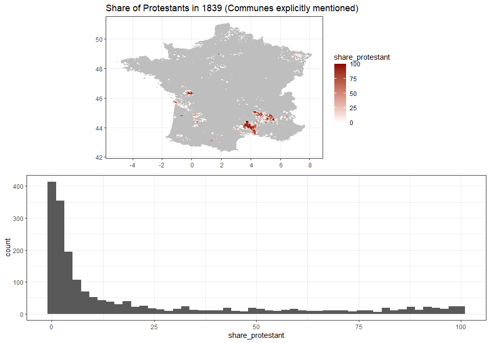
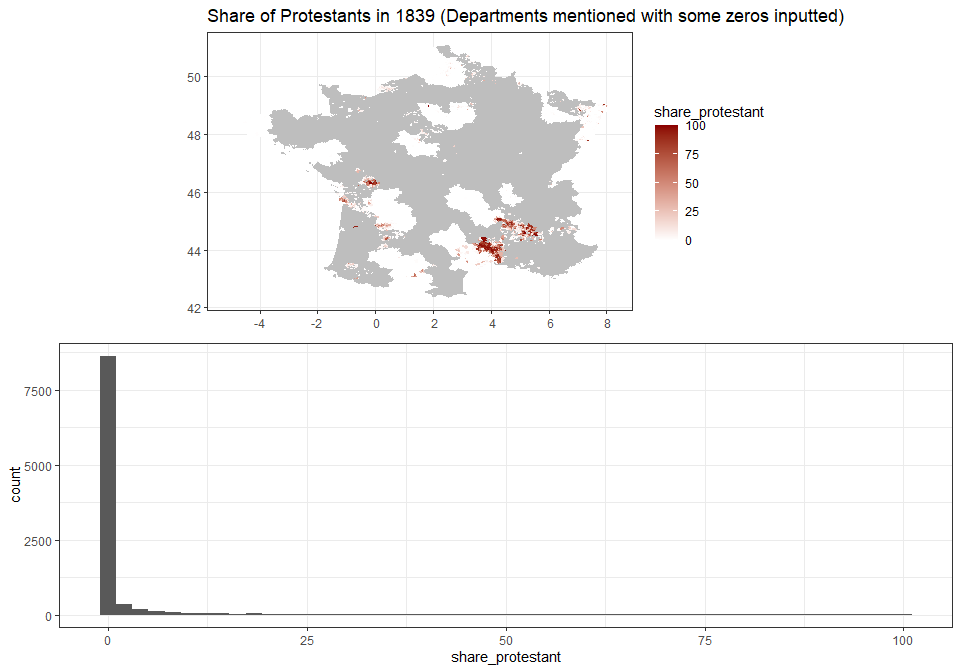
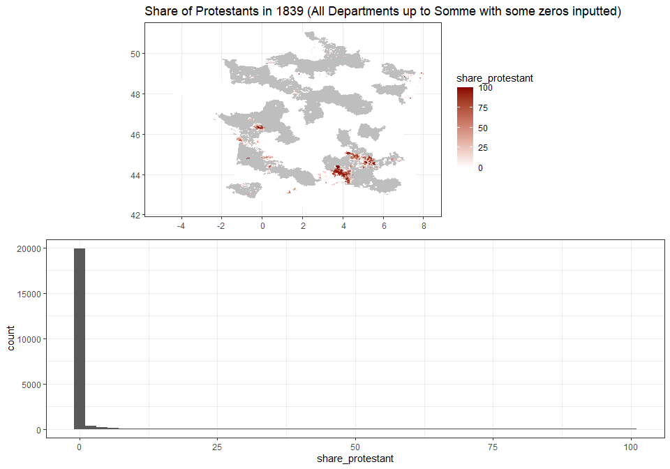
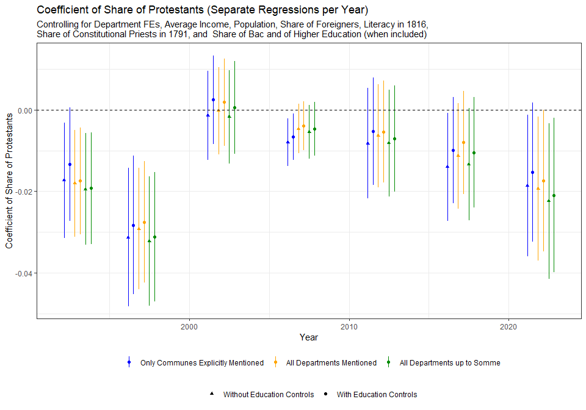
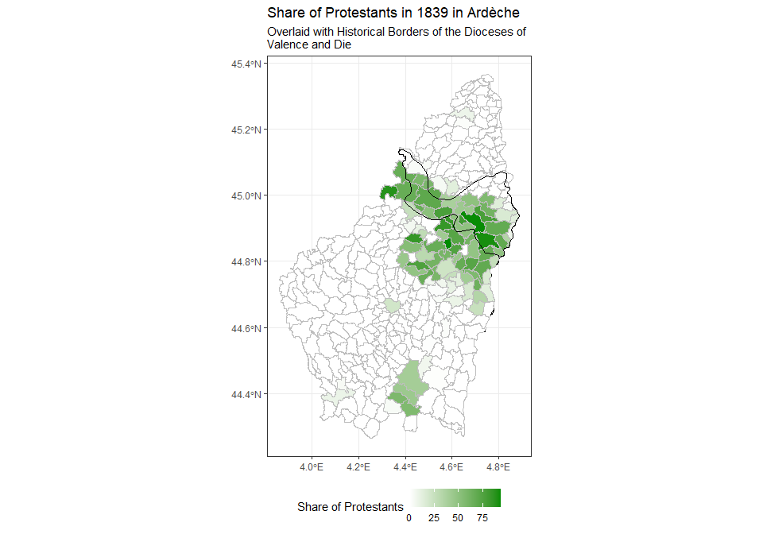
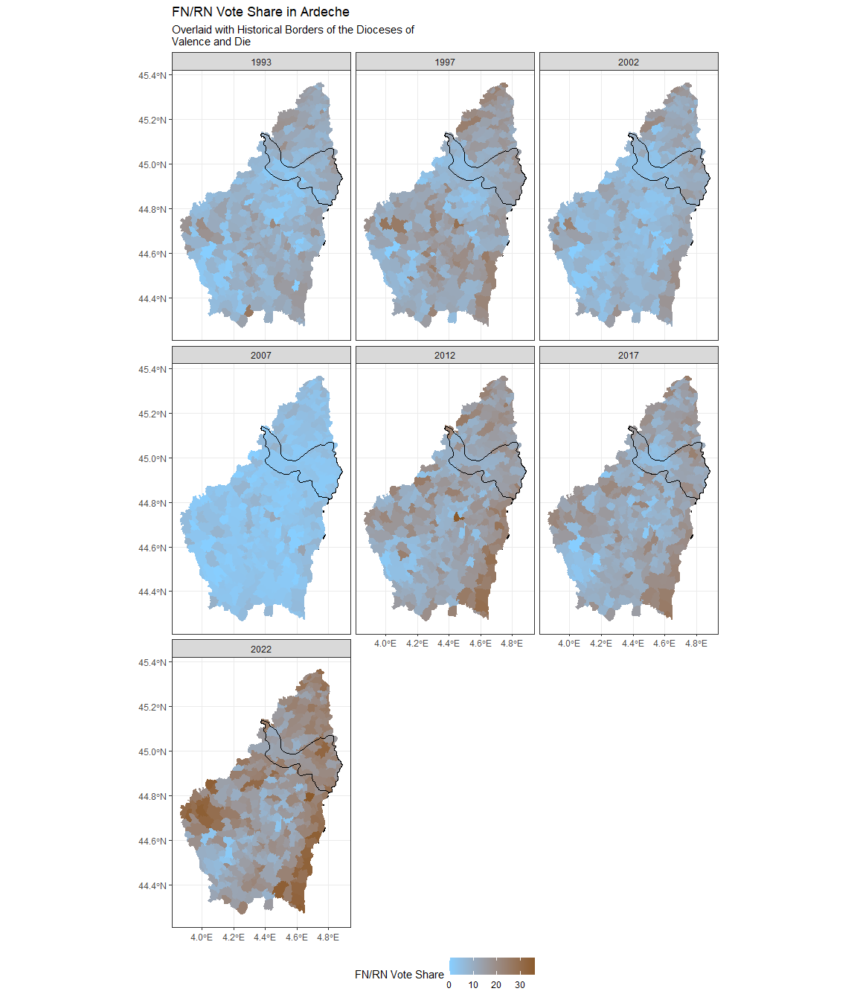
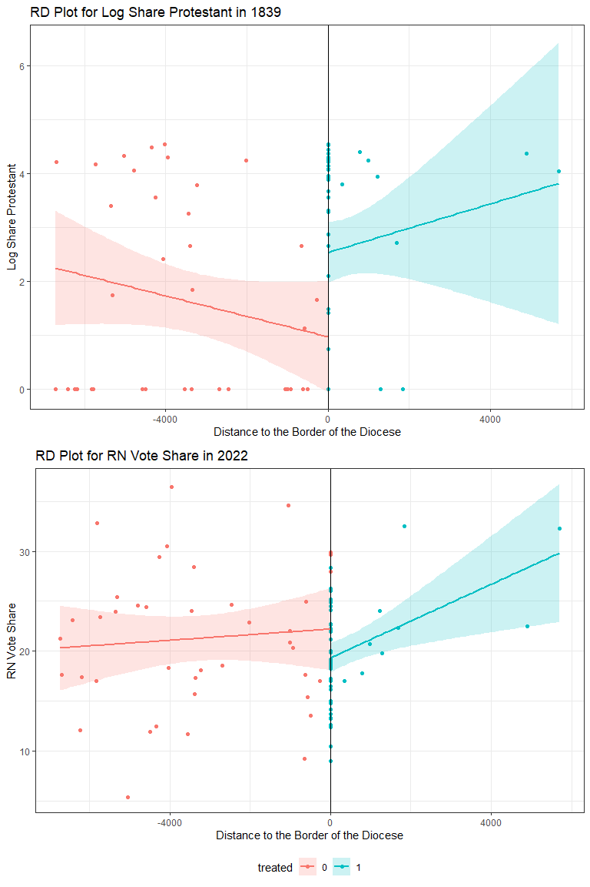

Protestantism Code
================
Duarte Amaro
2026-05-15

# Cleaning the hand-transcribed data

``` r
d_prots_1 <- read_xlsx("Protestants by Commune - 1839.xlsx") |>
  rename(
    code_insee = `Code INSEE`,
    code_insee_full = `Code INSEE (Department, Arrondissement, Canton, Commune)`,
    pop_general = `Population générale`,
    pop_protestant = `Population Protestante`,
    pop_protestant_section = `Population protestante par section`,
    dist = `Distance du chef-lieu de chaque commune au chef-lieu de la section`,
    residence = `Résidence du pasteur`,
    obs = `...16`
  ) |>
  mutate(
    Departement = as.character(Departement),
    Eglise = as.character(Eglise),
    Consistoire = as.character(Consistoire),
    Numeros = as.numeric(Numeros),
    Noms = as.character(Noms),
    Temples = as.character(Temples),
    Communes = as.character(Communes),
    code_insee = as.character(code_insee),
    code_insee_full = as.character(code_insee_full),
    pop_general = as.character(pop_general),
    pop_protestant = as.character(pop_protestant),
    pop_protestant_section = as.character(pop_protestant_section),
    dist = as.character(dist),
    residence = as.character(residence),
    Pasteur = as.character(Pasteur),
    obs = as.character(obs),
    obs_2 = NA_character_
  )


d_prots_2 <- read_xlsx("Protestants by Commune - 1839.xlsx", sheet = 2) |>
  rename(
    code_insee = `Code INSEE`,
    pop_general = `Population générale`,
    pop_protestant = `Population Protestante`,
    pop_protestant_section = `Population protestante par section`,
    dist = `Distance du chef-lieu de chaque commune au chef-lieu de la section`,
    residence = `Résidence du pasteur`,
    obs = `...15`,
    obs_2 = `...16`
  ) |>
  mutate(
    Departement = as.character(Departement),
    Eglise = as.character(Eglise),
    Consistoire = as.character(Consistoire),
    Numeros = as.numeric(Numeros),
    Noms = as.character(Noms),
    Temples = as.character(Temples),
    Communes = as.character(Communes),
    code_insee = as.character(code_insee),
    code_insee_full = NA_character_,
    pop_general = as.character(pop_general),
    pop_protestant = as.character(pop_protestant),
    pop_protestant_section = as.character(pop_protestant_section),
    dist = as.character(dist),
    residence = as.character(residence),
    Pasteur = as.character(Pasteur),
    obs = as.character(obs),
    obs_2 = as.character(code_insee_full)
  ) |>
  filter(!(Departement %in% c("Tarn", "Tarn et Garonne")))

d_prots <- bind_rows(d_prots_1, d_prots_2)


d_issues <- d_prots |> 
  filter(
    (code_insee %in% unique(d_prots$code_insee[duplicated(d_prots$code_insee) == TRUE])) | !is.na(obs) | !is.na(obs_2)) |>
  dplyr::select(Departement, Communes, code_insee, pop_general, pop_protestant, obs, obs_2)

nrow(d_issues)
```

    ## [1] 316

``` r
#View(d_issues |> filter(is.na(code_insee)))
```

UP TO TARN: There are 316 rows which might be problematic, including
repeated codes or observations left during coding.

Most rows lacking an INSEE code correspond to observations without
reference to a concrete commune. Some mention a specific locality within
a commune (e.g., Maine-Geoffroy in Royan or Saint-Césaire in Nîmes).
These can be safely discarded.

One case relates to two observations for the commune of Les
Salles-du-Gardon. One of them describes the left shore of the Gardon and
corresponds geographically to the commune of La Grand-Combe, formed in
1846. The other describes the right shore of the Gardon, corresponding
to the current commune of Les Salles-du-Gardon. The population mentioned
for the first is the historical record for the entire pre-1846 commune.
We have population estimates for both communes from 1846, when La
Grand-Combe had 4 011 people and Les Salles-du-Gardon had 1 041. If the
proportion had been the same in 1839, then out of the entire 1 224
people, about 972 would have lived in La Grand-Combe and 252 in Les
Salles-du-Gardon. I will therefore assign the first observation to the
modern-day commune of La Grand-Combe and the second to the modern-day
commune of Les Salles-du-Gardon, with the population in each of them
adjusted accordingly. These two communes should be removed from the
analysis as a robustness check.

``` r
d_salles <- d_issues |>
  filter(Communes %in% c("La Fovède, ou la partie de la commune des Salles, rive droite du Gardon", "La Grand Combe, ou la partie de la commune des Salles, rive gauche du Gardon")) |>
  mutate(
    code_insee = case_when(
      Communes == "La Fovède, ou la partie de la commune des Salles, rive droite du Gardon" ~ "30307",
      Communes == "La Grand Combe, ou la partie de la commune des Salles, rive gauche du Gardon" ~ "30132"
    ),
    pop_general = case_when(
      Communes == "La Fovède, ou la partie de la commune des Salles, rive droite du Gardon" ~ 252,
      Communes == "La Grand Combe, ou la partie de la commune des Salles, rive gauche du Gardon" ~ 972
    ),
    Communes = case_when(
      Communes == "La Fovède, ou la partie de la commune des Salles, rive droite du Gardon" ~ "Les Salles-du-Gardon",
      Communes == "La Grand Combe, ou la partie de la commune des Salles, rive gauche du Gardon" ~ "La Grand-Combe"
    )
  )
```

The other observations without a corresponding INSEE code are
observations where no particular commune is mentioned; instead, the
authors simply state ‘neighbouring communes’ or give a number of
communes without specifying which these relate. We can estimate which
communes these relate to by manually looking at a map and assuming that
they are the neighbouring communes, and then simply divide the number of
protestants among them (either equally or according to the population of
each commune). Another option is to exclude any communes not explicitly
mentioned from the analysis. A final option is to simply assign communes
not explicitly mentioned a value of 0, which would bias the results
towards finding no effect. For now, I will simply exclude these from the
analysis.

We can now move to cases where there is an INSEE code but the commune is
either duplicated or no longer exists.

We have the following mergers: Saint-Maurice (17300), which merged with
the the commune of La Rochelle (same code); Agonnay (17397) which merged
with Saint-Savinien (same code); Rouquette, Saint-Sulpice-d’Eymet, and
Cogulot (24167) which all merged with Eymet (same code); Le Canet and La
Rouquette (24335) which merged with Port-Sainte-Foy-et-Ponchapt (same
code); Puyguulhem and Mombos (24549) which merged with Thénac (same
code); La Répara (26020) which merged with La Répara-Auriples;
L’Escoulin (26128) which merged with Eygluy-Escoulin; La Bâtie-Crémazin
(26136) which merged with Val-Maravel; Béconne (26276) merged with
Roche-Saint-Secret-Béconne; La Ville-l’Évêque (28036) merged with
Berchères-sur-Vesgre; Mainterne and Vitray-sous-Brézolles (28120) merged
with Crucey-Villages; Bourneville (28190) merged with Guillonville;
Cambo (30058) merged with La Cadière-et-Cambo; Saint-Martin-de-Sossenac
(30106) merged with Durfort-et-Saint-Martin-de-Sossenac; Cézas (30325)
merged with Sumène; Paroisse-du-Vigan (30350) merged with Le Vigan;
Appelles (33369) merged with Saint-André-et-Appelles; Saint-Nazaire
(33378) merged with Saint-Avit-Saint-Nazaire; Le Pouzat (7204) merged
with Saint-Agrève; Naves (7334) merged with Les Vans; Ecoman (41273) was
merged with Vievy-le-Rayé (41273); Saint-Gayrand (47112) was merged with
Grateloup-Saint-Gayrand (47112); , Saint-Vincent (47038) was merged with
Bourran (47038); Lesterne (47213) was merged with Prayssas (47213);
Saint-Amant (47276) was merged with Saint-Sardos (47276); Etussan
(47143) was merged with Lavardac (47143); Limon (47097) was merged with
Feugarolles (47097); Angviller (57086) was merged into Belles-Forêts
(57086); Landonvillers (57155) was merged into Courcelles-Chaussy
(57155); Fives (59350), Moulins-Lille (59350), and Wazemmes (59350) were
merged into Lille (59350); Selvigny (59631) was merged with
Walincourt-Selvigny (59631); Audencourt (59139) was merged with Caudry
(59139); Ranchicourt (62693) was merged with Rebreuve-Ranchicourt
(62693); Sainte-Suzanne (64430) was merged with Orthez (64430);
Montestrucq (64440) was merged with Ozenx-Montestrucq (64440); Arance
(64396), Gouze (64396), and Lendresse (64396) were merged with Mont
(64396); Bezing (64133) was merged with Boeil-Bezing (64133); Cassaber
(64168) was merged with Carresee-Cassaber (64168); Aspis (64071) was
merged with Athos-Aspis (64071); Bideren (64083) and Saint-Martin
(64083) were merged with Autevielle-Saint-Martin-Bideren (64083);
Parenties (64251) merged with Guinarthe-Parenties (64251); Rivareyte
(64435) merged with Osserain-Rivareyte (64435); Arrive (64480) and
Munein (64480) merged with Saint-Gladie-Arrive-Munein (64480); Camu
(64096) merged with Barraute-Camu (64096); Saint-Esprit (64102) merged
with Bayonne (64102); Hanhoffen (67046) merged with Bischwiller (67046);
Niederseebach (67351) merged with Seebach (67351); Altenstadt (67544)
merged with Wissembourg (67544); Birlenbach (67104) merged with
Drachenbronn-Birlenbach (67104); Griesbach-le-Bastberg (67061) merged
with Bouxwiller (67061); Bischtroff-sur-Sarre (67435) and Zollingen
(67435) merged with Sarrewerden (67435); Wiler (67183) merged with
Harskirchen (67183); Dornach (68224) merged with Mulhouse (68224);
Saint-Rambert-l’île-Barbe (69123) merged with Lyon (69123); Valasse
(76329) merged with Gruchet-le-Valasse (76329); Bielleville (76543)
merged with Rouville (76543); Buglise (76167) and Rimbertot (76167)
merged with Cauville-sur-Mer (76167); Ecuquetot (76716) merged with
Turretot (76716); Émalleville (76650) merged with
Saint-Sauveur-d’Émalleville (76650); Graville-Sainte-Honorine (76351),
Bléville (76351), Sanvic (76351) merged with Le Havre (76351);
L’Enclave-de-la-Martinière (79264) merged with
Saint-Léger-de-la-Martinière (79264); Montigné (79061) and
Verrines-sous-Celles (79061) merged with Celles-sur-Belle (79061);
Souché (79191), Sainte-Pezenne (79191), Saint-Florent (79191), and
Saint-Liguaire (79191) merged with Niort (79191); Saint Carlais (79048)
and Chavagné (79048) merged with La Crèche (79048); Saint-Denis (79066)
merged with Champdenier-Saint-Denis (79066); Rouvre (79133) merged with
Germond-Rouvre (79133); La Ronde (79123) merged with La Forêt-sur-Sèvre
(79123); Plantières (57463), itself listed twice, is merged into Metz
(57463), as well as Devant-les-Ponts (57463); Vallières-lès-Metz (57463)
and Magny (57463); Vineuil-Saint-Firmin (60695) merged with Vinueil
(60695).

``` r
d_merged <- d_issues |>
  filter(code_insee %in% c("17300", "17397", "24167", "24335", "24549", "26020", "26128", "26136", "26276", "28036", "28120", "28190", "30058", "30106", "30325", "30350", "33369", "33378", "7204", "7334", "41273", "47112", "47213", "47038", "47213", "47276", "47143", "47097", "57086", "57155", "59350", "59631", "59139", "62693", "64430", "64440", "64396", "64133", "64168", "64071", "64083", "64251", "64435", "64480", "64096", "64102", "67046", "67351", "67544", "67104", "67061", "67435", "67183", "68224", "69123", "76329" , "76543" , "76167" , "76716" , "76650" , "76351" , "79264", "79061", "79191", "79048", "79066", "79133" , "79123", "57463", "60695")) |>
  mutate(pop_general = as.numeric(pop_general),
         pop_protestant = as.numeric(pop_protestant)) |>
  group_by(code_insee) |>
  summarise(
    Departement = first(Departement),
    Communes = first(Communes),
    pop_general = sum(pop_general),
    pop_protestant = sum(pop_protestant, na.rm = TRUE),
    obs = NA
  ) |>
  mutate(
    Communes = case_when(#code_insee %in% c("17300", "17397", "24167", "24335", "24549", "26020", "26128", "26136", "26276", "28036", "28190", "30106", "30350", "33369", "33378", "7204", "7334") ~ first(Communes),
                         code_insee == "28120" ~ "Crucey-Villages",
                         code_insee == "30058" ~ "La Cadière-et-Cambo",
                         code_insee == "30325" ~ "Sumène",
                         .default = Communes
                         )
  )
```

We then have cases where the same commune is mentioned twice. The true
protestant population is therefore either the sum of each entry or one
of the listed values.

For cases where it is only one the values, I have followed the
conservative approach of using the lesser one. We have the case of
Arvert (17021), mentioned twice with the same general population but
different values of Protestants (658 and 727). As the sum is greater
than the overall population, these are presumably two different measures
of the same population. I will go with the conservative approach and use
the lower value. Rémuzat (26264) is also listed twice although the
protestant population could not retrieved from the first entry; I’ll
assume the second entry corresponds to the true value. Pommiers (30199)
is a similar case, listed twice with the same general population but
with different values for the protestant population. I will assume the
lower value is correct. La Chefresne (50128) listed twice, with the same
values for both general and Protestant population, suggesting double
counting. Athis-de-l’Orne (61007), Flers (61169), Alençon (61001),
Sainte-Honorine-la-Chardonne (61407), Berjou (61044),
Montilly-sur-Noireau (61287) and Frênes (61177) are listed twice with
the same data, so I will assume that they have been double-counted.

Cherbourg (50129) is similarly listed twice though with similar but
different values. I assume double-counting and will take the higher
value for both the general (13395) and the Protestant (360) populations.

``` r
d_duplicates_1 <- d_issues |>
  filter(code_insee %in% c("17021", "26264", "30199", "50128",
                           "61007", "61169", "61001", "61407", 
                           "61044", "61287", "61177")) |> 
  mutate(pop_general = as.numeric(pop_general),
         pop_protestant = as.numeric(pop_protestant)) |>
  group_by(code_insee) |>
  summarise(
    Departement = first(Departement),
    Communes = first(Communes),
    pop_general = max(pop_general),
    pop_protestant = min(pop_protestant, na.rm = TRUE),
    obs = NA
  ) |>
  bind_rows(
    d_issues |>
      filter(code_insee %in% c("50129")) |> 
      mutate(pop_general = as.numeric(pop_general),
             pop_protestant = as.numeric(pop_protestant)) |>
      group_by(code_insee) |>
      summarise(
        Departement = first(Departement),
        Communes = first(Communes),
        pop_general = max(pop_general),
        pop_protestant = max(pop_protestant, na.rm = TRUE),
        obs = NA
      )
  )
```

In the case of Marennes (17219), the same commune is listed twice and in
immediate succession. One of the entries has a population a little above
the registered overall population, at 4900 inhabitants, while the other
is quite below at around 490. It would hardly be the case that the
overall population corresponds to their sum; instead, the second entry
probably refers to another commune and was mistakenly inputted as
Marennes. I will therefore assume both population values are correct in
the first entry. Chabeuil (26064) is also listed twice, once as ‘Portion
de Chabeuil’. It’s made clear that the second entry corresponds to the
whole Protestant population. Two entries were identified as referring to
Saint-Germain-du-Seudre (17342), although one was only listed as
Saint-Germain. It is possible that it refers to another commune, so I
will assume that the second entry is the only correct one. Montdardier
(30176) is listed twice, once with a slightly greater general population
and another time with a value in line with the Cassini figures. The
number of Prostestants differs - I will assume again the more
conservative figure is correct. Péronville (28296) appears to be listed
twice: once with a seemingly incorrect overall population and a
protestant population of 20, and another time with a population more in
line with the Cassini estimates but without listing the protestant
population. I will assume the population was 20 but flagging this for
the future. Similarly, Pranles (7184) is listed twice, once with a
correct general population and another time with a much smaller general
population. I will assume the second entry, with the correct population,
is the more trustworthy value for the Protestant population as well.

``` r
d_marennes <- d_issues |> 
  filter(code_insee == "17219" & pop_general == "4942")

d_chabeuil <- d_issues |> 
  filter(code_insee == "26064" & pop_general == "4295")

d_saint_germain <- d_issues |> 
  filter(code_insee == "17342" & pop_general == "812")

d_montdardier <- d_issues |> 
  filter(code_insee == "30176" & pop_general == "715")

d_peronville <- d_issues |> 
  filter(code_insee == "28296" & pop_general == "586") |>
  mutate(pop_protestant = "20")

d_pranles <- d_issues |>
  filter(code_insee == "7184" & pop_general == "1775")

d_duplicates_2 <- bind_rows(
  d_marennes,
  d_chabeuil,
  d_saint_germain,
  d_montdardier,
  d_peronville,
  d_pranles
)
```

Cases where the number of Protestants corresponds to the sum of each
entry are more straighforward. Bois (17050) is similarly mentioned twice
and with the same population. In this case, however, the values for the
Protestant population are very small (10 and 13). It is possible that
the real Protestant population here corresponds to their sum and I will
therefore consider it as such. The case of Gageac-et-Rouillac (24193) is
similar: the overall population listed is the same, the number of
protestants differs and is quite small by reference to the overall
population (50 and 70). Same goes for Verteuil (47317), Villeton
(47325), Clermont (60157), Houchain (62456), Fomperron (79121). Josnes
(41105) is listed twice, with a similar overall population (1503 vs
1500) and different Protestant population numbers (216 vs 400). The
second listing mentions a particular canton, and it seems reasonable to
assume that the correct number is their sum. Gardonne (24194) is listed
twice, once as Partie Nord and another as Partie Sud. The overall
population is the same but the protestant population differs, indicating
that the total corresponds to their sum (140 and 47). Lasalle Prunet
(48186) is similar. Dourbies (30105) is also listed twice with the same
general population but differing in their protestant population (30 and
40), which corresponds, I will assume, to their sum. Barr (67021) is
listed twice, once as the proper commune and another time as La scierie,
Commune de Barr. The overall population listed is the same but the
Protestant population differs, suggesting that the overall Protestant
population corresponds to their sum. Saint-Frézal-de-Ventalon (48175) is
listed twice, without any indication of the general population, but
mentions of a *partie est* and a *partie ouest* suggest that the
Protestant population corresponds to its sum.

Les Ollières-sur-Eyrieux (7167) is listed twice with the total number of
protestants corresponding to the sum, but with different population
values. The overall population seems, on the basis of the Cassini
figures, to correspond roughly to their sum as well. The same goes for
Saint-Étienne-Vallée-Française (48148).

Finally, we have cases like Saint-André-de-Majencoules (30229), which is
listed twice, once as Hameau du Roy dans la commune de
Saint-André-de-Majencoules, which suggests that the protestant
population in the overall commune corresponds to their sum while the
overall population is the greater value. Similarly, Giencourt (listed
under 60107) is a locality of Breuil-le-Vert (60107) - the Protestant
population seems to have been counted separately. Saint-Julien-lès-Metz
(57616) is also listed twice, in the first occurrence seemingly as a
part of the commune and without listing the general population. Laventie
(62491) is listed twice, first without an indication of the general
population and with 22 Protestants, and then with a general population
of 4415 and a Protestant population of 15. I will assume the Protestant
population corresponds to its sum. Saint-Michel-de-Dèze (48173) is
similarly listed twice, and the Protestant population likely corresponds
to the sum. However, the general population for the second half is not
listed - and that for the first half is unlikely to correspond to the
entire population. For these cases, I will sum the Protestant population
and keep the greater value for the overall population.

``` r
d_duplicates_3 <- d_issues |>
  filter(code_insee %in% c("17050", "24193", "47317", "47325", "60157", "62456", "79121", "41105", "24194", "48186", "30105", "67021", "48175")) |> 
  mutate(pop_general = as.numeric(pop_general),
         pop_protestant = as.numeric(pop_protestant)) |>
  group_by(code_insee) |>
  summarise(
    Departement = first(Departement),
    Communes = first(Communes),
    pop_general = first(pop_general),
    pop_protestant = sum(pop_protestant, na.rm = TRUE),
    obs = NA
  ) |>
  bind_rows(
    d_issues |>
      filter(code_insee %in% c("7167", "48148")) |> 
      mutate(pop_general = as.numeric(pop_general),
             pop_protestant = as.numeric(pop_protestant)) |>
      group_by(code_insee) |>
      summarise(
        Departement = first(Departement),
        Communes = first(Communes),
        pop_general = sum(pop_general, na.rm = TRUE),
        pop_protestant = sum(pop_protestant, na.rm = TRUE),
        obs = NA
      ),
    d_issues |>
        filter(code_insee %in% c("30229", "60107", "57616", "62491", "48173")) |> 
        mutate(pop_general = as.numeric(pop_general),
               pop_protestant = as.numeric(pop_protestant)) |>
        group_by(code_insee) |>
        summarise(
            Departement = first(Departement),
            Communes = first(Communes),
            pop_general = max(pop_general, na.rm = TRUE),
            pop_protestant = sum(pop_protestant, na.rm = TRUE),
            obs = NA
        )
  )


d_solved <- bind_rows(
  d_salles |>
    mutate(pop_general = as.numeric(pop_general),
             pop_protestant = as.numeric(pop_protestant)),
  d_merged,
  d_duplicates_1,
  d_duplicates_2 |>
    mutate(pop_general = as.numeric(pop_general),
             pop_protestant = as.numeric(pop_protestant)),
  d_duplicates_3
)
```

We also have some entries where the population or the number of
Protestants could not be established, many of which because there is no
concrete commune to which the entry refers. There is also one
observation where the Protestant population is greater than the overall
population, Collorgues (30086). This value has been checked again
against the digitised records and the mistake is not in the
transcription. The observation has been discarded.

For Le Chambon-Feugerolles (42044) and Firminy (42095), the Protestant
population of 60 is listed for the two. Same for Saint Chamond (42207)
and Rive-de-Gier (42186) and their joint Protestant population of 65.

There are 1894 clean observations.

``` r
d_clean <- d_prots |>
  filter(!(code_insee %in% unique(d_issues$code_insee)) & 
           !(code_insee %in% c("42044", "42095", "42207", "42186"))) |>
  dplyr::select(Departement, Communes, code_insee, pop_general, pop_protestant, obs) |>
  mutate(pop_general = as.numeric(pop_general),
         pop_protestant = as.numeric(pop_protestant)) |>
  bind_rows(d_solved) |>
  filter(!is.na(pop_general) & !is.na(pop_protestant) & pop_protestant <= pop_general) |>
  mutate(
    share_protestant = 100 * pop_protestant / pop_general
  )
```

While for some departments some observations state a rough number of
communes, making it impossible to infer the number of protestants in the
communes not explicitly mentioned, in others this is not the case and we
could, in theory, assume that there are no Protestants in any communes
not explicitly mentioned

``` r
d_missing <- d_prots |> 
  mutate(pop_general_num = as.numeric(pop_general),
         pop_protestant_num = as.numeric(pop_protestant)) |>
  filter(is.na(pop_general_num) | is.na(pop_protestant_num) | (code_insee %in% c("42044", "42095", 
                                                                                 "42207", "42186"))
         )

names <- unique(d_clean$Departement[!(d_clean$Departement %in% unique(d_missing$Departement))])
```

# Adding Geospatial Data

``` r
comm <- read_sf("commune-frmetdrom/COMMUNE_FRMETDROM.shp") |>
  filter(!(INSEE_DEP %in% c("971", "972", "973", "974", "976", "2A", "2B"))) |>
  rename(code_insee = INSEE_COM)
```

Each of the three following maps and corresponding dataframes follows
one approach: 1) simply assign a value for the share of Protestants in
1839 to the communes explicitly mentioned in the original document,
leaving all others NA; 2) as before, but also assigning a value of 0 to
communes in departments mentioned in the original document and where no
ambiguous “surrounding communes” are mentioned (e.g., Ariège (09), for
which we have information on the concrete protestant population of some
communes but no reference to any more dispersed population); 3) as
before, but further assigning asigning a value of 0 to all communes in
departments which should have been covered in the original document
(i.e., any departments alphabetically prior to Somme) but which are not
mentioned.

``` r
d_map_1 <- full_join(d_clean |> 
            mutate(code_insee = as.numeric(code_insee)), 
          comm |>
            mutate(code_insee = as.numeric(code_insee)), by = "code_insee")

d_map_2 <- full_join(d_clean |> 
            mutate(code_insee = as.numeric(code_insee)), 
          comm |>
            mutate(code_insee = as.numeric(code_insee)), by = "code_insee") |>
  mutate(
    share_protestant = case_when(
      !is.na(share_protestant) ~ share_protestant,
      is.na(share_protestant) & INSEE_DEP %in% c("09", "12", "16", "24", 
                                                 "29", "31", "32", "34", 
                                                 "43", "44", "41", "54", 
                                                 "62", "63", "67", "68", 
                                                 "69", "77", "78", "92", 
                                                 "91", "80") ~ 0,
      .default = NA
    )
  )
  

deps <- unique(
  d_map_2$INSEE_DEP[!(
    d_map_2$INSEE_DEP %in% unique(d_map_2$INSEE_DEP[!is.na(d_map_2$share_protestant)])) & 
      as.numeric(d_map_2$INSEE_DEP) < 80]
  )

d_map_3 <- full_join(d_clean |> 
            mutate(code_insee = as.numeric(code_insee)), 
          comm |>
            mutate(code_insee = as.numeric(code_insee)), by = "code_insee") |>
  mutate(
    share_protestant = case_when(
      !is.na(share_protestant) ~ share_protestant,
      is.na(share_protestant) & 
        INSEE_DEP %in% c("09", "12", "16", "24", 
                         "29", "31", "32", "34", 
                         "43", "44", "41", "54", 
                         "62", "63", "67", "68", 
                         "69", "77", "78", "92", 
                         "91", "80") ~ 0,
      is.na(share_protestant) &
        INSEE_DEP %in% deps ~ 0,
      .default = NA
    )
  )
  

cowplot::plot_grid(d_map_1 |>
                     ggplot() +
                     geom_sf(aes(geometry = geometry,
                                 fill = share_protestant), colour = NA) +
                     scale_fill_gradient(low = "white", high = "red4",
                                         na.value = "grey") +
                     labs(title = "Share of Protestants in 1839 (Communes explicitly mentioned)"),
                   d_map_1 |>
                     ggplot() +
                     geom_histogram(aes(x = share_protestant), bins = 50),
                   ncol = 1)
```

<!-- -->

``` r
cowplot::plot_grid(d_map_2 |>
                     ggplot() +
                     geom_sf(aes(geometry = geometry,
                                 fill = share_protestant), colour = NA) +
                     scale_fill_gradient(low = "white", high = "red4",
                                         na.value = "grey") +
                     labs(title = "Share of Protestants in 1839 (Departments mentioned with some zeros inputted)"),
                   d_map_2 |>
                     ggplot() +
                     geom_histogram(aes(x = share_protestant), bins = 50),
                   ncol = 1)
```

<!-- -->

``` r
cowplot::plot_grid(d_map_3 |>
                     ggplot() +
                     geom_sf(aes(geometry = geometry,
                                 fill = share_protestant), colour = "NA") +
                     scale_fill_gradient(low = "white", high = "red4",
                                         na.value = "grey") +
                     labs(title = "Share of Protestants in 1839 (All Departments up to Somme with some zeros inputted)"),
                   d_map_3 |>
                     ggplot() +
                     geom_histogram(aes(x = share_protestant), bins = 50),
                   ncol = 1)
```

<!-- -->

# Adding Electoral Data

``` r
d2022 <- read_csv("cage_piketty/leg2022comm.csv")

d2017 <- read_csv("cage_piketty/leg2017comm.csv")

d2012 <- read_csv("cage_piketty/leg2012comm.csv")

d2007 <- read_csv("cage_piketty/leg2007comm.csv")

d2002 <- read_csv("cage_piketty/leg2002comm.csv")

d1997 <- read_csv("cage_piketty/leg1997comm.csv")

d1993 <- read_csv("cage_piketty/leg1993comm.csv")


d_FN <- bind_rows(
  d2022 |> 
    dplyr::select(dep, nomdep, codecommune, nomcommune, pvoixRN, pvoixLR) |>
    mutate(year = 2022),
  d2017 |> 
    dplyr::select(dep, nomdep, codecommune, nomcommune, pvoixFN, pvoixLR) |>
    mutate(year = 2017),
  d2012 |> 
    dplyr::select(dep, nomdep, codecommune, nomcommune, pvoixFN, pvoixUMP) |>
    mutate(year = 2012),
  d2007 |> 
    dplyr::select(dep, nomdep, codecommune, nomcommune, pvoixFN, pvoixUMP) |>
    mutate(year = 2007),
  d2002 |> 
    dplyr::select(dep, nomdep, codecommune, nomcommune, pvoixFN, pvoixUMP) |>
    mutate(year = 2002),
  d1997 |> 
    dplyr::select(dep, nomdep, codecommune, nomcommune, pvoixFN, pvoixRPR) |>
    mutate(year = 1997),
  d1993 |> 
    dplyr::select(dep, nomdep, codecommune, nomcommune, pvoixFN, pvoixRPR) |>
    mutate(year = 1993)
) |>
  mutate(
    pvoixRN = case_when(
      year == 2022 ~ 100*pvoixRN,
      .default = 100*pvoixFN),
    pvoixLR = case_when(
      year %in% c(2022, 2017) ~ 100*pvoixLR,
      year %in% c(2012, 2007, 2002) ~ 100*pvoixUMP,
      year %in% c(1997, 1993) ~ 100*pvoixRPR
    )
    ) |>
  mutate(code_insee = as.numeric(codecommune)) |>
  right_join(d_map_1 |> filter(!is.na(share_protestant)))

d_FN_2 <- bind_rows(
  d2022 |> 
    dplyr::select(dep, nomdep, codecommune, nomcommune, pvoixRN, pvoixLR) |>
    mutate(year = 2022),
  d2017 |> 
    dplyr::select(dep, nomdep, codecommune, nomcommune, pvoixFN, pvoixLR) |>
    mutate(year = 2017),
  d2012 |> 
    dplyr::select(dep, nomdep, codecommune, nomcommune, pvoixFN, pvoixUMP) |>
    mutate(year = 2012),
  d2007 |> 
    dplyr::select(dep, nomdep, codecommune, nomcommune, pvoixFN, pvoixUMP) |>
    mutate(year = 2007),
  d2002 |> 
    dplyr::select(dep, nomdep, codecommune, nomcommune, pvoixFN, pvoixUMP) |>
    mutate(year = 2002),
  d1997 |> 
    dplyr::select(dep, nomdep, codecommune, nomcommune, pvoixFN, pvoixRPR) |>
    mutate(year = 1997),
  d1993 |> 
    dplyr::select(dep, nomdep, codecommune, nomcommune, pvoixFN, pvoixRPR) |>
    mutate(year = 1993)
) |>
  mutate(
    pvoixRN = case_when(
      year == 2022 ~ 100*pvoixRN,
      .default = 100*pvoixFN),
    pvoixLR = case_when(
      year %in% c(2022, 2017) ~ 100*pvoixLR,
      year %in% c(2012, 2007, 2002) ~ 100*pvoixUMP,
      year %in% c(1997, 1993) ~ 100*pvoixRPR
    )
    ) |>
  mutate(code_insee = as.numeric(codecommune)) |>
  right_join(d_map_2 |> filter(!is.na(share_protestant)))

d_FN_3 <- bind_rows(
  d2022 |> 
    dplyr::select(dep, nomdep, codecommune, nomcommune, pvoixRN, pvoixLR) |>
    mutate(year = 2022),
  d2017 |> 
    dplyr::select(dep, nomdep, codecommune, nomcommune, pvoixFN, pvoixLR) |>
    mutate(year = 2017),
  d2012 |> 
    dplyr::select(dep, nomdep, codecommune, nomcommune, pvoixFN, pvoixUMP) |>
    mutate(year = 2012),
  d2007 |> 
    dplyr::select(dep, nomdep, codecommune, nomcommune, pvoixFN, pvoixUMP) |>
    mutate(year = 2007),
  d2002 |> 
    dplyr::select(dep, nomdep, codecommune, nomcommune, pvoixFN, pvoixUMP) |>
    mutate(year = 2002),
  d1997 |> 
    dplyr::select(dep, nomdep, codecommune, nomcommune, pvoixFN, pvoixRPR) |>
    mutate(year = 1997),
  d1993 |> 
    dplyr::select(dep, nomdep, codecommune, nomcommune, pvoixFN, pvoixRPR) |>
    mutate(year = 1993)
) |>
  mutate(
    pvoixRN = case_when(
      year == 2022 ~ 100*pvoixRN,
      .default = 100*pvoixFN),
    pvoixLR = case_when(
      year %in% c(2022, 2017) ~ 100*pvoixLR,
      year %in% c(2012, 2007, 2002) ~ 100*pvoixUMP,
      year %in% c(1997, 1993) ~ 100*pvoixRPR
    )
    ) |>
  mutate(code_insee = as.numeric(codecommune)) |>
  right_join(d_map_3 |> filter(!is.na(share_protestant)))
```

Below is a simple regression of RN/FN voteshare since 1993 and the share
of Protestants. For each method of dealing with NAs (see discussion
above), I estimate a model with year FEs and another with year and
department FEs.

``` r
m1 <- lm(data = d_FN |> mutate(year = as.character(year)), pvoixRN ~ share_protestant + year)

m2 <- lm(data = d_FN|> mutate(year = as.character(year)), pvoixRN ~ share_protestant + year + dep)

m3 <- lm(data = d_FN_2 |> mutate(year = as.character(year)), pvoixRN ~ share_protestant + year)

m4 <- lm(data = d_FN_2 |> mutate(year = as.character(year)), pvoixRN ~ share_protestant + year + dep)

m5 <- lm(data = d_FN_3 |> mutate(year = as.character(year)), pvoixRN ~ share_protestant + year)

m6 <- lm(data = d_FN_3 |> mutate(year = as.character(year)), pvoixRN ~ share_protestant + year + dep)

modelsummary(list(m1, m2, m3, m4, m5, m6
                  ), 
             vcov = "robust", 
             stars = TRUE,
             coef_omit = "year|dep",
             coef_map = c(
               "(Intercept)" = "Constant",
               "share_protestant" = "Share of Protestants in 1839"),
             gof_map = tibble::tribble(~raw, ~clean, ~fmt,
                                       "nobs", "N", 0,
                                       "r.squared", "R^2", 2,
                                       "adj.r.squared", "Adj. R^2", 2),
             add_rows = tibble::tribble(
               ~term, ~m1, ~m2, ~m3, ~m4, ~m5, ~m6,
               "Year FE", "Yes", "Yes", "Yes", "Yes", "Yes", "Yes",
               "Department FE", "No", "Yes", "No", "Yes", "No", "Yes"
             ),
             #output = "table1.tex",
             #output = "text"
             )
```

<table style="width:95%;">
<colgroup>
<col style="width: 28%" />
<col style="width: 11%" />
<col style="width: 11%" />
<col style="width: 11%" />
<col style="width: 11%" />
<col style="width: 11%" />
<col style="width: 11%" />
</colgroup>
<thead>
<tr>
<th></th>
<th><ol type="1">
<li></li>
</ol></th>
<th><ol start="2" type="1">
<li></li>
</ol></th>
<th><ol start="3" type="1">
<li></li>
</ol></th>
<th><ol start="4" type="1">
<li></li>
</ol></th>
<th><ol start="5" type="1">
<li></li>
</ol></th>
<th><ol start="6" type="1">
<li></li>
</ol></th>
</tr>
</thead>
<tbody>
<tr>
<td>Constant</td>
<td>12.108***</td>
<td>8.261***</td>
<td>10.692***</td>
<td>7.971***</td>
<td>10.365***</td>
<td>7.686***</td>
</tr>
<tr>
<td></td>
<td>(0.149)</td>
<td>(1.627)</td>
<td>(0.059)</td>
<td>(1.692)</td>
<td>(0.040)</td>
<td>(1.748)</td>
</tr>
<tr>
<td>Share of Protestants in 1839</td>
<td>-0.025***</td>
<td>-0.019***</td>
<td>-0.005*</td>
<td>-0.014***</td>
<td>-0.004*</td>
<td>-0.014***</td>
</tr>
<tr>
<td></td>
<td>(0.002)</td>
<td>(0.002)</td>
<td>(0.002)</td>
<td>(0.002)</td>
<td>(0.002)</td>
<td>(0.002)</td>
</tr>
<tr>
<td>N</td>
<td>13160</td>
<td>13160</td>
<td>70627</td>
<td>70627</td>
<td>149500</td>
<td>149500</td>
</tr>
<tr>
<td>R^2</td>
<td>0.37</td>
<td>0.54</td>
<td>0.37</td>
<td>0.52</td>
<td>0.36</td>
<td>0.53</td>
</tr>
<tr>
<td>Adj. R^2</td>
<td>0.37</td>
<td>0.53</td>
<td>0.37</td>
<td>0.52</td>
<td>0.36</td>
<td>0.53</td>
</tr>
<tr>
<td>Year FE</td>
<td>Yes</td>
<td>Yes</td>
<td>Yes</td>
<td>Yes</td>
<td>Yes</td>
<td>Yes</td>
</tr>
<tr>
<td>Department FE</td>
<td>No</td>
<td>Yes</td>
<td>No</td>
<td>Yes</td>
<td>No</td>
<td>Yes</td>
</tr>
</tbody><tfoot>
<tr>
<td colspan="7"><ul>
<li>p &lt; 0.1, * p &lt; 0.05, ** p &lt; 0.01, *** p &lt; 0.001</li>
</ul></td>
</tr>
</tfoot>
&#10;</table>

# Adding Controls

We can now add some controls, including measures of religiosity (as
measured by the share of constitutional priests in 1791, mean revenue,
the share of the population with a baccalauréat or higher, and the share
of the population with higher education). I am also including historic
measures of human capital such as the literacy rate in 1816.

``` r
religiosite1791 <- read_csv("cage_piketty/religiositecommunes1791.csv") |>
  dplyr::select(dep, nomdep, codecommune, nomcommune, pserment1791)

alphabetisation <- read_csv("cage_piketty/alphabetisationcommunes.csv") |> 
  dplyr::select(dep, nomdep, codecommune, nomcommune, 
                starts_with(c("pc")) & 
                  ends_with(c("1686", "1816", "1854")))

revenus0 <- read_csv("cage_piketty/revcommunes.csv") |>
  dplyr::select(dep, nomdep, codecommune, nomcommune, 
                ends_with(c("1839", "1993", "1997", 
                            "2002", "2007", "2012", "2017", "2022")))

revenus <- revenus0 |>
  dplyr::select(dep, nomdep, codecommune, nomcommune, 
                starts_with(c("revmoy1", "revmoy2"))) |>
  pivot_longer(cols = starts_with("rev"),
               names_to = "Year",
               values_to = "revmoy") |>
  mutate(Year = str_sub(Year, -4, -1)) |>
  full_join(revenus0 |>
  dplyr::select(dep, nomdep, codecommune, nomcommune, 
                starts_with(c("pop"))) |>
  pivot_longer(cols = starts_with("pop"),
               names_to = "Year",
               values_to = "pop") |>
  mutate(Year = str_sub(Year, -4, -1)))

diplomes <- read_csv("cage_piketty/diplomescommunes.csv") |>
   dplyr::select(dep, nomdep, codecommune, nomcommune, 
                 starts_with(c("pb", "ps")) & 
                   ends_with(c("1993", "1997", "2002", 
                               "2007", "2012", "2017", "2022"))) |>
  mutate(
    nomcommune = case_when(codecommune == "35363" ~ "PONT-PEAN",
                           .default = nomcommune)
  ) |>
  filter(codecommune != "91692") ## The name of the commune is listed as Butry-sur-Oise (which is in the wrong department and has a different code)

diplomes <- diplomes |> 
  pivot_longer(cols = starts_with("pbac"), 
               names_to = "Year", 
               values_to = "pbac") |>
  mutate(Year = str_sub(Year, -4, -1)) |> 
  full_join(diplomes |> 
              pivot_longer(cols = starts_with("psup"), 
                           names_to = "Year", values_to = "psup") |> 
              mutate(Year = str_sub(Year, -4, -1))) |> 
  dplyr::select(-ends_with(c("1993", "1997", "2002", 
                             "2007", "2012", "2017", "2022")))
etrangers <- read_csv("cage_piketty/etrangerscommunes.csv") |> 
  dplyr::select(dep, nomdep, codecommune, nomcommune, 
                starts_with(c("petranger")) & 
                  ends_with(c("1993", "1997", "2002", 
                              "2007", "2012", "2017", "2022"))) |>
  pivot_longer(cols = starts_with("petranger"), 
               names_to = "Year", values_to = "petranger") |>
  mutate(Year = str_sub(Year, -4, -1))


d_controls <- full_join(diplomes, 
                        revenus |>
                          rename(nomcommune_2 = nomcommune), 
                        by = c("dep", "nomdep", "codecommune", "Year")) |>
  full_join(religiosite1791 |>
              rename(nomcommune_3 = nomcommune,
                     nomdep_3 = nomdep),
            by = c("dep", "codecommune")
            ) |>
  full_join(alphabetisation|>
              rename(nomcommune_4 = nomcommune),
            by = c("dep", "nomdep", "codecommune")
            ) |>
  full_join(etrangers|>
              rename(nomcommune_5 = nomcommune),
            by = c("dep", "nomdep", "codecommune", "Year")
            ) |>
  dplyr::select(-c(nomcommune_2, nomcommune_3, nomdep_3, nomcommune_4, nomcommune_5))

nrow(d_controls) == 7*(c(revenus$codecommune, diplomes$codecommune, religiosite1791$codecommune, alphabetisation$codecommune, etrangers$codecommune) |> unique() |> length())
```

    ## [1] TRUE

``` r
d_FN_controls <- left_join(d_FN |>
                             mutate(Year = as.character(year)), 
                           d_controls, by = c("dep", "nomdep", "codecommune", 
                                              "nomcommune", "Year")) |>
  filter(!is.na(Year))

d_FN_controls_2 <- left_join(d_FN_2 |>
                               mutate(Year = as.character(year)), 
                             d_controls, by = c("dep", "nomdep", "codecommune", 
                                                "nomcommune", "Year")) |>
  filter(!is.na(Year))

d_FN_controls_3 <- left_join(d_FN_3 |>
                               mutate(Year = as.character(year)), 
                             d_controls, by = c("dep", "nomdep", "codecommune", 
                                                "nomcommune", "Year")) |>
  filter(!is.na(Year))
```

With the most liberal approach to dealing with NAs, we find a
statistically significant negative association between the share of
Protestants in 1839 and the vote share of the RN/FN since 1993:

``` r
m1 <- lm(data = d_FN_controls_3 |> 
           mutate(year = as.character(year)), 
         pvoixRN ~ share_protestant + year)

m2 <- lm(data = d_FN_controls_3 |> 
           mutate(year = as.character(year)),
         pvoixRN ~ share_protestant + year + dep)

m3 <- lm(data = d_FN_controls_3 |> 
           mutate(year = as.character(year)),
         pvoixRN ~ share_protestant + year + dep + revmoy + pop + petranger)

m4 <- lm(data = d_FN_controls_3 |> 
           mutate(year = as.character(year)),
         pvoixRN ~ share_protestant + year + dep + revmoy + pop + petranger + psup)

m5 <- lm(data = d_FN_controls_3 |> 
           mutate(year = as.character(year)),
         pvoixRN ~ share_protestant + year + dep + revmoy + pop + petranger + psup + pbac)

m6 <- lm(data = d_FN_controls_3 |> 
           mutate(year = as.character(year)),
         pvoixRN ~ share_protestant + year + dep + revmoy + pop + petranger + psup + pbac + pconjsign1816)

m7 <- lm(data = d_FN_controls_3 |> 
           mutate(year = as.character(year)),
         pvoixRN ~ share_protestant + year + dep + revmoy + pop + petranger + psup + pbac + pconjsign1816 + pserment1791)

m8 <- lm(data = d_FN_controls_3 |> 
           mutate(year = as.character(year)),
         psup ~ share_protestant + year + dep + revmoy + pop + petranger)

m9 <- lm(data = d_FN_controls_3 |> 
           mutate(year = as.character(year)),
         psup ~ share_protestant + year + dep + revmoy + pop + petranger + pconjsign1816)

m10 <- lm(data = d_FN_controls_3 |> 
           mutate(year = as.character(year)),
         pconjsign1816 ~ share_protestant + year + dep + revmoy + pop + petranger)

modelsummary(dvnames(list(m1, m2, m3, m4, m5, m6, m7, m8, m9, m10
                  )), 
             vcov = "robust", 
             stars = TRUE,
             
             coef_omit = "year|dep",
             coef_map = c(
               "(Intercept)" = "Constant",
               "share_protestant" = "Share of Protestants in 1839",
               "revmoy" = "Average income",
               "pop" = "Population", 
               "petranger" = "Percentage of foreigners",
               "psup" = "Percentage of people with higher education",
               "pbac" = "Percentage of people with the bac",
               "pconjsign1816" = "Literacy in 1816",
               "pserment1791" = "Share of constitutional priests in 1791"
               ),
             gof_map = tibble::tribble(~raw, ~clean, ~fmt,
                                       "nobs", "N", 0,
                                       "r.squared", "R^2", 2,
                                       "adj.r.squared", "Adj. R^2", 2),
             add_rows = tibble::tribble(
               ~term, ~m1, ~m2, ~m3, ~m4, ~m5, ~m6, ~m7, ~m8, ~m9, ~m10,
               "Year FE", "Yes", "Yes", "Yes", "Yes", "Yes", "Yes", "Yes", "Yes", "Yes", "Yes",
               "Department FE", "No", "Yes", "Yes", "Yes", "Yes", "Yes", "Yes", "Yes", "Yes", "Yes",
             ),
             #output = "table1.tex",
             #output = "text"
             )
```

<table style="width:95%;">
<colgroup>
<col style="width: 24%" />
<col style="width: 6%" />
<col style="width: 6%" />
<col style="width: 6%" />
<col style="width: 6%" />
<col style="width: 7%" />
<col style="width: 8%" />
<col style="width: 8%" />
<col style="width: 5%" />
<col style="width: 5%" />
<col style="width: 8%" />
</colgroup>
<thead>
<tr>
<th></th>
<th>pvoixRN</th>
<th>pvoixRN</th>
<th>pvoixRN</th>
<th>pvoixRN</th>
<th>pvoixRN</th>
<th>pvoixRN</th>
<th>pvoixRN</th>
<th>psup</th>
<th>psup</th>
<th>pconjsign1816</th>
</tr>
</thead>
<tbody>
<tr>
<td>Constant</td>
<td>10.365***</td>
<td>7.686***</td>
<td>13.904***</td>
<td>14.932***</td>
<td>15.022***</td>
<td>15.380***</td>
<td>15.433***</td>
<td>0.133***</td>
<td>0.121***</td>
<td>0.472***</td>
</tr>
<tr>
<td></td>
<td>(0.040)</td>
<td>(1.748)</td>
<td>(1.714)</td>
<td>(1.686)</td>
<td>(1.694)</td>
<td>(1.696)</td>
<td>(1.745)</td>
<td>(0.025)</td>
<td>(0.024)</td>
<td>(0.054)</td>
</tr>
<tr>
<td>Share of Protestants in 1839</td>
<td>-0.004*</td>
<td>-0.014***</td>
<td>-0.013***</td>
<td>-0.011***</td>
<td>-0.011***</td>
<td>-0.011***</td>
<td>-0.013***</td>
<td>0.000***</td>
<td>0.000***</td>
<td>0.000*</td>
</tr>
<tr>
<td></td>
<td>(0.002)</td>
<td>(0.002)</td>
<td>(0.003)</td>
<td>(0.003)</td>
<td>(0.003)</td>
<td>(0.003)</td>
<td>(0.003)</td>
<td>(0.000)</td>
<td>(0.000)</td>
<td>(0.000)</td>
</tr>
<tr>
<td>Average income</td>
<td></td>
<td></td>
<td>0.000***</td>
<td>0.000***</td>
<td>0.000***</td>
<td>0.000***</td>
<td>0.000***</td>
<td>0.000***</td>
<td>0.000***</td>
<td>0.000***</td>
</tr>
<tr>
<td></td>
<td></td>
<td></td>
<td>(0.000)</td>
<td>(0.000)</td>
<td>(0.000)</td>
<td>(0.000)</td>
<td>(0.000)</td>
<td>(0.000)</td>
<td>(0.000)</td>
<td>(0.000)</td>
</tr>
<tr>
<td>Population</td>
<td></td>
<td></td>
<td>0.000***</td>
<td>0.000***</td>
<td>0.000***</td>
<td>0.000**</td>
<td>0.000+</td>
<td>0.000***</td>
<td>0.000***</td>
<td>0.000***</td>
</tr>
<tr>
<td></td>
<td></td>
<td></td>
<td>(0.000)</td>
<td>(0.000)</td>
<td>(0.000)</td>
<td>(0.000)</td>
<td>(0.000)</td>
<td>(0.000)</td>
<td>(0.000)</td>
<td>(0.000)</td>
</tr>
<tr>
<td>Percentage of foreigners</td>
<td></td>
<td></td>
<td>-12.752***</td>
<td>-12.184***</td>
<td>-12.130***</td>
<td>-11.718***</td>
<td>-13.424***</td>
<td>0.074***</td>
<td>0.060***</td>
<td>0.462***</td>
</tr>
<tr>
<td></td>
<td></td>
<td></td>
<td>(0.751)</td>
<td>(0.742)</td>
<td>(0.743)</td>
<td>(0.745)</td>
<td>(0.827)</td>
<td>(0.015)</td>
<td>(0.015)</td>
<td>(0.025)</td>
</tr>
<tr>
<td>Percentage of people with higher education</td>
<td></td>
<td></td>
<td></td>
<td>-7.744***</td>
<td>-6.851***</td>
<td>-6.733***</td>
<td>-6.235***</td>
<td></td>
<td></td>
<td></td>
</tr>
<tr>
<td></td>
<td></td>
<td></td>
<td></td>
<td>(0.278)</td>
<td>(0.459)</td>
<td>(0.459)</td>
<td>(0.486)</td>
<td></td>
<td></td>
<td></td>
</tr>
<tr>
<td>Percentage of people with the bac</td>
<td></td>
<td></td>
<td></td>
<td></td>
<td>-0.980*</td>
<td>-1.007**</td>
<td>-1.220**</td>
<td></td>
<td></td>
<td></td>
</tr>
<tr>
<td></td>
<td></td>
<td></td>
<td></td>
<td></td>
<td>(0.383)</td>
<td>(0.383)</td>
<td>(0.404)</td>
<td></td>
<td></td>
<td></td>
</tr>
<tr>
<td>Literacy in 1816</td>
<td></td>
<td></td>
<td></td>
<td></td>
<td></td>
<td>-0.819***</td>
<td>-0.882***</td>
<td></td>
<td>0.025***</td>
<td></td>
</tr>
<tr>
<td></td>
<td></td>
<td></td>
<td></td>
<td></td>
<td></td>
<td>(0.104)</td>
<td>(0.114)</td>
<td></td>
<td>(0.002)</td>
<td></td>
</tr>
<tr>
<td>Share of constitutional priests in 1791</td>
<td></td>
<td></td>
<td></td>
<td></td>
<td></td>
<td></td>
<td>0.262</td>
<td></td>
<td></td>
<td></td>
</tr>
<tr>
<td></td>
<td></td>
<td></td>
<td></td>
<td></td>
<td></td>
<td></td>
<td>(0.164)</td>
<td></td>
<td></td>
<td></td>
</tr>
<tr>
<td>N</td>
<td>149500</td>
<td>149500</td>
<td>97902</td>
<td>97898</td>
<td>97898</td>
<td>97820</td>
<td>84672</td>
<td>97906</td>
<td>97828</td>
<td>97832</td>
</tr>
<tr>
<td>R^2</td>
<td>0.36</td>
<td>0.53</td>
<td>0.56</td>
<td>0.57</td>
<td>0.57</td>
<td>0.57</td>
<td>0.59</td>
<td>0.40</td>
<td>0.40</td>
<td>0.48</td>
</tr>
<tr>
<td>Adj. R^2</td>
<td>0.36</td>
<td>0.53</td>
<td>0.56</td>
<td>0.57</td>
<td>0.57</td>
<td>0.57</td>
<td>0.59</td>
<td>0.40</td>
<td>0.40</td>
<td>0.48</td>
</tr>
<tr>
<td>Year FE</td>
<td>Yes</td>
<td>Yes</td>
<td>Yes</td>
<td>Yes</td>
<td>Yes</td>
<td>Yes</td>
<td>Yes</td>
<td>Yes</td>
<td>Yes</td>
<td>Yes</td>
</tr>
<tr>
<td>Department FE</td>
<td>No</td>
<td>Yes</td>
<td>Yes</td>
<td>Yes</td>
<td>Yes</td>
<td>Yes</td>
<td>Yes</td>
<td>Yes</td>
<td>Yes</td>
<td>Yes</td>
</tr>
</tbody><tfoot>
<tr>
<td colspan="11"><ul>
<li>p &lt; 0.1, * p &lt; 0.05, ** p &lt; 0.01, *** p &lt; 0.001</li>
</ul></td>
</tr>
</tfoot>
&#10;</table>

This holds if we restrict to the communes explicitly mentioned in the
original document.

``` r
m1 <- lm(data = d_FN_controls |> 
           mutate(year = as.character(year)), 
         pvoixRN ~ share_protestant + year)

m2 <- lm(data = d_FN_controls|> 
           mutate(year = as.character(year)),
         pvoixRN ~ share_protestant + year + dep)

m3 <- lm(data = d_FN_controls|> 
           mutate(year = as.character(year)),
         pvoixRN ~ share_protestant + year + dep + revmoy + pop + petranger)

m4 <- lm(data = d_FN_controls|> 
           mutate(year = as.character(year)),
         pvoixRN ~ share_protestant + year + dep + revmoy + pop + petranger + psup)

m5 <- lm(data = d_FN_controls|> 
           mutate(year = as.character(year)),
         pvoixRN ~ share_protestant + year + dep + revmoy + pop + petranger + psup + pbac)

m6 <- lm(data = d_FN_controls|> 
           mutate(year = as.character(year)),
         pvoixRN ~ share_protestant + year + dep + revmoy + pop + petranger + psup + pbac + pconjsign1816)

m7 <- lm(data = d_FN_controls|> 
           mutate(year = as.character(year)),
         pvoixRN ~ share_protestant + year + dep + revmoy + pop + petranger + psup + pbac + pconjsign1816 + pserment1791)

m8 <- lm(data = d_FN_controls|> 
           mutate(year = as.character(year)),
         psup ~ share_protestant + year + dep + revmoy + pop + petranger + pconjsign1816 + pserment1791)


modelsummary(dvnames(list(m1, m2, m3, m4, m5, m6, m7, m8)), 
             vcov = "robust", 
             stars = TRUE,
             
             coef_omit = "year|dep",
             coef_map = c(
               "(Intercept)" = "Constant",
               "share_protestant" = "Share of Protestants in 1839",
               "revmoy" = "Average income",
               "pop" = "Population", 
               "petranger" = "Percentage of foreigners",
               "psup" = "Percentage of people with higher education",
               "pbac" = "Percentage of people with the bac",
               "pconjsign1816" = "Literacy in 1816",
               "pserment1791" = "Share of constitutional priests in 1791"),
             gof_map = tibble::tribble(~raw, ~clean, ~fmt,
                                       "nobs", "N", 0,
                                       "r.squared", "R^2", 2,
                                       "adj.r.squared", "Adj. R^2", 2),
             add_rows = tibble::tribble(
               ~term, ~m1, ~m2, ~m3, ~m4, ~m5, ~m6, ~m7, ~m8,
               "Year FE", "Yes", "Yes", "Yes", "Yes", "Yes", "Yes", "Yes", "Yes",
               "Department FE", "No", "Yes", "Yes", "Yes", "Yes", "Yes", "Yes", "Yes"
             ),
             #output = "table1.tex",
             #output = "text"
             )
```

<table style="width:96%;">
<colgroup>
<col style="width: 28%" />
<col style="width: 7%" />
<col style="width: 7%" />
<col style="width: 8%" />
<col style="width: 8%" />
<col style="width: 8%" />
<col style="width: 9%" />
<col style="width: 10%" />
<col style="width: 6%" />
</colgroup>
<thead>
<tr>
<th></th>
<th>pvoixRN</th>
<th>pvoixRN</th>
<th>pvoixRN</th>
<th>pvoixRN</th>
<th>pvoixRN</th>
<th>pvoixRN</th>
<th>pvoixRN</th>
<th>psup</th>
</tr>
</thead>
<tbody>
<tr>
<td>Constant</td>
<td>12.108***</td>
<td>8.261***</td>
<td>13.477***</td>
<td>14.222***</td>
<td>14.343***</td>
<td>14.851***</td>
<td>18.478***</td>
<td>0.069*</td>
</tr>
<tr>
<td></td>
<td>(0.149)</td>
<td>(1.627)</td>
<td>(1.754)</td>
<td>(1.755)</td>
<td>(1.771)</td>
<td>(1.791)</td>
<td>(1.829)</td>
<td>(0.027)</td>
</tr>
<tr>
<td>Share of Protestants in 1839</td>
<td>-0.025***</td>
<td>-0.019***</td>
<td>-0.016***</td>
<td>-0.013***</td>
<td>-0.013***</td>
<td>-0.013***</td>
<td>-0.011***</td>
<td>0.000***</td>
</tr>
<tr>
<td></td>
<td>(0.002)</td>
<td>(0.002)</td>
<td>(0.003)</td>
<td>(0.003)</td>
<td>(0.003)</td>
<td>(0.003)</td>
<td>(0.003)</td>
<td>(0.000)</td>
</tr>
<tr>
<td>Average income</td>
<td></td>
<td></td>
<td>0.000***</td>
<td>0.000</td>
<td>0.000</td>
<td>0.000</td>
<td>0.000</td>
<td>0.000***</td>
</tr>
<tr>
<td></td>
<td></td>
<td></td>
<td>(0.000)</td>
<td>(0.000)</td>
<td>(0.000)</td>
<td>(0.000)</td>
<td>(0.000)</td>
<td>(0.000)</td>
</tr>
<tr>
<td>Population</td>
<td></td>
<td></td>
<td>0.000***</td>
<td>0.000**</td>
<td>0.000**</td>
<td>0.000+</td>
<td>0.000*</td>
<td>0.000***</td>
</tr>
<tr>
<td></td>
<td></td>
<td></td>
<td>(0.000)</td>
<td>(0.000)</td>
<td>(0.000)</td>
<td>(0.000)</td>
<td>(0.000)</td>
<td>(0.000)</td>
</tr>
<tr>
<td>Percentage of foreigners</td>
<td></td>
<td></td>
<td>-12.931***</td>
<td>-10.278***</td>
<td>-10.166***</td>
<td>-7.995**</td>
<td>-9.996***</td>
<td>0.164***</td>
</tr>
<tr>
<td></td>
<td></td>
<td></td>
<td>(2.636)</td>
<td>(2.562)</td>
<td>(2.572)</td>
<td>(2.582)</td>
<td>(2.618)</td>
<td>(0.050)</td>
</tr>
<tr>
<td>Percentage of people with higher education</td>
<td></td>
<td></td>
<td></td>
<td>-12.464***</td>
<td>-10.937***</td>
<td>-10.873***</td>
<td>-9.947***</td>
<td></td>
</tr>
<tr>
<td></td>
<td></td>
<td></td>
<td></td>
<td>(0.944)</td>
<td>(1.648)</td>
<td>(1.652)</td>
<td>(1.754)</td>
<td></td>
</tr>
<tr>
<td>Percentage of people with the bac</td>
<td></td>
<td></td>
<td></td>
<td></td>
<td>-1.610</td>
<td>-1.492</td>
<td>-2.790+</td>
<td></td>
</tr>
<tr>
<td></td>
<td></td>
<td></td>
<td></td>
<td></td>
<td>(1.365)</td>
<td>(1.371)</td>
<td>(1.469)</td>
<td></td>
</tr>
<tr>
<td>Literacy in 1816</td>
<td></td>
<td></td>
<td></td>
<td></td>
<td></td>
<td>-2.028***</td>
<td>-2.046***</td>
<td>0.014*</td>
</tr>
<tr>
<td></td>
<td></td>
<td></td>
<td></td>
<td></td>
<td></td>
<td>(0.333)</td>
<td>(0.355)</td>
<td>(0.006)</td>
</tr>
<tr>
<td>Share of constitutional priests in 1791</td>
<td></td>
<td></td>
<td></td>
<td></td>
<td></td>
<td></td>
<td>-6.278***</td>
<td>0.027**</td>
</tr>
<tr>
<td></td>
<td></td>
<td></td>
<td></td>
<td></td>
<td></td>
<td></td>
<td>(0.593)</td>
<td>(0.009)</td>
</tr>
<tr>
<td>N</td>
<td>13160</td>
<td>13160</td>
<td>8803</td>
<td>8802</td>
<td>8802</td>
<td>8802</td>
<td>7615</td>
<td>7615</td>
</tr>
<tr>
<td>R^2</td>
<td>0.37</td>
<td>0.54</td>
<td>0.56</td>
<td>0.57</td>
<td>0.58</td>
<td>0.58</td>
<td>0.58</td>
<td>0.45</td>
</tr>
<tr>
<td>Adj. R^2</td>
<td>0.37</td>
<td>0.53</td>
<td>0.56</td>
<td>0.57</td>
<td>0.57</td>
<td>0.57</td>
<td>0.58</td>
<td>0.44</td>
</tr>
<tr>
<td>Year FE</td>
<td>Yes</td>
<td>Yes</td>
<td>Yes</td>
<td>Yes</td>
<td>Yes</td>
<td>Yes</td>
<td>Yes</td>
<td>Yes</td>
</tr>
<tr>
<td>Department FE</td>
<td>No</td>
<td>Yes</td>
<td>Yes</td>
<td>Yes</td>
<td>Yes</td>
<td>Yes</td>
<td>Yes</td>
<td>Yes</td>
</tr>
</tbody><tfoot>
<tr>
<td colspan="9"><ul>
<li>p &lt; 0.1, * p &lt; 0.05, ** p &lt; 0.01, *** p &lt; 0.001</li>
</ul></td>
</tr>
</tfoot>
&#10;</table>

``` r
results <- d_FN_controls |>
  group_by(Year) |>
  group_modify(~ {
    model <- lm(
      pvoixRN ~ share_protestant + dep + revmoy + pop + petranger + psup + pbac + 
        pconjsign1816 + pserment1791,
      data = .x
    )
    
    tidy(model, conf.int = TRUE) |>
      filter(term == "share_protestant")
  }) |>
  ungroup() |>
  mutate(
    group = "1",
    controls = "With Educ"
  ) |>
  bind_rows(d_FN_controls |>
  group_by(Year) |>
  group_modify(~ {
    model <- lm(
      pvoixRN ~ share_protestant + dep + revmoy + pop + petranger + 
        pconjsign1816 + pserment1791,
      data = .x
    )
    
    tidy(model, conf.int = TRUE) |>
      filter(term == "share_protestant")
  }) |>
  ungroup() |>
  mutate(
    group = "1",
    controls = "No Educ"
  )) |>
  bind_rows(
    d_FN_controls_2 |>
      group_by(Year) |>
      group_modify(~ {
        model <- lm(
          pvoixRN ~ share_protestant + dep + revmoy + pop + petranger + psup + pbac + 
            pconjsign1816 + pserment1791,
          data = .x
        )
        
        tidy(model, conf.int = TRUE) |>
          filter(term == "share_protestant")
      }) |>
      ungroup() |>
      mutate(
        group = "2",
        controls = "With Educ"
      )
  ) |>
  bind_rows(
    d_FN_controls_2 |>
      group_by(Year) |>
      group_modify(~ {
        model <- lm(
          pvoixRN ~ share_protestant + dep + revmoy + pop + petranger + 
            pconjsign1816 + pserment1791,
          data = .x
        )
        
        tidy(model, conf.int = TRUE) |>
          filter(term == "share_protestant")
      }) |>
      ungroup() |>
      mutate(
        group = "2",
        controls = "No Educ"
      )
  ) |>
  bind_rows(
    d_FN_controls_3 |>
      group_by(Year) |>
      group_modify(~ {
        model <- lm(
          pvoixRN ~ share_protestant + dep + revmoy + pop + petranger + psup + pbac + 
            pconjsign1816 + pserment1791,
          data = .x
        )
        
        tidy(model, conf.int = TRUE) |>
          filter(term == "share_protestant")
      }) |>
      ungroup() |>
      mutate(
        group = "3",
        controls = "With Educ"
      )
  ) |>
  bind_rows(
    d_FN_controls_3 |>
      group_by(Year) |>
      group_modify(~ {
        model <- lm(
          pvoixRN ~ share_protestant + dep + revmoy + pop + petranger + 
            pconjsign1816 + pserment1791,
          data = .x
        )
        
        tidy(model, conf.int = TRUE) |>
          filter(term == "share_protestant")
      }) |>
      ungroup() |>
      mutate(
        group = "3",
        controls = "No Educ"
      )
  )

ggplot(results, aes(x = as.numeric(Year), y = estimate, colour = group, shape = controls)) +
  geom_point(position = position_dodge(2)) +
  geom_linerange(aes(ymin = conf.low, ymax = conf.high), 
                width = 0.2,
                position = position_dodge(2)) +
  geom_hline(yintercept = 0, linetype = "dashed") +
  scale_colour_manual(values = c("1" = "blue", "2" = "orange", "3" = "green4"),
                      labels = c("1" = "Only Communes Explicitly Mentioned",
                                 "2" = "All Departments Mentioned",
                                 "3" = "All Departments up to Somme"),
                      name = "") +
  scale_shape_manual(values = c("With Educ" = 16, "No Educ" = 17),
                     labels = c("With Educ" = "With Education Controls",
                                "No Educ" = "Without Education Controls"),
                     name = "") +
  labs(
    x = "Year",
    y = "Coefficient of Share of Protestants",
    title = "Coefficient of Share of Protestants (Separate Regressions per Year)",
    subtitle = "Controlling for Department FEs, Average Income, Population, Share of Foreigners, Literacy in 1816, \nShare of Constitutional Priests in 1791, and  Share of Bac and of Higher Education (when included)"
  ) +
  theme(legend.position = "bottom", legend.box = "vertical")
```

<!-- -->

## Effect of Share of Protestants on RPR/UMP/LR Vote Share

``` r
m1 <- lm(data = d_FN_controls_3|> 
           mutate(year = as.character(year)),
         pvoixLR ~ share_protestant + year + dep + revmoy + pop + petranger + psup + pbac + pconjsign1816)

m2 <- lm(data = d_FN_controls_3|> 
           mutate(year = as.character(year)),
         pvoixLR ~ share_protestant + year + dep + revmoy + pop + petranger + psup + pbac + pconjsign1816 + pserment1791)


modelsummary(list(m1, m2
                  ), 
             vcov = "robust", 
             stars = TRUE,
             
             coef_omit = "year|dep",
             coef_map = c(
               "(Intercept)" = "Constant",
               "share_protestant" = "Share of Protestants in 1839",
               "log(share_protestant + 1)" = "Log of Share of Protestants in 1839",
               "revmoy" = "Average income",
               "pop" = "Population", 
               "petranger" = "Percentage of foreigners",
               "pserment1791" = "Share of constitutional priests in 1791",
               "psup" = "Percentage of people with higher education",
               "pbac" = "Percentage of people with the bac",
               "pconjsign1816" = "Literacy in 1816"),
             gof_map = tibble::tribble(~raw, ~clean, ~fmt,
                                       "nobs", "N", 0,
                                       "r.squared", "R^2", 2,
                                       "adj.r.squared", "Adj. R^2", 2),
             add_rows = tibble::tribble(
               ~term, ~m1, ~m2,
               "Year FE", "Yes", "Yes",
               "Department FE", "Yes", "Yes"
             ),
             #output = "table1.tex",
             #output = "text"
             )
```

<table style="width:96%;">
<colgroup>
<col style="width: 62%" />
<col style="width: 16%" />
<col style="width: 16%" />
</colgroup>
<thead>
<tr>
<th></th>
<th><ol type="1">
<li></li>
</ol></th>
<th><ol start="2" type="1">
<li></li>
</ol></th>
</tr>
</thead>
<tbody>
<tr>
<td>Constant</td>
<td>28.214***</td>
<td>28.265***</td>
</tr>
<tr>
<td></td>
<td>(3.986)</td>
<td>(4.032)</td>
</tr>
<tr>
<td>Share of Protestants in 1839</td>
<td>-0.020***</td>
<td>-0.013*</td>
</tr>
<tr>
<td></td>
<td>(0.006)</td>
<td>(0.006)</td>
</tr>
<tr>
<td>Average income</td>
<td>0.000***</td>
<td>0.000***</td>
</tr>
<tr>
<td></td>
<td>(0.000)</td>
<td>(0.000)</td>
</tr>
<tr>
<td>Population</td>
<td>0.000***</td>
<td>0.000***</td>
</tr>
<tr>
<td></td>
<td>(0.000)</td>
<td>(0.000)</td>
</tr>
<tr>
<td>Percentage of foreigners</td>
<td>-7.972***</td>
<td>-4.419*</td>
</tr>
<tr>
<td></td>
<td>(1.479)</td>
<td>(1.724)</td>
</tr>
<tr>
<td>Share of constitutional priests in 1791</td>
<td></td>
<td>-1.559***</td>
</tr>
<tr>
<td></td>
<td></td>
<td>(0.356)</td>
</tr>
<tr>
<td>Percentage of people with higher education</td>
<td>-5.022***</td>
<td>-4.485***</td>
</tr>
<tr>
<td></td>
<td>(0.721)</td>
<td>(0.753)</td>
</tr>
<tr>
<td>Percentage of people with the bac</td>
<td>1.409*</td>
<td>1.304*</td>
</tr>
<tr>
<td></td>
<td>(0.623)</td>
<td>(0.650)</td>
</tr>
<tr>
<td>Literacy in 1816</td>
<td>-1.986***</td>
<td>-1.658***</td>
</tr>
<tr>
<td></td>
<td>(0.245)</td>
<td>(0.266)</td>
</tr>
<tr>
<td>N</td>
<td>97820</td>
<td>84672</td>
</tr>
<tr>
<td>R^2</td>
<td>0.44</td>
<td>0.44</td>
</tr>
<tr>
<td>Adj. R^2</td>
<td>0.44</td>
<td>0.44</td>
</tr>
<tr>
<td>Year FE</td>
<td>Yes</td>
<td>Yes</td>
</tr>
<tr>
<td>Department FE</td>
<td>Yes</td>
<td>Yes</td>
</tr>
</tbody><tfoot>
<tr>
<td colspan="3"><ul>
<li>p &lt; 0.1, * p &lt; 0.05, ** p &lt; 0.01, *** p &lt; 0.001</li>
</ul></td>
</tr>
</tfoot>
&#10;</table>

# Replicating Siegfried (1949):

Siegfried (1949) argued that the strong results for the Left (or, to put
it another way, the weak results for the Right), in some areas of the
department, were due to the high share of Protestants.

Before we can assume that all communes not explicitly mentioned have no
Protestants at all, we have to address the only vague entry, which
relates to Tournon-sur-Rhône and the surrounding communes. The
immediately surrounding communes (in Ardèche) are Mauves,
Saint-Jean-de-Muzols, Saint-Barthélemy-le-Plain, and Plats. None of
these are listed elsewhere. The current unité urbaine of
Tournon-sur-Rhône includes Mauves and Saint-Jean-de-Muzols, so it seems
fair to assume that these are the closest (economically and socially) to
it.

There were 130 Protestants overall in 1839. The 1836 population census
for Tournon-sur-Rhône was 4 174; that for Mauves was 976; and that for
Saint-Jean-de-Muzols was 801, so 5951 in total. This means the aggregate
share of Protestants was 2.18% for the three. If we include
Saint-Barthélemy-le-Plain (population of 900 in 1836) and Plats (704),
we get a share of 1.72%. If the population was only concentrated in
Tournon-sur-Rhône, that would be 3.11% in that commune alone. I will
assume that the share of Protestants was 0 for Saint-Barthélemy-le-Plan
and Plats and 2.18% for Tournon-sur-Rhône, Mauves, and
Saint-Jean-de-Muzols - but this is flagged here for further analysis.

I assume all other communes not explicitly mentioned have no Protestants
at all.

``` r
temp <- unzip("limites-des-dioceses-de-france-apres-1317.zip")

dioceses <- read_sf("./limites-des-dioceses-de-france-apres-1317.shp") |>
  filter(diocese %in% c("Diocèse de Valence", "Diocèse de Dié")) |>
  rename(diocese_map = geometry)

polygon1 <- d_map_1 |> 
  filter(INSEE_DEP == "07") |> 
  mutate(share_protestant = case_when(
             is.na(share_protestant) ~ 0,
             NOM %in% c("Tournon-sur-Rhône", "Saint-Jean-de-Muzols", "Mauves") ~ 2.18,
             TRUE ~ share_protestant)) |>
  st_as_sf()

polygon2 <- st_transform(dioceses, st_crs(polygon1))

poly2_clip <- st_intersection(polygon2, polygon1)

poly2_clip_dissolved <- st_union(poly2_clip)

poly2_clip_dissolved <- st_sf(geometry = st_sfc(poly2_clip_dissolved, crs = st_crs(polygon1)))

ggplot() +
    geom_sf(data = polygon1, aes(fill = share_protestant), colour = "grey") +
    geom_sf(data = poly2_clip_dissolved, colour = "black", fill = NA) +
  scale_fill_gradient(
    low = "white",
    high = "green4",
    na.value = "black"
  ) +
  labs(
    title = "Share of Protestants in 1839 in Ardèche",
    subtitle = "Overlaid with Historical Borders of the Dioceses of \nValence and Die",
    fill = "Share of Protestants"
  ) +
  theme(legend.position = "bottom") 
```

<!-- -->

Compare to Siegfried’s map:

<figure>

<figcaption aria-hidden="true">Siegfried’s (1949) Map of the Protestant
Population in Ardèche</figcaption>
</figure>

I can now regress FN vote share now on the share of Protestants in 1839:

``` r
d_FN_ardeche <- bind_rows(
  d2022 |> 
    dplyr::select(dep, nomdep, codecommune, nomcommune, pvoixRN) |>
    mutate(year = 2022),
  d2017 |> 
    dplyr::select(dep, nomdep, codecommune, nomcommune, pvoixFN) |>
    mutate(year = 2017),
  d2012 |> 
    dplyr::select(dep, nomdep, codecommune, nomcommune, pvoixFN) |>
    mutate(year = 2012),
  d2007 |> 
    dplyr::select(dep, nomdep, codecommune, nomcommune, pvoixFN) |>
    mutate(year = 2007),
  d2002 |> 
    dplyr::select(dep, nomdep, codecommune, nomcommune, pvoixFN) |>
    mutate(year = 2002),
  d1997 |> 
    dplyr::select(dep, nomdep, codecommune, nomcommune, pvoixFN) |>
    mutate(year = 1997),
  d1993 |> 
    dplyr::select(dep, nomdep, codecommune, nomcommune, pvoixFN) |>
    mutate(year = 1993)
) |>
  mutate(pvoixRN = case_when(
    year == 2022 ~ 100*pvoixRN,
    .default = 100*pvoixFN
  )) |>
  mutate(code_insee = as.numeric(codecommune)) |>
  right_join(d_map_1 |> 
  filter(INSEE_DEP == "07") |> 
  mutate(share_protestant = case_when(
             is.na(share_protestant) ~ 0,
             NOM %in% c("Tournon-sur-Rhône", "Saint-Jean-de-Muzols", "Mauves") ~ 2.18,
             TRUE ~ share_protestant)),
  ) |>
  mutate(Year = as.character(year)) |>
  left_join(d_controls, by = c("dep", "nomdep", "codecommune", 
                                                "nomcommune", "Year"))
```

``` r
m1 <- lm(data = d_FN_ardeche,
         pvoixRN ~ share_protestant + year)

m3 <- lm(data = d_FN_ardeche,
         pvoixRN ~ share_protestant + year + revmoy + pop + petranger)

m4 <- lm(data = d_FN_ardeche,
         pvoixRN ~ share_protestant + year + revmoy + pop + petranger + psup)

m5 <- lm(data = d_FN_ardeche,
         pvoixRN ~ share_protestant + year + revmoy + pop + petranger + psup + pbac)

m6 <- lm(data = d_FN_ardeche,
         pvoixRN ~ share_protestant + year + revmoy + pop + petranger + psup + pbac + pconjsign1816)

# m7 <- lm(data = d_FN_controls |> 
#            filter(nomdep == "ARDECHE") |>
#            mutate(year = as.character(year)),
#          pvoixRN ~ share_protestant + year + revmoy + pop + psup + pbac + pconjsign1816 + pserment1791)

m7 <- lm(data = d_FN_ardeche,
         psup ~ share_protestant + year + revmoy + pop + petranger)

m8 <- lm(data = d_FN_ardeche,
         psup ~ share_protestant + year + revmoy + pop + petranger + pconjsign1816)


modelsummary(dvnames(list(m1, m3, m4, m5, m6, m7, m8
                  )), 
             vcov = "robust", 
             stars = TRUE,
             
             coef_omit = "year",
             coef_map = c(
               "(Intercept)" = "Constant",
               "share_protestant" = "Share of Protestants in 1839",
               "revmoy" = "Average income",
               "pop" = "Population",
               "petranger" = "Percentage of foreigners",
               "psup" = "Percentage of people with higher education",
               "pbac" = "Percentage of people with the bac",
               "pconjsign1816" = "Literacy in 1816"#,
               #"pserment1791" = "Share of constitutional priests in 1791"
               ),
             gof_map = tibble::tribble(~raw, ~clean, ~fmt,
                                       "nobs", "N", 0,
                                       "r.squared", "R^2", 2,
                                       "adj.r.squared", "Adj. R^2", 2),
             add_rows = tibble::tribble(
               ~term, ~m1, ~m3, ~m4, ~m5, ~m6, ~m7, ~m8,
               "Year FE", "Yes", "Yes", "Yes", "Yes", "Yes", "Yes", "Yes"
             ),
             #output = "table1.tex",
             #output = "text"
             )
```

<table style="width:96%;">
<colgroup>
<col style="width: 30%" />
<col style="width: 9%" />
<col style="width: 9%" />
<col style="width: 9%" />
<col style="width: 9%" />
<col style="width: 9%" />
<col style="width: 8%" />
<col style="width: 8%" />
</colgroup>
<thead>
<tr>
<th></th>
<th>pvoixRN</th>
<th>pvoixRN</th>
<th>pvoixRN</th>
<th>pvoixRN</th>
<th>pvoixRN</th>
<th>psup</th>
<th>psup</th>
</tr>
</thead>
<tbody>
<tr>
<td>Constant</td>
<td>-463.648***</td>
<td>-501.115***</td>
<td>-576.745***</td>
<td>-585.136***</td>
<td>-581.399***</td>
<td>-10.398***</td>
<td>-10.197***</td>
</tr>
<tr>
<td></td>
<td>(26.737)</td>
<td>(43.156)</td>
<td>(45.944)</td>
<td>(46.554)</td>
<td>(47.108)</td>
<td>(0.736)</td>
<td>(0.755)</td>
</tr>
<tr>
<td>Share of Protestants in 1839</td>
<td>-0.032***</td>
<td>-0.028***</td>
<td>-0.027***</td>
<td>-0.027***</td>
<td>-0.026***</td>
<td>0.000</td>
<td>0.000</td>
</tr>
<tr>
<td></td>
<td>(0.005)</td>
<td>(0.006)</td>
<td>(0.006)</td>
<td>(0.006)</td>
<td>(0.006)</td>
<td>(0.000)</td>
<td>(0.000)</td>
</tr>
<tr>
<td>Average income</td>
<td></td>
<td>0.000</td>
<td>0.000</td>
<td>0.000</td>
<td>0.000</td>
<td>0.000***</td>
<td>0.000***</td>
</tr>
<tr>
<td></td>
<td></td>
<td>(0.000)</td>
<td>(0.000)</td>
<td>(0.000)</td>
<td>(0.000)</td>
<td>(0.000)</td>
<td>(0.000)</td>
</tr>
<tr>
<td>Population</td>
<td></td>
<td>0.000*</td>
<td>0.000*</td>
<td>0.000*</td>
<td>0.000*</td>
<td>0.000***</td>
<td>0.000*</td>
</tr>
<tr>
<td></td>
<td></td>
<td>(0.000)</td>
<td>(0.000)</td>
<td>(0.000)</td>
<td>(0.000)</td>
<td>(0.000)</td>
<td>(0.000)</td>
</tr>
<tr>
<td>Percentage of foreigners</td>
<td></td>
<td>-44.948***</td>
<td>-41.413***</td>
<td>-40.374***</td>
<td>-40.014***</td>
<td>0.486***</td>
<td>0.500***</td>
</tr>
<tr>
<td></td>
<td></td>
<td>(6.908)</td>
<td>(6.838)</td>
<td>(7.117)</td>
<td>(7.155)</td>
<td>(0.100)</td>
<td>(0.102)</td>
</tr>
<tr>
<td>Percentage of people with higher education</td>
<td></td>
<td></td>
<td>-7.274***</td>
<td>-5.746+</td>
<td>-5.802+</td>
<td></td>
<td></td>
</tr>
<tr>
<td></td>
<td></td>
<td></td>
<td>(1.838)</td>
<td>(3.267)</td>
<td>(3.273)</td>
<td></td>
<td></td>
</tr>
<tr>
<td>Percentage of people with the bac</td>
<td></td>
<td></td>
<td></td>
<td>-1.594</td>
<td>-1.607</td>
<td></td>
<td></td>
</tr>
<tr>
<td></td>
<td></td>
<td></td>
<td></td>
<td>(2.740)</td>
<td>(2.745)</td>
<td></td>
<td></td>
</tr>
<tr>
<td>Literacy in 1816</td>
<td></td>
<td></td>
<td></td>
<td></td>
<td>-0.909</td>
<td></td>
<td>-0.040*</td>
</tr>
<tr>
<td></td>
<td></td>
<td></td>
<td></td>
<td></td>
<td>(1.210)</td>
<td></td>
<td>(0.017)</td>
</tr>
<tr>
<td>N</td>
<td>2345</td>
<td>1608</td>
<td>1608</td>
<td>1608</td>
<td>1608</td>
<td>1608</td>
<td>1608</td>
</tr>
<tr>
<td>R^2</td>
<td>0.13</td>
<td>0.15</td>
<td>0.15</td>
<td>0.15</td>
<td>0.16</td>
<td>0.39</td>
<td>0.39</td>
</tr>
<tr>
<td>Adj. R^2</td>
<td>0.13</td>
<td>0.14</td>
<td>0.15</td>
<td>0.15</td>
<td>0.15</td>
<td>0.39</td>
<td>0.39</td>
</tr>
<tr>
<td>Year FE</td>
<td>Yes</td>
<td>Yes</td>
<td>Yes</td>
<td>Yes</td>
<td>Yes</td>
<td>Yes</td>
<td>Yes</td>
</tr>
</tbody><tfoot>
<tr>
<td colspan="8"><ul>
<li>p &lt; 0.1, * p &lt; 0.05, ** p &lt; 0.01, *** p &lt; 0.001</li>
</ul></td>
</tr>
</tfoot>
&#10;</table>

``` r
polygon3 <- d_FN_ardeche |>
  st_as_sf()
  

ggplot() +
    geom_sf(data = polygon3, aes(fill = pvoixRN), colour = NA) +
    geom_sf(data = poly2_clip_dissolved, colour = "black", fill = NA) +
  scale_fill_gradient(
    low = "skyblue1",
    high = "tan4",
    na.value = "lightgrey"
  ) +
  facet_wrap(~Year) +
  labs(
    title = "FN/RN Vote Share in Ardeche",
    subtitle = "Overlaid with Historical Borders of the Dioceses of \nValence and Die",
    fill = "FN/RN Vote Share"
  ) +
  theme(legend.position = "bottom")
```

<!-- -->

# RDD

``` r
d_rdd <- d_FN_ardeche |> 
  filter(Year == "2022")

d_rdd$treated <- assign_treated(d_rdd |> 
                                  st_as_sf(), 
                                poly2_clip_dissolved |> 
                                  st_as_sf(), 
                                id = "codecommune")

d_rdd$treated[d_rdd$NOM %in% c("Le Pouzin", "Cruas", "Rochemaure")] <- 0

d_rdd$dist2cutoff <- as.numeric(
  sf::st_distance(d_rdd |> 
                    st_as_sf() |>
                    st_transform(crs = 32643), 
                  poly2_clip_dissolved |> 
                    st_as_sf() |> 
                    st_transform(crs = 32643) |>
                    st_cast("MULTILINESTRING")))

d_rdd$distrunning <- d_rdd$dist2cutoff
# give the non-treated one's a negative score
d_rdd$distrunning[d_rdd$treated == 0] <- -1 * d_rdd$distrunning[d_rdd$treated == 0]


d_rdd$log_share_protestant <- log(d_rdd$share_protestant + 1)
```

The logic would be something like what follows graphically, although
here all observations are represented and not just those within a
smaller bandwidth.

``` r
cowplot::plot_grid(
  ggplot(data = d_rdd |>
           filter(d_rdd$dist2cutoff < max(d_rdd$distrunning)), 
         aes(x = distrunning, y = log_share_protestant, 
             colour = treated, fill = treated)) + 
    geom_point() + 
    geom_smooth(method = "lm", alpha = 0.2) +
    geom_vline(xintercept = 0, col = "black") +
    labs(x = "Distance to the Border of the Diocese", 
         y = "Log Share Protestant", 
         title = "RD Plot for Log Share Protestant in 1839") +
    theme(legend.position = "none"),
  ggplot(data = d_rdd |>
           filter(d_rdd$dist2cutoff < max(d_rdd$distrunning)), 
         aes(x = distrunning, y = pvoixRN, 
             colour = treated, fill = treated)) + 
    geom_point() + 
    geom_smooth(method = "lm", alpha = 0.2) +
    geom_vline(xintercept = 0, col = "black") +
    labs(x = "Distance to the Border of the Diocese", 
         y = "RN Vote Share", 
         title = "RD Plot for RN Vote Share in 2022") +
    theme(legend.position = "bottom"),
  ncol = 1
  
)
```

<!-- -->

``` r
summary(rdrobust(y = d_rdd$log_share_protestant, x = d_rdd$distrunning, c = 0))
```

    ## Sharp RD estimates using local polynomial regression.
    ## 
    ## Number of Obs.                  335
    ## BW type                       mserd
    ## Kernel                   Triangular
    ## VCE method                       NN
    ## 
    ## Number of Obs.                  282           53
    ## Eff. Number of Obs.              27           51
    ## Order est. (p)                    1            1
    ## Order bias  (q)                   2            2
    ## BW est. (h)                4974.155     4974.155
    ## BW bias (b)                8314.569     8314.569
    ## rho (h/b)                     0.598        0.598
    ## Unique Obs.                     281           11
    ## 
    ## =====================================================================
    ##                    Point    Robust Inference
    ##                 Estimate         z     P>|z|      [ 95% C.I. ]       
    ## ---------------------------------------------------------------------
    ##      RD Effect     2.179     4.506     0.000     [1.432 , 3.637]     
    ## =====================================================================

``` r
fuzzy_rdd <- rdrobust(y = d_rdd$pvoixRN, x = d_rdd$distrunning, fuzzy = d_rdd$log_share_protestant, c = 0)

summary(fuzzy_rdd)
```

    ## Fuzzy RD estimates using local polynomial regression.
    ## 
    ## Number of Obs.                  335
    ## BW type                       mserd
    ## Kernel                   Triangular
    ## VCE method                       NN
    ## 
    ## Number of Obs.                  282           53
    ## Eff. Number of Obs.              26           50
    ## Order est. (p)                    1            1
    ## Order bias  (q)                   2            2
    ## BW est. (h)                4647.855     4647.855
    ## BW bias (b)                7655.608     7655.608
    ## rho (h/b)                     0.607        0.607
    ## Unique Obs.                     281           11
    ## 
    ## First-stage estimates.
    ## 
    ## =====================================================================
    ##                    Point    Robust Inference
    ##                 Estimate         z     P>|z|      [ 95% C.I. ]       
    ## =====================================================================
    ##      Rd Effect     2.179     4.318     0.000     [1.384 , 3.686]     
    ## =====================================================================
    ## 
    ## Treatment effect estimates.
    ## 
    ## =====================================================================
    ##                    Point    Robust Inference
    ##                 Estimate         z     P>|z|      [ 95% C.I. ]       
    ## ---------------------------------------------------------------------
    ##      RD Effect     0.782     0.790     0.429    [-1.594 , 3.749]     
    ## =====================================================================

``` r
fuzzy_rdd$bws["h",1] == fuzzy_rdd$bws["h",2]
```

    ## [1] TRUE

``` r
firststage <- lm(log_share_protestant ~ treated, data = d_rdd |>
           filter(d_rdd$dist2cutoff < fuzzy_rdd$bws["h",1])
)

iv1 <- ivreg(pvoixRN ~ log_share_protestant | treated , 
              data = d_rdd |>
           filter(d_rdd$dist2cutoff < fuzzy_rdd$bws["h",1])
        )

iv2 <- ivreg(pvoixRN ~ log_share_protestant + pop + revmoy | treated + pop + revmoy , 
              data = d_rdd |>
           filter(d_rdd$dist2cutoff < fuzzy_rdd$bws["h",1])
)

iv3 <- ivreg(pvoixRN ~ log_share_protestant + pop + revmoy + psup | pop + revmoy + psup + treated , 
              data = d_rdd |>
           filter(d_rdd$dist2cutoff < fuzzy_rdd$bws["h",1])
)

iv4 <- ivreg(psup ~ log_share_protestant + pop + revmoy | pop + revmoy + treated , 
              data = d_rdd |>
           filter(d_rdd$dist2cutoff < fuzzy_rdd$bws["h",1])
)

modelsummary(dvnames(list(firststage, iv1, iv2, iv3, iv4)),
        stars = TRUE
        )
```

<table style="width:96%;">
<colgroup>
<col style="width: 24%" />
<col style="width: 24%" />
<col style="width: 12%" />
<col style="width: 11%" />
<col style="width: 12%" />
<col style="width: 10%" />
</colgroup>
<thead>
<tr>
<th></th>
<th>log_share_protestant</th>
<th>pvoixRN</th>
<th>pvoixRN</th>
<th>pvoixRN</th>
<th>psup</th>
</tr>
</thead>
<tbody>
<tr>
<td>(Intercept)</td>
<td>1.498***</td>
<td>24.407***</td>
<td>23.621**</td>
<td>23.621**</td>
<td>0.036</td>
</tr>
<tr>
<td></td>
<td>(0.339)</td>
<td>(3.354)</td>
<td>(7.793)</td>
<td>(7.949)</td>
<td>(0.185)</td>
</tr>
<tr>
<td>treated1</td>
<td>1.055*</td>
<td></td>
<td></td>
<td></td>
<td></td>
</tr>
<tr>
<td></td>
<td>(0.431)</td>
<td></td>
<td></td>
<td></td>
<td></td>
</tr>
<tr>
<td>log_share_protestant</td>
<td></td>
<td>-1.833</td>
<td>-2.386</td>
<td>-2.386</td>
<td>0.047</td>
</tr>
<tr>
<td></td>
<td></td>
<td>(1.517)</td>
<td>(1.823)</td>
<td>(1.733)</td>
<td>(0.043)</td>
</tr>
<tr>
<td>pop</td>
<td></td>
<td></td>
<td>0.000</td>
<td>0.000</td>
<td>0.000</td>
</tr>
<tr>
<td></td>
<td></td>
<td></td>
<td>(0.001)</td>
<td>(0.001)</td>
<td>(0.000)</td>
</tr>
<tr>
<td>revmoy</td>
<td></td>
<td></td>
<td>0.000</td>
<td>0.000</td>
<td>0.000</td>
</tr>
<tr>
<td></td>
<td></td>
<td></td>
<td>(0.000)</td>
<td>(0.000)</td>
<td>(0.000)</td>
</tr>
<tr>
<td>psup</td>
<td></td>
<td></td>
<td></td>
<td>0.006</td>
<td></td>
</tr>
<tr>
<td></td>
<td></td>
<td></td>
<td></td>
<td>(7.359)</td>
<td></td>
</tr>
<tr>
<td>Num.Obs.</td>
<td>76</td>
<td>76</td>
<td>55</td>
<td>55</td>
<td>55</td>
</tr>
<tr>
<td>R2</td>
<td>0.075</td>
<td>-0.265</td>
<td>-0.444</td>
<td>-0.445</td>
<td>-0.429</td>
</tr>
<tr>
<td>R2 Adj.</td>
<td>0.062</td>
<td>-0.282</td>
<td>-0.529</td>
<td>-0.560</td>
<td>-0.513</td>
</tr>
<tr>
<td>AIC</td>
<td>311.0</td>
<td>510.5</td>
<td>388.2</td>
<td>390.2</td>
<td>-23.1</td>
</tr>
<tr>
<td>BIC</td>
<td>318.0</td>
<td>517.5</td>
<td>398.2</td>
<td>402.2</td>
<td>-13.1</td>
</tr>
<tr>
<td>Log.Lik.</td>
<td>-152.522</td>
<td></td>
<td></td>
<td></td>
<td></td>
</tr>
<tr>
<td>F</td>
<td>5.993</td>
<td></td>
<td></td>
<td></td>
<td></td>
</tr>
<tr>
<td>RMSE</td>
<td>1.80</td>
<td>6.69</td>
<td>7.53</td>
<td>7.53</td>
<td>0.18</td>
</tr>
</tbody><tfoot>
<tr>
<td colspan="6"><ul>
<li>p &lt; 0.1, * p &lt; 0.05, ** p &lt; 0.01, *** p &lt; 0.001</li>
</ul></td>
</tr>
</tfoot>
&#10;</table>
